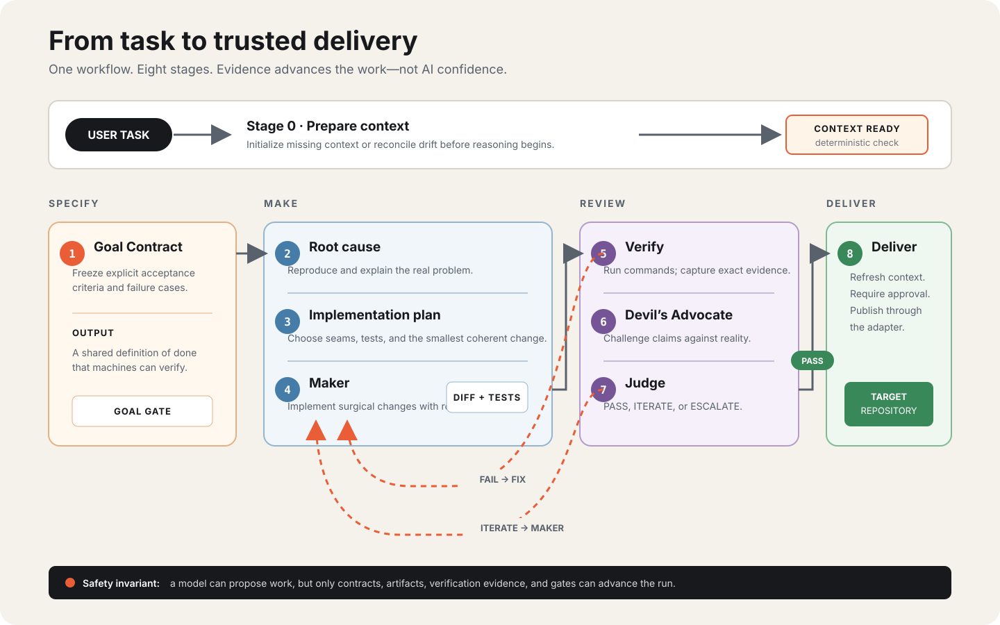

<div align="center">
<h1>AI Engineering Loop</h1>

[](https://www.npmjs.com/package/ai-engineering-loop)
[](https://opensource.org/licenses/MIT)
[](https://github.com/egagofur/ai-engineering-loop/pulls)
[](https://github.com/egagofur/ai-engineering-loop)
[](https://github.com/egagofur/ai-engineering-loop/releases)

**A Reusable, Framework-Agnostic AI Engineering Operating System for Autonomous Coding Agents**

*Featuring graduated safety modes, token budgets, isolated Maker worktrees, deterministic artifact gates, bounded secret-redacted context, and cheap-model escalation.*

[Overview](#overview--philosophy) • [Stage techniques](#stage-techniques) • [Runtime Capability Registry](#runtime-capability-registry--execution-modes) • [Verification Evidence](#verification-evidence-contract) • [CLI Commands](#cli-interface--commands) • [Grok CLI](#grok-cli-integration) • [Claude Code](#claude-code-integration) • [Antigravity](#antigravity-agent-integration) • [Lifecycle](#lifecycle-stages) • [Architecture](#architecture--5-layer-configuration) • [Project Profiles](#project-profiles) • [Repository Structure](#repository-structure) • [Reference Examples](#reference-examples) • [Contributing](#contributing)

</div>

---

## Overview & Philosophy

The AI Engineering Loop keeps one understandable path across four phases. Deterministic gates—not model confidence—decide when work can advance:

[](docs/images/engineering-loop-overview.svg)

---

## Stage techniques

The 8-stage loop stays one OS. These techniques sit **inside** existing stages (they are not optional slash-command products):

| Stage | Technique | Spec |
|---|---|---|
| 1 | Grill until the design-tree frontier is empty, then freeze the Goal Contract. Idea requests: menu, wait, then grill the pick. Chat `setuju` is not freeze; user-visible decisions must be numbered AC in the contract file. AC is a **failure table** (happy, empty/omit, boundary, sibling, error), not sunny path only. **Sloppy prompt** (no numbered AC): draft the Goal Contract file, show it, wait for freeze — do not Maker. Business-logic change: **blast radius** (lifecycle sketch, four pillars, ASCII picture) via `task-impact-inquiry` inside grill — not a second loop. Passing unit tests are not isolation proof. | `core/grill-policy.md` |
| 1 | Ubiquitous language in `.ai-engineering-loop/glossary.md`; load-bearing choices in `.ai-engineering-loop/adrs/` | `core/repo-config-schema.md` |
| 2 | Bugs: red repro → minimise → hypothesise → instrument → fix | `core/root-cause-analysis.md` |
| 4 | Optional **Maker intern**: overlay `maker_intern`. Default `none`. Pick from the host catalog (`grok models` or `/models` if that command exists; numbered options). Do not type a model name. No custom endpoint. Imagine/video models are not intern picks. Unknown id → parent Maker (`INVOCATION_UNAVAILABLE`). Devil's Advocate and Judge stay on the parent. | `.ai-engineering-loop/workflow.md` |
| 4–5 | Red-green at named **seams**; failure table (not happy path only); coverage is a map; no grep/tautology | `policies/tdd-policy.md` |
| 5 | **Claimed vs Reality** table before DA. Missing file or empty Reality blocks Devil's Advocate. "Seems green" is not Reality. | `core/verification-loop.md` |
| 6–7 | Spec vs Standards reported separately. Standards BLOCKER/HIGH iterate only when `hardConvention` is true | `policies/finding-policy.md` |
| 0–8 | Stateful run ledger and deterministic artifact transitions; model claims cannot advance a stage | `core/artifact-gates.md` |
| 0–8 | `REPORT_ONLY`, human-approved `ASSISTED`, opt-in `UNATTENDED`; actual token budgets, kill switch, and locked Maker worktrees | `core/runtime-safety.md` |
| any | Mid-loop stop writes `.ai-engineering-loop/tasks/handoff.md` | `core/handoff-policy.md` |
| any | **Compact map** (host guidance, not a second OS): Specify (stages 0-1), Make (stages 2-4), Review (stages 5-7), Deliver (stage 8). Keep the 8-stage numbers. Do not skip Goal Contract, verification, Devil's Advocate, or Judge. | host skills |

`init` now requires `glossary.md` and `adrs/README.md`. Repair fills missing files only; a filled glossary is never overwritten.

---

## Runtime Capability Registry & Execution Modes

The system maintains a strict distinction between **Configuration Support**, **Invocation Availability**, and **Execution Proof**:

```text
┌───────────────────────────┐     ┌───────────────────────────┐     ┌───────────────────────────┐
│  CONFIGURATION_SUPPORTED  │ ──> │   INVOCATION_AVAILABLE    │ ──> │     EXECUTION_PROVEN      │
│  (Config is recognized)   │     │ (Callable tool is active) │     │ (Child LLM response seen) │
└───────────────────────────┘     └───────────────────────────┘     └───────────────────────────┘
```

### 5 Standard Execution Modes (Deterministic Priority):

| Priority | Mode Name | Requires Independent LLM Execution? | Condition for Selection |
|:---:|---|:---:|---|
| **1** | **`TRUE_INDEPENDENT_AGENT`** | **YES** | Child session exists **AND** actual model response is captured **AND** context is independent. |
| **2** | **`ISOLATED_AGENT_INSTANCE`** | **YES** | Programmatic SDK agent instance with verified independent model execution. |
| **3** | **`FRESH_PROCESS_AGENT`** | **YES** | Separate OS process successfully executes an LLM agent with fresh context. |
| **4** | **`CONTEXT_ISOLATION_ONLY`** | **NO** | Clean-Slate Artifact Isolation Barrier in same session (100% prompt history excluded on disk). |
| **5** | **`UNAVAILABLE`** | **NO** | No review execution mechanism is available. |

### Truthful Reporting Disclosure:
When `CONTEXT_ISOLATION_ONLY` is selected, the report strictly produces:
```text
Execution Mode: CONTEXT_ISOLATION_ONLY
Independent LLM Execution: NOT PROVEN
Native Subagent Invocation: UNAVAILABLE
Review Method: Clean-Slate Artifact Isolation Barrier
```

---

## Verification Evidence Contract

A verification `PASS` is strictly invalid without concrete execution evidence. The system categorically rejects vague statements such as *"command was launched"* or *"test appears to have passed"*.

### Mandatory Execution Proof:
- **`command`**: Exact CLI string executed.
- **`executionIdentity`**: PID, execution hash, or system execution identifier.
- **`startTime` & `endTime`**: Documented execution duration.
- **`exitCode`**: Must be `0`.
- **`stdout` & `stderr`**: Raw machine logs captured.
- **`timeoutStatus`**: Must be `"COMPLETED"`.
- **`testCounts`**: Explicit counts of passed, failed, and skipped tests.
- **`assertionEvidence`**: Specific assertion proof matching the active Goal Contract's Acceptance Criteria.

---

## Dual-Axis Finding Model & Judge Decision Matrix

The Devil's Advocate categorizes findings along separate **Validity**, **Severity**, and **Disposition** axes:

```json
{
  "id": "DA-01",
  "topic": "correctness",
  "validity": "VALID",
  "severity": "BLOCKER",
  "disposition": "STRONG",
  "location": "src/services/payment.ts#L42-L58",
  "acceptanceCriteria": "AC-2",
  "failureScenario": "Under concurrent traffic, duplicate rows are inserted before the lock is acquired.",
  "evidence": "Missing SELECT FOR UPDATE in findByPaymentKey query.",
  "concreteAlternativeDiff": "```diff\n- const tx = await findByKey(key);\n+ const tx = await findByKeyWithLock(key, { mode: 'FOR UPDATE' });\n```"
}
```

### Judge Decision Matrix:
- **`VALID + BLOCKER / HIGH`** $\rightarrow$ **`ITERATE`** (Maker must apply concrete fix diff and add regression tests).
- **`VALID + MEDIUM / LOW`** $\rightarrow$ **`ACCEPT / TRADEOFF`** (Merged; documented as acceptable tradeoff in MR notes).
- **`INVALID`** $\rightarrow$ **`DISMISS`** (Reviewer hallucination disproven by code; cannot block delivery; signature recorded).

*Reviewer disposition (`STRONG`, `ACCEPTABLE`, `WEAK`) never overrides factual evidence.*

---

## Living Project Context

The `.ai-engineering-loop/` directory is **Living Context**, not a static wiki generated once.

1. **Post-Task Context Impact Assessment**: Evaluates completed tasks (`NONE`, `TARGETED`, `MAJOR`) to keep project context fresh without expensive whole-repo re-analysis.
2. **Context Baseline (`metadata.json`)**: Tracks `repositoryRevision` (git commit SHA) and `manifestChecksums` for instant Level 0 (0ms) drift verification.
3. **Strict Context Isolation**: Decouples living project context from ephemeral task logs and loop execution states.

---

## CLI Interface & Commands

The CLI package is published on NPM as [`ai-engineering-loop`](https://www.npmjs.com/package/ai-engineering-loop) and operates against the current working directory.

```bash
# Bootstrap .ai-engineering-loop/ context from repository discovery
npx ai-engineering-loop init

# Check the validity, readiness, and baseline freshness of context
npx ai-engineering-loop status

# Reconcile drifted context against repository non-destructively
npx ai-engineering-loop refresh

# Start or resume a stateful engineering run
npx ai-engineering-loop run
npx ai-engineering-loop run --mode report-only "audit this repository"
npx ai-engineering-loop run --recipe bugfix --mode assisted "repair retry race"

# Inspect the run ledger
npx ai-engineering-loop state --json

# Inspect policy, opt into unattended, and operate the token kill switch
npx ai-engineering-loop policy show
npx ai-engineering-loop policy set --allow-unattended true
npx ai-engineering-loop budget status
npx ai-engineering-loop budget pause
npx ai-engineering-loop budget resume

# Record actual provider-reported usage after each model response
npx ai-engineering-loop budget record --input 1200 --output 300 --model provider/model-id
npx ai-engineering-loop budget status --node root-cause --estimate 4000
npx ai-engineering-loop budget record --node root-cause --input 3000 --output 700 --model provider/model-id

# Isolate unattended Maker, then capture only its diff
npx ai-engineering-loop sandbox create
npx ai-engineering-loop sandbox capture

# Validate artifacts and advance stages
npx ai-engineering-loop gate goal
npx ai-engineering-loop gate report
npx ai-engineering-loop gate maker
npx ai-engineering-loop gate verification
npx ai-engineering-loop gate review
npx ai-engineering-loop escalation --json
npx ai-engineering-loop gate judge
npx ai-engineering-loop gate delivery

# Build bounded model-visible context
npx ai-engineering-loop context devil-advocate <files...>
npx ai-engineering-loop context judge <files...>

# Validate installation and the production evaluation catalog
npx ai-engineering-loop doctor
npx ai-engineering-loop eval

# Inspect declarative workflow recipes without executing nodes
npx ai-engineering-loop recipe list
npx ai-engineering-loop recipe validate default --mode assisted
npx ai-engineering-loop recipe explain default --mode assisted
npx ai-engineering-loop recipe graph default --mode assisted
npx ai-engineering-loop recipe simulate default --mode assisted
npx ai-engineering-loop recipe catalog --json
npx ai-engineering-loop recipe create api-bugfix --from bugfix
npx ai-engineering-loop recipe inspect api-bugfix --json
npx ai-engineering-loop recipe diff bugfix api-bugfix
npx ai-engineering-loop recipe install candidate.json
npx ai-engineering-loop recipe install candidate-v2.json --replace

# Operate a custom node in an immutable recipe-bound run
npx ai-engineering-loop node status
npx ai-engineering-loop node start root-cause
npx ai-engineering-loop node activity root-cause --message "Comparing failing evidence"
npx ai-engineering-loop node complete root-cause --artifact .ai-engineering-loop/runs/<run-id>/root-cause.json
npx ai-engineering-loop node approve delivery-approval --yes

# Open the local workflow canvas (localhost-only, authenticated session)
npx ai-engineering-loop studio
npx ai-engineering-loop studio --port 4400 --no-open

# Transfer redacted knowledge to another developer or agent
npx ai-engineering-loop handoff create --audience developer
npx ai-engineering-loop handoff inspect <run-id>.ael-handoff.json
npx ai-engineering-loop handoff brief <run-id>.ael-handoff.json

# Copy package skills/agents/commands into ~/.claude ~/.grok ~/.gemini ~/.agents
npx ai-engineering-loop sync-hosts

# Grill (or --type) a Stage 8 delivery adapter for this repo
npx ai-engineering-loop generate-adapter
npx ai-engineering-loop generate-adapter --type github

# Grill (or --write) a loop overlay + empty lessons.md for this repo
npx ai-engineering-loop generate-workflow
npx ai-engineering-loop generate-workflow --write
```

Every full run stores private local artifacts under `.ai-engineering-loop/runs/<run-id>/`. Usage, worktrees, locks, context packs, and logs are Git-ignored. Markdown remains the human contract; JSON sidecars follow the shipped `schemas/` and make stage claims deterministic. `ASSISTED` is the default and requires explicit human delivery approval. `UNATTENDED` is disabled until a human enables it. See [`core/runtime-safety.md`](core/runtime-safety.md), [`core/artifact-gates.md`](core/artifact-gates.md), [`SECURITY.md`](SECURITY.md), and [`SUPPORT.md`](SUPPORT.md).

Declarative recipes let an AI or future visual editor author a workflow graph without weakening the safety gates. Built-in presets and project recipes can be validated, explained, graphed, and simulated deterministically. `run --recipe` opts into an immutable, resumable DAG scheduler; legacy runs remain unchanged. See [`core/workflow-recipes.md`](core/workflow-recipes.md) and [`core/controlled-workflow-runtime.md`](core/controlled-workflow-runtime.md).

The deterministic recipe builder scaffolds from safe presets, validates candidates before atomic installation, and preserves replaced versions locally. Workflow Studio is a thin local interface over that compiler and controlled runtime: a pannable and zoomable DAG canvas, drag-and-drop nodes, guarded visual connections, undo/redo, private per-project layouts, Stage 8 adapter selection, live activity and budget telemetry, explicit approval/retry controls, decision memory, and integrity-bound handoff export—without model or shell execution in the browser. See [`core/local-workflow-studio.md`](core/local-workflow-studio.md). The host-neutral agent protocol remains available in [`agents/recipe-builder.md`](agents/recipe-builder.md).

Shipped adapters (Stage 8 only, after Judge PASS): `standard`, `github`, `gitlab`, `dot`. Catalog: `adapters/README.md`. Each team generates its own; do not copy a neighbour's pipeline.

`sync-hosts` updates only hosts that already exist on the machine. DOT skills (`dot-dev-skill-router`, `dot-dev-workflow`) are updated only if they are already installed. `task-impact-inquiry`, `generate-adapter`, and `generate-workflow` are upserted onto Claude, Grok, and Gemini. After a copy, start a new session so the host reloads skill text. `/ai-engineering-loop` Stage 0 and `run` call `sync-hosts` so a published package bump reaches global host files without a manual copy.

---

## Grok CLI Integration

Grok CLI is a first-class host. `spawn_subagent` is a real independent child session (own context, no parent transcript unless `resume_from` is set). After a child id and model response are captured, the registry selects **`TRUE_INDEPENDENT_AGENT`**.

| Loop role | Grok `subagent_type` | Spawn rules |
|---|---|---|
| Orchestrator / Maker | parent session | Parent stays the orchestrator (Grok nesting depth is 1) |
| Devil's Advocate | `devil-advocate` (fallback `general-purpose`) | `capability_mode: execute`, omit `resume_from` |
| Judge | `judge` (fallback `general-purpose`) | Sibling of DA, never nested under DA |

Do **not** use `caveman:cavecrew-reviewer` as Devil's Advocate or Judge — its output schema is not the Finding Ledger.

Repo-local Grok files:

- `.grok/agents/devil-advocate.md` / `.grok/agents/judge.md`
- `.grok/skills/ai-engineering-loop/SKILL.md`
- `.grok/commands/ai-engineering-loop.md` → `/ai-engineering-loop`

Fallback: `GROK_SUBAGENTS=0` or `--disallowed-tools Agent` → `CONTEXT_ISOLATION_ONLY`, disclosed as such. Optional process fallback: `grok -p` → `FRESH_PROCESS_AGENT` only after a model response is captured.

See [docs/grok-cli-feasibility.md](docs/grok-cli-feasibility.md).

---

## Claude Code Integration

Claude Code is a first-class host. Use the **Task** (or **Agent**) tool with **only** `subagent_type`, `description`, and `prompt`.

Do **not** pass Grok keys (`spawn_subagent`, `capability_mode`, `isolation`, `resume_from`). Extra keys are the usual cause of:

```
API Error: 400 [kiro/claude-sonnet-5] REQUEST_BODY_INVALID
```

| Loop role | Claude Code `subagent_type` | Task keys |
|---|---|---|
| Orchestrator / Maker | parent session | n/a |
| Devil's Advocate | `devil-advocate` (fallback `general-purpose`) | `subagent_type`, `description`, `prompt`, wait (no background) |
| Judge | `judge` (fallback `general-purpose`) | same, after DA returns |

Parent writes `git diff` to a file and passes that path. DA is capped at 8 tool calls and skips css/generated blobs so review does not take tens of minutes.

Repo-local Claude Code files:

- `.claude/agents/devil-advocate.md` / `.claude/agents/judge.md`
- `.claude/skills/ai-engineering-loop/SKILL.md`
- `.claude/commands/ai-engineering-loop.md` → `/ai-engineering-loop`

On Kiro auto mode, pre-allow verification Bash or the safety classifier 400s the session. Copy `templates/repo-config/claude-permissions.json` into the target repo `.claude/settings.local.json` `permissions.allow` list. If Bash returns "cannot determine the safety", do not retry; switch permission mode to default and start a new session.

See [docs/claude-code-feasibility.md](docs/claude-code-feasibility.md).

---

## Antigravity Agent Integration

Antigravity uses `.agents/devil-advocate.md`, `.agents/judge.md`, and `.agents/workflows/ai-engineering-loop.md`. Same review budget as Claude Code and Grok: DA 8 tool calls, Judge 4, wait (no background), skip css/generated, never `browser_subagent`. If `invoke_subagent` is missing, disclose `CONTEXT_ISOLATION_ONLY`.

When working inside the Antigravity IDE or compatible agentic platforms, you can invoke the loop via slash commands:

- **`/ai-engineering-loop init`**: Initialize project context only (non-destructive bootstrap).
- **`/ai-engineering-loop status`**: Check repository context health & baseline freshness.
- **`/ai-engineering-loop refresh`**: Reconcile drifted context files non-destructively.
- **`/ai-engineering-loop [task description]`**: Execute the full 8-stage engineering lifecycle with pre-task drift gate and post-task impact assessment.

On Grok CLI the same slash command is provided by `.grok/commands/ai-engineering-loop.md` and runs Devil's Advocate / Judge as native subagents.

---

## Repository Structure

```text
ai-engineering-loop/
│
├── README.md                           # Operating system overview & architecture
├── LICENSE                             # MIT Open Source License
├── package.json                        # CLI package manifest
│
├── bin/                                # CLI execution entrypoints
│   └── ai-engineering-loop.js          # npx executable CLI (init, status, refresh, run, sync-hosts)
│
├── lib/                                # Core orchestration & decision engine
│   ├── orchestration.js                # 3-stage capability registry, barrier builder, Judge engine
│   ├── recipe.js                       # Declarative graph validator and deterministic compiler
│   └── workflow-runtime.js             # Resumable scheduler and hash-chained event ledger
│
├── recipes/                            # Built-in workflow presets; target repos may add their own
│   ├── default.json                    # Current production loop represented as a graph
│   └── audit.json                      # Read-only report workflow
│
├── tests/                              # Deterministic test suites
│   ├── capability-selection.test.js    # Unit tests for capability lifecycle & truthful selection
│   ├── orchestration.test.js           # Tests for isolation, Finding schema, Judge matrix
│   └── grok-runtime.test.js            # Grok spawn_subagent mapping, aliases, forbidden types
│
├── .agents/                            # Antigravity host adapter
│   ├── devil-advocate.md
│   ├── judge.md
│   └── workflows/ai-engineering-loop.md
│
├── .grok/                              # Grok CLI host adapter
│   ├── agents/devil-advocate.md        # Native DA subagent type
│   ├── agents/judge.md                 # Native Judge subagent type
│   ├── skills/ai-engineering-loop/     # Grok skill (spawn protocol)
│   └── commands/ai-engineering-loop.md # /ai-engineering-loop slash command
│
├── .claude/                            # Claude Code host adapter (Kiro-safe)
│   ├── agents/devil-advocate.md        # Task subagent type
│   ├── agents/judge.md                 # Task subagent type
│   ├── skills/ai-engineering-loop/     # Claude skill (Task keys only)
│   └── commands/ai-engineering-loop.md # /ai-engineering-loop slash command
│
├── core/                               # Generic engineering loop specifications
│   ├── orchestration-model.md          # 3-stage capability lifecycle & execution priority
│   ├── project-initialization.md       # Auto-discovery & initialization lifecycle
│   ├── context-refresh-policy.md       # Progressive drift hierarchy & living baseline
│   ├── context-impact-assessment.md    # Post-task impact assessment (NONE, TARGETED, MAJOR)
│   ├── goal-contract.md                # Task contract schema & acceptance criteria
│   ├── grill-policy.md                 # Stage 1 human alignment (design tree)
│   ├── root-cause-analysis.md          # Stage 2 diagnosis gates
│   ├── handoff-policy.md               # Mid-loop session handoff artifact
│   ├── verification-loop.md            # Dual-layer verification & Evidence Contract
│   ├── definition-of-done.md           # 5 pillars of Done & rejection triggers
│   ├── iteration-policy.md             # Bounded autonomous loop (MAX_ITERATIONS = 3)
│   ├── escalation-policy.md            # Deterministic human escalation triggers
│   ├── judge-policy.md                 # Evaluation rules, triage audit, & verdicts
│   ├── configuration-precedence.md     # 5-layer precedence & conflict resolution
│   ├── controlled-workflow-runtime.md  # Immutable plan, scheduler, events, and recovery
│   ├── workflow-recipes.md             # Recipe safety backbone and AI authoring protocol
│   └── repo-config-schema.md           # Schema for target repo .ai-engineering-loop/
│
├── profiles/                           # Project archetype profiles
│   ├── README.md                       # Profile catalog & auto-detection rules
│   ├── web-app.md                      # Frontend web applications
│   ├── backend-api.md                  # Backend APIs & microservices
│   ├── mobile-app.md                   # Native & cross-platform mobile apps
│   ├── library.md                      # Reusable SDKs & shared packages
│   └── monorepo.md                     # Multi-package monorepo workspaces
│
├── agents/                             # Triad agent role specifications
│   ├── maker.md                        # Maker agent: surgical diffs & unit tests
│   ├── devil-advocate.md               # Adversarial reviewer: dual-axis finding ledger & diffs
│   └── judge.md                        # Judge agent: impartial magistrate on Validity + Severity
│
├── policies/                           # Operational schemas & algorithms
│   ├── discovery-safety-policy.md      # Secret protection & non-destructive discovery rules
│   ├── finding-policy.md               # Dual-axis finding schema & severity matrix
│   ├── tdd-policy.md                   # Red-green at named seams
│   ├── evidence-policy.md              # 5-level evidence hierarchy & Verification Evidence Contract
│   └── no-progress-policy.md           # Finding signature hashing & stagnation detection
│
├── adapters/                           # Pluggable Stage 8 delivery (not a second OS)
│   ├── README.md                       # Catalog: standard, github, gitlab, dot
│   ├── generate-adapter/SKILL.md       # Grill Q1-Q5, then write adapter.md
│   ├── generate-workflow/SKILL.md      # Grill Q1-Q6, then write workflow.md + lessons.md
│   ├── standard/                       # Generic git delivery (any forge)
│   ├── github/                         # gh pr / GitHub Issues
│   ├── gitlab/                         # glab mr (not the DOT pipeline)
│   └── dot/                            # DOT-specific GitLab + multi-branch + chat
│
└── templates/                          # Starter templates for target repositories
    └── repo-config/                    # Ready-to-copy .ai-engineering-loop/ files
        ├── config.md                   # Project identity & profile binding
        ├── architecture.md             # Layers & boundary invariants
        ├── glossary.md                 # Ubiquitous language
        ├── adr-readme.md               # ADR folder template
        ├── conventions.md              # Code standards & forbidden patterns
        ├── verification.md             # CLI test/lint/build commands
        ├── adapter.md                  # Configured release pipeline
        ├── workflow.md                 # Optional loop overlay hooks
        └── lessons.md                  # Optional confirmed process lessons
```

---

## License

This project is licensed under the **MIT License** — see the [LICENSE](LICENSE) file for details.
