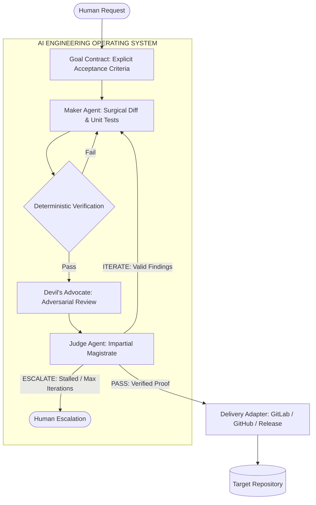

# AI Engineering Loop

<div align="center">

[](https://opensource.org/licenses/MIT)
[](https://github.com/egagofur/ai-engineering-loop/pulls)
[](https://github.com/egagofur/ai-engineering-loop)
[](https://github.com/egagofur/ai-engineering-loop/releases)
[](https://github.com/egagofur/ai-engineering-loop)

**A Reusable, Framework-Agnostic AI Engineering Operating System for Autonomous Coding Agents**

*Transitioning autonomous agent workflows from optimistic self-evaluation toward contract-driven execution, deterministic machine verification, and independent adversarial review.*

[Overview](#overview--philosophy) • [Key Features](#key-features) • [Architecture](#architecture--5-layer-configuration) • [Project Profiles](#project-profiles) • [Quickstart](#quickstart) • [Repository Structure](#repository-structure) • [Reference Examples](#reference-examples) • [Contributing](#contributing)

</div>

---

## Overview & Philosophy

Traditional AI coding workflows rely heavily on **optimistic self-evaluation**: a single model analyzes, generates code, executes tests, and declares completion. This single-context pattern often introduces blind spots, false-positive test validations, and premature merge declarations.

The **AI Engineering Loop** establishes a multi-agent engineering lifecycle that separates implementation from verification and final evaluation:



### Core Axiom

> **"Do not ask whether the agent thinks the task is finished. Define how the system can prove that the task is finished."**

---

## Key Features

- **Goal-Contracted Execution**: Tasks begin with an explicit [Goal Contract](core/goal-contract.md) defining testable Acceptance Criteria (AC-1..N), technical invariants, and out-of-scope boundaries before touching codebase files.
- **Triad Agent Architecture**:
  - **[Maker Agent](agents/maker.md)**: Focuses on root-cause analysis, surgical code diffs, and comprehensive unit test authoring.
  - **[Devil's Advocate Agent](agents/devil-advocate.md)**: Independent reviewer evaluating correctness, security, concurrency, performance, and testing gaps with concrete diffs.
  - **[Judge Agent](agents/judge.md)**: Impartial magistrate evaluating evidence to issue `PASS`, `ITERATE`, or `ESCALATE` verdicts.
- **Deterministic Precedence**: Machine-checkable tests, static type analysis (`tsc`), linters, and build pipelines must pass 100% before adversarial review begins.
- **Bounded Iteration & Stagnation Detection**: Limits autonomous cycles (`MAX_ITERATIONS = 3`) and detects recurring finding signatures to prevent infinite retry loops.
- **5-Layer Configuration Precedence**: Multi-project support that resolves repository facts dynamically without requiring a centralized registry.
- **Pluggable Delivery Adapters**: Encapsulates release workflows (GitLab, GitHub, Mattermost, Jira, Slack) without coupling platform tools to the generic engineering core.

---

## Architecture & 5-Layer Configuration

The system dynamically resolves configuration and review rules through a cascading 5-layer hierarchy:

$$\text{GLOBAL} \longrightarrow \text{ENGINEERING CORE} \longrightarrow \text{PROJECT TYPE PROFILE} \longrightarrow \text{PROJECT CONFIG (`.ai-engineering-loop/`)} \longrightarrow \text{TASK CONTRACT}$$

1. **GLOBAL**: Host execution safety limits and maximum iteration ceilings (`MAX_ITERATIONS <= 5`).
2. **ENGINEERING CORE**: Universal loop invariants ([Goal Contract](core/goal-contract.md), [Verification Loop](core/verification-loop.md), [Definition of Done](core/definition-of-done.md)).
3. **PROJECT TYPE PROFILE ([`profiles/`](profiles/README.md))**: Archetype defaults for web applications, backend APIs, mobile apps, libraries, or monorepos.
4. **PROJECT CONFIGURATION (`<repo>/.ai-engineering-loop/`)**: Target repository ground truth ([`verification.md`](templates/repo-config/verification.md), [`architecture.md`](templates/repo-config/architecture.md), [`conventions.md`](templates/repo-config/conventions.md)).
5. **TASK CONTRACT**: Active task-scoped acceptance criteria and diff constraints.

Detailed specification: [configuration-precedence.md](core/configuration-precedence.md).

---

## Project Profiles

Profiles define technology-specific characteristics and activate relevant review domains for the Devil's Advocate without modifying the core engine:

| Profile | Specification | Target Tech Stack | Active Review Focus |
|---|---|---|---|
| **`web-app`** | [web-app.md](profiles/web-app.md) | Next.js, Remix, Vite, React, Vue | DOM rendering, responsiveness (320px–4k), accessibility (a11y/ARIA), client state, Core Web Vitals |
| **`backend-api`** | [backend-api.md](profiles/backend-api.md) | Go, Node.js, Python, Java, PostgreSQL | Auth/IDOR, database transactions & ACID rollbacks, concurrency locks (`SELECT FOR UPDATE`), N+1 query loops |
| **`mobile-app`** | [mobile-app.md](profiles/mobile-app.md) | Flutter, React Native, iOS (Swift), Android (Kotlin) | Offline sync queues, OS lifecycle termination & state loss, permission denials, battery/GPS hygiene |
| **`library`** | [library.md](profiles/library.md) | npm/PyPI packages, SDKs, crates | SemVer public API stability, zero dependency bloat, cross-runtime compatibility, bundle tree-shaking |
| **`monorepo`** | [monorepo.md](profiles/monorepo.md) | Turborepo, Nx, Cargo/pnpm workspaces | Cross-package boundaries, circular dependencies, affected scope testing, workspace cache invalidation |

Profile index: [profiles/README.md](profiles/README.md).

---

## Repository Structure

```text
ai-engineering-loop/
│
├── README.md                           # Operating system overview & architecture
├── LICENSE                             # MIT Open Source License
│
├── core/                               # Generic engineering loop specifications
│   ├── goal-contract.md                # Task contract schema & acceptance criteria
│   ├── verification-loop.md            # Dual-layer verification lifecycle
│   ├── definition-of-done.md           # 5 pillars of Done & rejection triggers
│   ├── iteration-policy.md             # Bounded autonomous loop (MAX_ITERATIONS = 3)
│   ├── escalation-policy.md            # Deterministic human escalation triggers
│   ├── judge-policy.md                 # Evaluation rules, triage audit, & verdicts
│   ├── configuration-precedence.md     # 5-layer precedence & conflict resolution
│   └── repo-config-schema.md           # Schema for target repo .ai-engineering-loop/
│
├── profiles/                           # Project archetype profiles
│   ├── README.md                       # Profile catalog & auto-detection rules
│   ├── web-app.md                      # Frontend web applications
│   ├── backend-api.md                  # Backend APIs & microservices
│   ├── mobile-app.md                   # Native & cross-platform mobile apps
│   ├── library.md                      # Reusable SDKs & shared packages
│   └── monorepo.md                     # Multi-package monorepo workspaces
│
├── agents/                             # Triad agent role specifications
│   ├── maker.md                        # Maker agent: surgical diffs & unit tests
│   ├── devil-advocate.md               # Adversarial reviewer: layered review rules & concrete diffs
│   └── judge.md                        # Judge agent: neutral magistrate & verdict computation
│
├── policies/                           # Operational schemas & algorithms
│   ├── finding-policy.md               # Standardized finding schema & severity matrix
│   ├── evidence-policy.md              # 5-level evidence hierarchy
│   └── no-progress-policy.md           # Finding signature hashing & stagnation detection
│
├── adapters/                           # Pluggable delivery pipelines
│   └── dot/                            # DOT Indonesia delivery adapter
│       ├── README.md                   # DOT adapter overview
│       ├── gitlab.md                   # glab CLI, issue cards, & MR generation
│       ├── multi-branch.md             # main / staging / develop cherry-pick propagation
│       ├── coreview.md                 # @coreview-bot external review triage (Valid vs Halu)
│       └── mattermost.md               # Channel mapping & MCP dispatch (from: "AI Agent")
│
├── templates/                          # Starter templates for target repositories
│   └── repo-config/                    # Ready-to-copy .ai-engineering-loop/ files
│       ├── config.md                   # Project identity & profile binding
│       ├── architecture.md             # Layers & boundary invariants
│       ├── conventions.md              # Code standards & forbidden patterns
│       ├── verification.md             # CLI test/lint/build commands
│       └── adapter.md                  # Configured release pipeline
│
├── examples/                           # End-to-end multi-archetype reference walkthroughs
│   ├── dot/attendance-confirmation/    # Scenario A: DOT Web Application bugfix & multi-branch MRs
│   ├── backend-api/payment-idempotency/# Scenario B: Go/PostgreSQL race condition & idempotency fix
│   └── mobile-app/offline-sync-queue/  # Scenario C: Flutter/SQLite offline sync queue
│
└── docs/                               # Meta-documentation & integration guides
    ├── migration-plan.md               # 8-phase legacy workflow mapping & rationale
    └── antigravity-feasibility.md      # Antigravity runtime evaluation & subagent orchestration
```

---

## Quickstart

### Step 1: Configure Your Repository (Recommended)
Copy the starter templates into your repository's `.ai-engineering-loop/` directory:

```bash
mkdir -p .ai-engineering-loop
# Copy templates from templates/repo-config/ into your project:
# config.md, architecture.md, conventions.md, verification.md, adapter.md
```

### Step 2: Formulate the Goal Contract
Before modifying code, establish an explicit [Goal Contract](core/goal-contract.md) with numbered Acceptance Criteria and clear out-of-scope boundaries.

### Step 3: Run the Engineering Loop
1. **Maker**: Perform data-flow analysis, generate surgical diffs, and write automated tests.
2. **Verification**: Execute machine-checked gates (`test`, `typecheck`, `lint`, `build`).
3. **Devil's Advocate**: Review the diff against active profile rules with concrete alternative diffs.
4. **Judge**: Evaluate complete evidence and issue formal `PASS`, `ITERATE`, or `ESCALATE` verdict.

---

## Reference Examples

- **[Scenario A: DOT Web Application](examples/dot/attendance-confirmation/README.md)**: Resolves an attendance status bug across `main`, `staging`, and `develop` with `@coreview-bot` triage and Mattermost dispatch.
- **[Scenario B: Backend API Service](examples/backend-api/payment-idempotency/README.md)**: Eliminates double-spend race conditions in Go/PostgreSQL with `SELECT FOR UPDATE` and automated race test suites.
- **[Scenario C: Mobile Application](examples/mobile-app/offline-sync-queue/README.md)**: Implements an offline SQLite mutation queue in Flutter with network flapping tolerance and state preservation.

---

## Contributing

Contributions, feedback, and new adapter profiles are welcome.

1. Fork the repository (`https://github.com/egagofur/ai-engineering-loop/fork`).
2. Create your feature branch (`git checkout -b feature/new-adapter`).
3. Ensure all changes adhere to [core/definition-of-done.md](core/definition-of-done.md).
4. Open a Pull Request.

---

## License

This project is licensed under the **MIT License** — see the [LICENSE](LICENSE) file for details.

---

<div align="center">
Designed for software engineering teams and autonomous AI coding agents.
</div>
