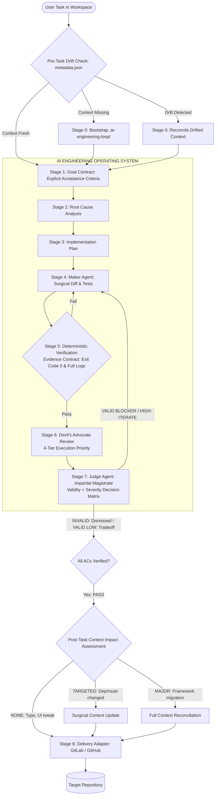

# AI Engineering Loop

<div align="center">

[](https://www.npmjs.com/package/ai-engineering-loop)
[](https://opensource.org/licenses/MIT)
[](https://github.com/egagofur/ai-engineering-loop/pulls)
[](https://github.com/egagofur/ai-engineering-loop)
[](https://github.com/egagofur/ai-engineering-loop/releases)

**A Reusable, Framework-Agnostic AI Engineering Operating System for Autonomous Coding Agents**

*Featuring living project context, strict verification evidence contracts, 4-tier adversarial review orchestration, and dual-axis Judge evaluation.*

[Overview](#overview--philosophy) • [Orchestration & Review Modes](#multi-agent-orchestration--review-modes) • [Verification Evidence](#verification-evidence-contract) • [CLI Commands](#cli-interface--commands) • [Agent Integration](#antigravity-agent-integration) • [Lifecycle](#lifecycle-stages) • [Architecture](#architecture--5-layer-configuration) • [Project Profiles](#project-profiles) • [Repository Structure](#repository-structure) • [Reference Examples](#reference-examples) • [Contributing](#contributing)

</div>

---

## Overview & Philosophy

The AI Engineering Loop enforces clean architectural separation across three core layers:



---

## Multi-Agent Orchestration & Review Modes

The system maintains a strict distinction between **Context Isolation** (stripping conversational history) and **Agent Independence** (spawning physically separate agent processes).

### 4-Tier Execution Priority:

| Priority | Mode Name | Execution Mechanism | Agent Independence | Logged Designation |
|:---:|---|---|:---:|---|
| **1** | **`NATIVE_SUBAGENT`** | Host runtime natively summons an independent sub-agent. | **YES** | `Execution Mode: NATIVE_SUBAGENT (Independent Agent)` |
| **2** | **`SDK_AGENT`** | Programmatic instantiation via Python SDK (`google-antigravity.Agent`). | **YES** | `Execution Mode: SDK_AGENT (Independent Process & Context)` |
| **3** | **`HEADLESS_SUBPROCESS`** | Headless CLI agent spawned in a separate subprocess. | **YES** | `Execution Mode: HEADLESS_SUBPROCESS (Fresh Process)` |
| **4** | **`ARTIFACT_ISOLATED_REVIEW`** | Clean-Slate Artifact Isolation Barrier in single-agent session. | **NO** | `Execution Mode: ARTIFACT_ISOLATED_REVIEW (Isolated Review Context, Not Independent Agent Execution)` |

> [!IMPORTANT]
> When `ARTIFACT_ISOLATED_REVIEW` is used, the system **never** claims "independent sub-agent review" in delivery logs or audit artifacts. It is explicitly labeled as *isolated review context*.

---

## Verification Evidence Contract

A verification `PASS` is strictly invalid without concrete execution evidence. The system categorically rejects vague statements such as *"command was launched"* or *"test appears to have passed"*.

### Mandatory Execution Proof:
- **`command`**: Exact CLI string executed.
- **`executionIdentity`**: PID, execution hash, or system execution identifier.
- **`startTime` & `endTime`**: Documented execution duration.
- **`exitCode`**: Must be `0`.
- **`stdout` & `stderr`**: Raw machine logs captured.
- **`timeoutStatus`**: Must be `"COMPLETED"`.
- **`testCounts`**: Explicit counts of passed, failed, and skipped tests.
- **`assertionEvidence`**: Specific assertion proof matching the active Goal Contract's Acceptance Criteria.

---

## Dual-Axis Finding Model & Judge Decision Matrix

The Devil's Advocate categorizes findings along separate **Validity**, **Severity**, and **Disposition** axes:

```json
{
  "id": "DA-01",
  "topic": "correctness",
  "validity": "VALID",
  "severity": "BLOCKER",
  "disposition": "STRONG",
  "location": "src/services/payment.ts#L42-L58",
  "acceptanceCriteria": "AC-2",
  "failureScenario": "Under concurrent traffic, duplicate rows are inserted before the lock is acquired.",
  "evidence": "Missing SELECT FOR UPDATE in findByPaymentKey query.",
  "concreteAlternativeDiff": "```diff\n- const tx = await findByKey(key);\n+ const tx = await findByKeyWithLock(key, { mode: 'FOR UPDATE' });\n```"
}
```

### Judge Decision Matrix:
- **`VALID + BLOCKER / HIGH`** $\rightarrow$ **`ITERATE`** (Maker must apply concrete fix diff and add regression tests).
- **`VALID + MEDIUM / LOW`** $\rightarrow$ **`ACCEPT / TRADEOFF`** (Merged; documented as acceptable tradeoff in MR notes).
- **`INVALID`** $\rightarrow$ **`DISMISS`** (Reviewer hallucination disproven by code; cannot block delivery; signature recorded).

*Reviewer disposition (`STRONG`, `ACCEPTABLE`, `WEAK`) never overrides factual evidence.*

---

## Living Project Context

The `.ai-engineering-loop/` directory is **Living Context**, not a static wiki generated once.

1. **Post-Task Context Impact Assessment**: Evaluates completed tasks (`NONE`, `TARGETED`, `MAJOR`) to keep project context fresh without expensive whole-repo re-analysis.
2. **Context Baseline (`metadata.json`)**: Tracks `repositoryRevision` (git commit SHA) and `manifestChecksums` for instant Level 0 (0ms) drift verification.
3. **Strict Context Isolation**: Decouples living project context from ephemeral task logs and loop execution states.

---

## CLI Interface & Commands

The CLI package is published on NPM as [`ai-engineering-loop`](https://www.npmjs.com/package/ai-engineering-loop) and operates against the current working directory.

```bash
# Bootstrap .ai-engineering-loop/ context from repository discovery
npx ai-engineering-loop init

# Check the validity, readiness, and baseline freshness of context
npx ai-engineering-loop status

# Reconcile drifted context against repository non-destructively
npx ai-engineering-loop refresh

# Verify context readiness and begin engineering loop
npx ai-engineering-loop run
```

---

## Antigravity Agent Integration

When working inside the Antigravity IDE or compatible agentic platforms, you can invoke the loop via slash commands:

- **`/ai-engineering-loop init`**: Initialize project context only (non-destructive bootstrap).
- **`/ai-engineering-loop status`**: Check repository context health & baseline freshness.
- **`/ai-engineering-loop refresh`**: Reconcile drifted context files non-destructively.
- **`/ai-engineering-loop [task description]`**: Execute the full 8-stage engineering lifecycle with pre-task drift gate and post-task impact assessment.

---

## Lifecycle Stages

1. **Stage 0: Living Context & Drift Gate ([`core/project-initialization.md`](core/project-initialization.md), [`core/context-refresh-policy.md`](core/context-refresh-policy.md))**:
   - Check `metadata.json` baseline. If fresh $\rightarrow$ proceed. If missing or drifted $\rightarrow$ reconcile context.
2. **Stage 1: Goal Contract ([`core/goal-contract.md`](core/goal-contract.md))**: Formulate explicit, testable Acceptance Criteria.
3. **Stage 2: Root Cause Analysis**: End-to-end data tracing and git commit history examination.
4. **Stage 3: Implementation Plan**: Structured diff proposal and test plan.
5. **Stage 4: Maker Execution ([`agents/maker.md`](agents/maker.md))**: Surgical implementation and test engineering.
6. **Stage 5: Deterministic Verification ([`core/verification-loop.md`](core/verification-loop.md))**: 100% green pass on tests, typechecks, linters, and builds backed by Verification Evidence Contract.
7. **Stage 6: Devil's Advocate Review ([`agents/devil-advocate.md`](agents/devil-advocate.md), [`core/orchestration-model.md`](core/orchestration-model.md))**: 4-Tier adversarial critique with concrete alternative diffs and Clean-Slate barrier.
8. **Stage 7: Judge & Impact Assessment ([`agents/judge.md`](agents/judge.md), [`core/judge-policy.md`](core/judge-policy.md))**: Impartial verdict (`PASS`/`ITERATE`/`ESCALATE`) on Validity + Severity, followed by Context Impact Assessment (`NONE`/`TARGETED`/`MAJOR`).
9. **Stage 8: Delivery Pipeline ([`adapters/`](adapters/))**: Automated PR/MR generation, multi-branch propagation, and notification dispatch.

---

## Architecture & 5-Layer Configuration

The system dynamically resolves configuration and review rules through a cascading 5-layer hierarchy:

$$\text{GLOBAL} \longrightarrow \text{ENGINEERING CORE} \longrightarrow \text{PROJECT TYPE PROFILE} \longrightarrow \text{PROJECT CONFIG (`.ai-engineering-loop/`)} \longrightarrow \text{TASK CONTRACT}$$

1. **GLOBAL**: Host execution safety limits and maximum iteration ceilings (`MAX_ITERATIONS <= 5`).
2. **ENGINEERING CORE**: Universal loop invariants ([Goal Contract](core/goal-contract.md), [Verification Loop](core/verification-loop.md), [Definition of Done](core/definition-of-done.md)).
3. **PROJECT TYPE PROFILE ([`profiles/`](profiles/README.md))**: Archetype defaults for web applications, backend APIs, mobile apps, libraries, or monorepos.
4. **PROJECT CONFIGURATION (`<repo>/.ai-engineering-loop/`)**: Target repository ground truth ([`verification.md`](templates/repo-config/verification.md), [`architecture.md`](templates/repo-config/architecture.md), [`conventions.md`](templates/repo-config/conventions.md)).
5. **TASK CONTRACT**: Active task-scoped acceptance criteria and diff constraints.

---

## Project Profiles

| Profile | Specification | Target Tech Stack | Active Review Focus |
|---|---|---|---|
| **`web-app`** | [web-app.md](profiles/web-app.md) | Next.js, Remix, Vite, React, Vue | DOM rendering, responsiveness (320px–4k), accessibility (a11y/ARIA), client state, Core Web Vitals |
| **`backend-api`** | [backend-api.md](profiles/backend-api.md) | Go, Node.js, Python, Java, PostgreSQL | Auth/IDOR, database transactions & ACID rollbacks, concurrency locks (`SELECT FOR UPDATE`), N+1 query loops |
| **`mobile-app`** | [mobile-app.md](profiles/mobile-app.md) | Flutter, React Native, iOS (Swift), Android (Kotlin) | Offline sync queues, OS lifecycle termination & state loss, permission denials, battery/GPS hygiene |
| **`library`** | [library.md](profiles/library.md) | npm/PyPI packages, SDKs, crates | SemVer public API stability, zero dependency bloat, cross-runtime compatibility, bundle tree-shaking |
| **`monorepo`** | [monorepo.md](profiles/monorepo.md) | Turborepo, Nx, Cargo/pnpm workspaces | Cross-package boundaries, circular dependencies, affected scope testing, workspace cache invalidation |

Profile index: [profiles/README.md](profiles/README.md).

---

## Repository Structure

```text
ai-engineering-loop/
│
├── README.md                           # Operating system overview & architecture
├── LICENSE                             # MIT Open Source License
├── package.json                        # CLI package manifest
│
├── bin/                                # CLI execution entrypoints
│   └── ai-engineering-loop.js          # npx executable CLI (init, status, refresh, run)
│
├── lib/                                # Core orchestration & decision engine
│   └── orchestration.js                # Mode detection, barrier builder, Judge verdict engine
│
├── tests/                              # Deterministic test suites
│   └── orchestration.test.js           # Verification of modes, isolation, Finding schema, Judge matrix
│
├── core/                               # Generic engineering loop specifications
│   ├── orchestration-model.md          # 4-tier execution priority & Clean-Slate barrier
│   ├── project-initialization.md       # Auto-discovery & initialization lifecycle
│   ├── context-refresh-policy.md       # Progressive drift hierarchy & living baseline
│   ├── context-impact-assessment.md    # Post-task impact assessment (NONE, TARGETED, MAJOR)
│   ├── goal-contract.md                # Task contract schema & acceptance criteria
│   ├── verification-loop.md            # Dual-layer verification & Evidence Contract
│   ├── definition-of-done.md           # 5 pillars of Done & rejection triggers
│   ├── iteration-policy.md             # Bounded autonomous loop (MAX_ITERATIONS = 3)
│   ├── escalation-policy.md            # Deterministic human escalation triggers
│   ├── judge-policy.md                 # Evaluation rules, triage audit, & verdicts
│   ├── configuration-precedence.md     # 5-layer precedence & conflict resolution
│   └── repo-config-schema.md           # Schema for target repo .ai-engineering-loop/
│
├── profiles/                           # Project archetype profiles
│   ├── README.md                       # Profile catalog & auto-detection rules
│   ├── web-app.md                      # Frontend web applications
│   ├── backend-api.md                  # Backend APIs & microservices
│   ├── mobile-app.md                   # Native & cross-platform mobile apps
│   ├── library.md                      # Reusable SDKs & shared packages
│   └── monorepo.md                     # Multi-package monorepo workspaces
│
├── agents/                             # Triad agent role specifications
│   ├── maker.md                        # Maker agent: surgical diffs & unit tests
│   ├── devil-advocate.md               # Adversarial reviewer: dual-axis finding ledger & diffs
│   └── judge.md                        # Judge agent: impartial magistrate on Validity + Severity
│
├── policies/                           # Operational schemas & algorithms
│   ├── discovery-safety-policy.md      # Secret protection & non-destructive discovery rules
│   ├── finding-policy.md               # Dual-axis finding schema & severity matrix
│   ├── evidence-policy.md              # 5-level evidence hierarchy & Verification Evidence Contract
│   └── no-progress-policy.md           # Finding signature hashing & stagnation detection
│
├── adapters/                           # Pluggable delivery pipelines
│   └── dot/                            # DOT Indonesia delivery adapter
│       ├── README.md                   # DOT adapter overview
│       ├── gitlab.md                   # glab CLI, issue cards, & MR generation
│       ├── multi-branch.md             # main / staging / develop cherry-pick propagation
│       ├── coreview.md                 # @coreview-bot external review triage (Valid vs Halu)
│       └── mattermost.md               # Channel mapping & MCP dispatch (from: "AI Agent")
│
├── templates/                          # Starter templates for target repositories
│   └── repo-config/                    # Ready-to-copy .ai-engineering-loop/ files
│       ├── config.md                   # Project identity & profile binding
│       ├── architecture.md             # Layers & boundary invariants
│       ├── conventions.md              # Code standards & forbidden patterns
│       ├── verification.md             # CLI test/lint/build commands
│       └── adapter.md                  # Configured release pipeline
│
├── examples/                           # End-to-end multi-archetype reference walkthroughs
│   ├── initialization/                 # Unconfigured Monorepo auto-discovery trace
│   ├── dot/attendance-confirmation/    # Scenario A: DOT Web Application bugfix & multi-branch MRs
│   ├── backend-api/payment-idempotency/# Scenario B: Go/PostgreSQL race condition & idempotency fix
│   └── mobile-app/offline-sync-queue/  # Scenario C: Flutter/SQLite offline sync queue
│
└── docs/                               # Meta-documentation & integration guides
    ├── migration-plan.md               # 8-phase legacy workflow mapping & rationale
    └── antigravity-feasibility.md      # Antigravity runtime evaluation & subagent orchestration
```

---

## Contributing

Contributions, feedback, and new adapter profiles are welcome.

1. Fork the repository (`https://github.com/egagofur/ai-engineering-loop/fork`).
2. Create your feature branch (`git checkout -b feature/new-adapter`).
3. Ensure all tests pass (`npm test`).
4. Ensure all changes adhere to [core/definition-of-done.md](core/definition-of-done.md).
5. Open a Pull Request.

---

## License

This project is licensed under the **MIT License** — see the [LICENSE](LICENSE) file for details.

---

<div align="center">
Designed for software engineering teams and autonomous AI coding agents.
</div>
