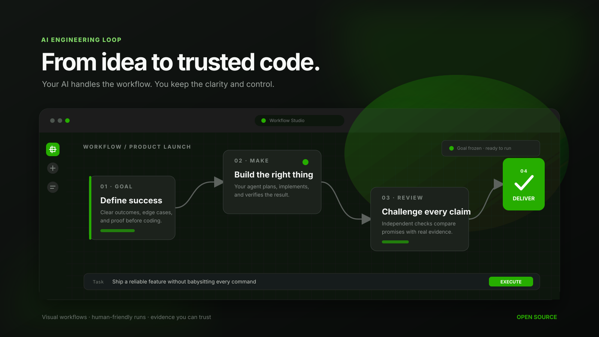

<div align="center">

# AI Engineering Loop

### From idea to trusted code—without babysitting every command.

Give your AI agent a goal. It plans the work, builds it, checks itself, challenges the result, and prepares a safe delivery. You get a visual workflow and a clear history instead of a wall of terminal output.

[](https://www.npmjs.com/package/ai-engineering-loop)
[](https://github.com/egagofur/ai-engineering-loop/releases)
[](LICENSE)

[Get started](#get-started-in-a-minute) · [See what it does](#one-workspace-from-idea-to-delivery) · [Open Workflow Studio](#meet-workflow-studio) · [Read the docs](core/)

</div>

[](docs/images/studio-hero.svg)

## Software delivery that feels simple

AI coding tools are fast, but important details can disappear between the prompt, the code, and the final answer. AI Engineering Loop gives every task one calm, repeatable path:

| You want | The Loop handles |
|---|---|
| **A clear outcome** | Turns the request into an agreed Goal before code changes |
| **Less supervision** | Guides your agent through planning, building, and checking |
| **Honest progress** | Shows what is ready, running, blocked, or waiting for approval |
| **Fewer surprises** | Tests happy paths, edge cases, and failure cases |
| **A trustworthy result** | Compares every claim with real evidence before delivery |
| **A useful history** | Keeps searchable Runs, decisions, artifacts, and proof |

You stay in control of the product decisions. Your AI agent takes care of the repetitive engineering ceremony.

## Get started in a minute

Install it in any project:

```bash
npx ai-engineering-loop init
```

Then tell your coding agent:

> Use AI Engineering Loop to build this feature: **your idea here**

That is the intended experience. You do not need to memorize the internal commands—the agent can operate the loop for you.

Want the visual workspace?

```bash
npx ai-engineering-loop studio
```

Workflow Studio opens locally in your browser. Your project and run evidence stay on your machine.

On first setup, `.ai-engineering-loop/` is added to your project’s `.gitignore` so plans and Run evidence stay private by default. Want to share that context with your team? Simply remove that line from `.gitignore`.

## Meet Workflow Studio

Workflow Studio makes agent work feel like a product, not a terminal session.

### Build workflows visually

- Connect steps on an open canvas
- Add the next step directly from any node
- Rename nodes in place without breaking their identity
- Select, move, duplicate, or delete groups of nodes
- Turn selected steps into independent Loop Groups
- Label repeat and continue paths in plain language
- Import and export workflow JSON safely
- Create your own prompt-powered Agent nodes

### Start with a Goal—not a vague prompt

Write the task in plain language, add the outcomes that matter, and **Freeze** the Goal when it is ready. The agent cannot quietly move the finish line after work begins.

### Follow every Run

Runs have human-friendly names instead of cryptic hashes. Search previous work, open any Run as a read-only workflow, and see exactly where it stopped.

Select a node to inspect its real **Input**, **Output**, **Evidence**, and timeline. The canvas shows the actual status of every step, so completed work, failures, approvals, and waiting nodes are easy to understand.

### Continue with your AI agent

Use **Copy for AI Agent** to create a ready-to-use handoff for the selected Run. The agent continues with the same Goal, workflow, and evidence instead of starting from scratch.

If the agent needs clarification, its questions can appear inside Workflow Studio. You answer them there, and the answer stays attached to the Run.

### Repeat only the steps that need another pass

Create multiple independent Loop Groups in one workflow:

- Select the steps that belong together
- Choose where the loop starts and where the decision happens
- Give repeat and continue paths clear labels such as `NO · RETRY` and `YES · CONTINUE`
- Set a maximum number of passes
- Follow a separate `Iteration 2 / 3` counter for each group

When a loop reaches its limit, Workflow Studio pauses for approval. You can allow one focused extra pass, continue with the current evidence, or stop the Run safely. Nested and overlapping loops stay disabled so the workflow remains easy to read.

### Execute with confidence

The Execute button lives beside the workflow trigger. A Run starts only when the Goal, workflow, mode, and safety checks are ready.

> **New in v1.9.0:** Run Checkout, AI Agent handoff, live Run questions, and Multiple Loop Groups. [See the release](https://github.com/egagofur/ai-engineering-loop/releases/tag/v1.9.0).

## One workspace from idea to delivery

The experience is organized into four simple moments:

1. **Specify** — agree on what success and failure look like.
2. **Make** — let the agent investigate, plan, and build.
3. **Review** — verify the result and challenge unsupported claims.
4. **Deliver** — ask for human approval before publishing.

Under the hood, these moments use eight evidence-backed stages. The rigor is there when you need it, but it does not have to dominate the experience.

`Specify (stages 0-1)` → `Make (stages 2-4)` → `Review (stages 5-7)` → `Deliver (stage 8)`

## Bring your own AI agent

AI Engineering Loop is designed to work with the tools developers already use:

- **Claude Code**
- **Grok CLI**
- **Gemini / Antigravity**
- Other agent hosts that can read project instructions and run local commands

The project includes ready-to-use skills and reviewer roles for supported hosts. Each host follows the same Goal, verification, review, and approval rules.

## Create workflows that fit your team

Start from a built-in workflow or make your own:

- Product feature
- Bug fix
- Security review
- Repository audit
- Refactor
- Custom prompt-powered Agent workflow

Custom Agents can reference approved capabilities, MCP connections, input artifacts, and output formats. They do not receive hidden shell, filesystem, network, or secret access.

## Safety without the scary dashboard

The Loop keeps a few promises:

- **Nothing ships only because an AI says “done.”**
- **Goals are frozen before implementation.**
- **Verification records the real command and result.**
- **A Devil’s Advocate challenges the work before the Judge decides.**
- **Sensitive context is bounded and redacted.**
- **Publishing in assisted mode needs human approval.**
- **The browser never silently runs arbitrary shell commands.**

Choose the level of autonomy that feels right:

| Mode | Best for |
|---|---|
| **Report only** | Explore a codebase without changing it |
| **Assisted** | Everyday work with human approval before delivery |
| **Unattended** | Trusted automation with stricter isolation and limits |

Assisted mode is the default. Unattended mode stays off until you deliberately enable it.

## For people who want the controls

The friendly workflow sits on top of a complete local CLI. You can inspect recipes, budgets, evidence, nodes, gates, policies, and handoffs whenever you need to.

<details>
<summary><strong>Show common CLI commands</strong></summary>

```bash
# Project setup and health
npx ai-engineering-loop init
npx ai-engineering-loop status
npx ai-engineering-loop doctor

# Start work
npx ai-engineering-loop run "describe the task"
npx ai-engineering-loop studio

# Explore workflows
npx ai-engineering-loop recipe list
npx ai-engineering-loop recipe simulate default --mode assisted

# Inspect the active Run
npx ai-engineering-loop state --json
npx ai-engineering-loop node status

# Emergency stop and resume
npx ai-engineering-loop budget pause
npx ai-engineering-loop budget resume
```

See the [`core/`](core/) documentation for the full runtime, evidence, recipe, security, and adapter contracts.

</details>

## Works locally, delivers anywhere

Your living project context and Run evidence are stored under `.ai-engineering-loop/` and kept out of normal commits by default. You can remove its `.gitignore` entry whenever you want to share that context. Delivery adapters support:

- Standard Git
- GitHub
- GitLab
- Custom team workflows

The same engineering flow stays consistent even when teams use different delivery tools.

## Why open source?

The rules that decide whether AI-generated work is trustworthy should be inspectable. AI Engineering Loop keeps its schemas, safety policies, verification logic, recipes, and agent prompts in the repository.

No hidden cloud control plane is required. No project source is uploaded by Workflow Studio.

## Documentation

- [Workflow Studio](core/local-workflow-studio.md)
- [Workflow recipes](core/workflow-recipes.md)
- [Runtime safety](core/runtime-safety.md)
- [Verification](core/verification-loop.md)
- [Controlled workflow runtime](core/controlled-workflow-runtime.md)
- [Security](SECURITY.md)
- [Support](SUPPORT.md)

## Contributing

Ideas, workflow recipes, bug reports, and pull requests are welcome. Start with an issue or open a focused PR with a clear explanation of the user outcome.

```bash
npm test
npm run doctor
```

## License

MIT © [Ega Gofur](https://github.com/egagofur)

<div align="center">

**Let the agent handle the process. Keep your attention on the product.**

</div>
