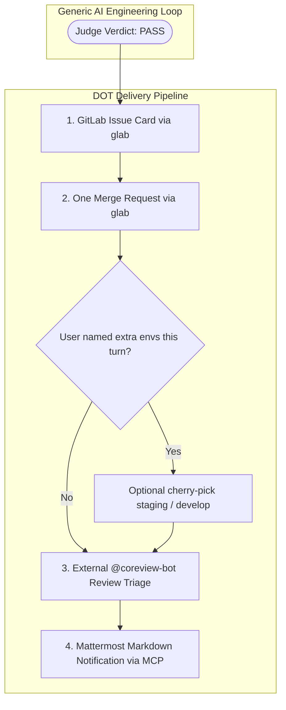

# DOT Ecosystem Delivery Adapter

## 1. Overview & Architecture

The **DOT Delivery Adapter** connects the generic [AI Engineering Loop](../../README.md) to DOT's delivery tools (GitLab, multi-branch, Coreview, Mattermost).

The generic engineering loop guarantees that code is correct, verified, and adversarially tested. The DOT adapter is responsible for downstream release engineering, collaboration tools, issue tracking, and multi-environment synchronization.

---

## 2. Adapter Modules

The DOT adapter is organized into four dedicated specification modules:

1. **[GitLab Integration (`gitlab.md`)](gitlab.md)**:
   - CLI automation with `glab`.
   - Standardized issue card templates with actual vs expected tables and QA testing steps.
   - Standardized MR descriptions linking issue IDs and change summaries.
2. **[Topic branch and optional propagate (`multi-branch.md`)](multi-branch.md)**:
   - Unrelated HEAD (`main` / `develop` / `staging` / other ticket): new `type/name` branch.
   - Related `feat/…` or `fix/…`: stay. One MR. Do not open three MRs.
   - Base: `origin/develop` when develop is in use (default branch is `develop`), including when HEAD is `main`. HEAD being `main` does not override an in-use `develop` default. `origin/main` only when develop is unused leftover (default branch is `main` / `master`). Do not force leftover develop.
   - Cherry-pick extra envs only if the user named them this turn. Chat `setuju` is not propagate.
3. **[Coreview External Reviewer Triage (`coreview.md`)](coreview.md)**:
   - Ingestion of `@coreview-bot` automated PR comments.
   - Mandatory Phase 8 Triage reporting gate before Mattermost dispatch.
   - Rigorous evaluation of bot suggestions into `VALID` (fix on the same topic MR; do not cherry-pick unless the user named extra envs this turn) vs `HALU` (false positive pushback) using principles from `gitlab-mr-feedback` and `receiving-code-review`.
4. **[Mattermost Notifications (`mattermost.md`)](mattermost.md)**:
   - Repository-to-channel resolution using persistent configuration.
   - MCP `mattermost_send_message` dispatch with mandatory `from: "AI Agent"` attribution.
   - Environment-tagged Markdown blocks (`[MR DEV]`, `[MR STAGING]`, `[MR MAIN]`) formatted with strict **`no-ai-slop`** human-written standards.

---

## 3. Official DOT Engineering Skills Integration

This adapter composes the DOT skill suite. `task-impact-inquiry` ships in this package (`adapters/dot/skills/task-impact-inquiry/`) and `sync-hosts` upserts it to Claude, Grok, and Gemini. Other DOT skills (router, workflow) still update-if-exists only.

On a DOT repo (`adapter_type: dot`), **run `ai-engineering-loop`**, not the old 9-phase `dot-dev-workflow`, as the engineering OS. Stage 1 grill **includes** `task-impact-inquiry`. Do not run a second interview. After Judge `PASS`, Stage 8 is `dot-dev-workflow` delivery (GitLab, cherry-pick, Coreview, Mattermost). Canonical copies: `adapters/dot/skills/`. See `core/grill-policy.md`.

| Skill | Primary Role & Governance |
| :--- | :--- |
| **`ai-engineering-loop`** | Engineering OS (Stages 0-7). Use this for DOT bugfix/feature/refactor. |
| **`dot-dev-workflow`** | Stage 8 delivery only after Judge PASS. Not a parallel engineering loop. |
| **`dot-dev-skill-router`** | Routes commit-bound DOT work to `ai-engineering-loop`, then Stage 8. |
| **`task-impact-inquiry`** | Business blast radius (lifecycle sketch, four pillars, ASCII picture). Canonical: `adapters/dot/skills/task-impact-inquiry/`. Host copies: `~/.claude/skills/`, `~/.grok/skills/`, `~/.gemini/config/skills/`. Fills Stage 1 grill; impact-only stops after the matrix. Not a parallel OS. |
| **`backend-development`** | Framework-agnostic backend guidelines (clean naming, database queries, security, error handling). |
| **`backend-safety-guardrails`** | 6 architectural backend safety invariants (queue bypass, BigInt, status recalculation loops). |
| **`devils-advocate`** | Legacy DOT pre-commit skill. On AEL, Stages 6-7 are package Devil's Advocate + Judge. Do not re-run this skill after Judge PASS. |
| **`requesting-code-review`** | Optional peer-review dispatch. AEL Judge is the pre-commit gate. |
| **`receiving-code-review`** | Technical rigor in evaluating review feedback without blind compliance. |
| **`gitlab-mr-feedback`** | GitLab API patterns and thread resolution on MR discussions. |
| **`auto-mr-issue`** | Automated issue, MR creation, and Mattermost Markdown formatting. |
| **`no-ai-slop`** | Human-written, crisp, active-voice release notes without AI puffery. |

---

## 4. Separation of Concerns

| Generic Core Responsibility | DOT Adapter Responsibility |
|---|---|
| Goal Contract & Acceptance Criteria | GitLab Issue Card drafting |
| Unit testing, typecheck, lint, build | Commands from `.ai-engineering-loop/verification.md` |
| Internal Devil's Advocate Review | External `@coreview-bot` triage on GitLab MRs |
| Judge verdict & completion certificate | Multi-environment cherry-picking & branch synchronization |
| Evidence collection & finding logs | Mattermost channel notifications & MR link delivery |
