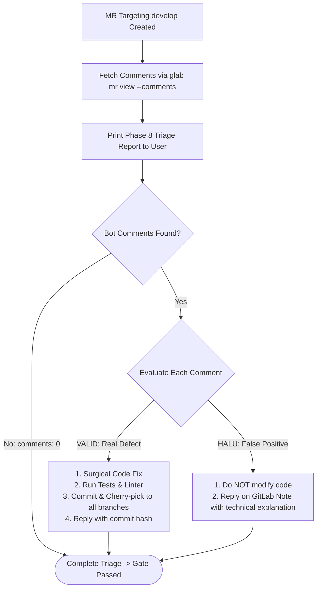

# DOT Adapter: Coreview Review Triage (`@coreview-bot`)

## 1. Overview & Role of Coreview

In the DOT ecosystem, `@coreview-bot` operates as an external, company-level automated code reviewer attached to GitLab Merge Requests (specifically MRs targeting `develop`).

> [!IMPORTANT]
> **GATE sebelum Phase 9 (Mattermost Dispatch)**:
> Dilarang mengirim Mattermost sebelum hasil `glab mr view --comments` **tercetak di pesan ke user**.
> Jika `comments: 0`, triage kosong tetap wajib dilaporkan sebagai bukti bahwa pengecekan bot telah dilakukan secara riil.
> 
> Selalu cetak laporan triage dengan format:
> ```text
> Phase 8 Triage
> MR: !<id>
> Command: glab mr view <id> --comments
> Comments: <n>
> Valid: <list atau none>
> Halu: <list atau none>
> Action: <none | fix | reply>
> ```

---

## 2. Coreview Triage Workflow

Mengikuti panduan dari skill `gitlab-mr-feedback` dan `receiving-code-review` (verifikasi teknis menyeluruh sebelum implementasi, tanpa *performative agreement*).



---

## 3. Step 1: Fetching Bot Comments

After pushing the MR targeting `develop` (`[MR DEV]`), inspect the review comments posted by the bot:

```bash
glab mr view <mr-id> --comments --repo <repo>
```

---

## 4. Step 2: Rigorous Evaluation Protocol

Every Coreview comment must be categorized into one of two paths:

### Case A: Feedback is VALID (Real Issue)
- **Criteria**:
  - Uncovered a real type mismatch or potential runtime `undefined` / `null` exception.
  - Identified an unhandled timezone conversion or unused import/variable.
  - Highlighted a genuine performance or concurrency risk.
- **Action Plan**:
  1. Apply the fix surgically to the local working branch.
  2. Re-run all unit tests and static analysis:
     ```bash
     # commands from .ai-engineering-loop/verification.md
     npx jest
     npx tsc --noEmit
     ```
  3. Commit and push the fix to the branch:
     ```bash
     git commit -m "fix(coreview): resolve <issue summary>"
     git push origin <branch-name>
     ```
  4. Cherry-pick the new fix commit to all other active environment branches (`main`, `staging`).
  5. Post a resolution reply directly **inside the bot's discussion thread**:
     ```bash
     # Get discussion_id: glab api "projects/:fullpath/merge_requests/<mr-id>/discussions"
     glab api "projects/:fullpath/merge_requests/<mr-id>/discussions/<discussion_id>/notes" \
       -X POST \
       -F "body=Fixed in commit <commit-hash>: <technical explanation of the resolution>"
     ```

### Case B: Feedback is HALU (False Positive / Intended Architecture)
- **Criteria**:
  - The bot suggests calling an API, library method, or hook that does not exist in the codebase or standard library.
  - The bot flags intentional architecture or established framework patterns as "errors".
  - The bot proposes invalid TypeScript syntax or breaks existing type contracts.
  - The bot misinterprets domain-specific business logic already agreed in the Goal Contract.
- **Action Plan**:
  1. **DO NOT modify any code.**
  2. Post a polite, evidence-backed technical rebuttal directly **inside the bot's discussion thread**:
     ```bash
     # Get discussion_id: glab api "projects/:fullpath/merge_requests/<mr-id>/discussions"
     glab api "projects/:fullpath/merge_requests/<mr-id>/discussions/<discussion_id>/notes" \
       -X POST \
       -F "body=Terima kasih atas masukannya @coreview-bot. <detailed technical explanation with file citations>."
     ```

---

## 5. Anti-Pattern: Blind Compliance

Agents must **never** rewrite working, verified code solely because an automated review bot posted a comment. If the bot's suggestion violates the [Goal Contract](../../core/goal-contract.md) or introduces broken dependencies, it MUST be triaged as `HALU` with evidence.
