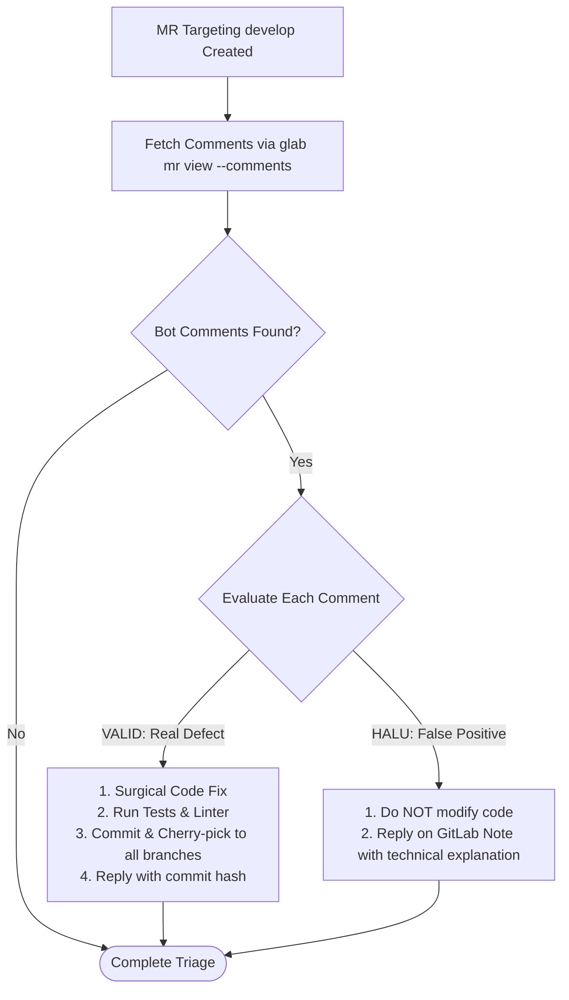

# DOT Adapter: Coreview Review Triage (`@coreview-bot`)

## 1. Overview & Role of Coreview

In the DOT ecosystem, `@coreview-bot` operates as an external, company-level automated code reviewer attached to GitLab Merge Requests (specifically MRs targeting `develop`).

> [!IMPORTANT]
> **We do not have access to `@coreview-bot`'s internal rules or heuristics.**
> - Do not attempt to reverse-engineer or invent Coreview behavior.
> - Treat Coreview strictly as an external reviewer providing asynchronous critique on GitLab MRs.
> - Evaluate its comments objectively through the lens of the repository's ground truth.

---

## 2. Coreview Triage Workflow



---

## 3. Step 1: Fetching Bot Comments

After pushing the MR targeting `develop` (`[MR DEV]`), inspect the review comments posted by the bot:

```bash
glab mr view <mr-id> --comments --repo <repo>
```

---

## 4. Step 2: Rigorous Evaluation Protocol

Every Coreview comment must be categorized into one of two paths:

### Case A: Feedback is VALID (Real Issue)
- **Criteria**:
  - Uncovered a real type mismatch or potential runtime `undefined` / `null` exception.
  - Identified an unhandled timezone conversion or unused import/variable.
  - Highlighted a genuine performance or concurrency risk.
- **Action Plan**:
  1. Apply the fix surgically to the local working branch.
  2. Re-run all unit tests and static analysis:
     ```bash
     npx jest --testPathIgnorePatterns="dotify-api"
     npx tsc --noEmit
     ```
  3. Commit and push the fix to the branch:
     ```bash
     git commit -m "fix(coreview): resolve <issue summary>"
     git push origin <branch-name>
     ```
  4. Cherry-pick the new fix commit to all other active environment branches (`main`, `staging`).
  5. Post a resolution note on GitLab citing the commit hash:
     ```bash
     glab mr note <mr-id> --repo <repo> -m "Fixed in commit <commit-hash>: <technical explanation of the resolution>"
     ```

### Case B: Feedback is HALU (False Positive / Hallucinated)
- **Criteria**:
  - The bot suggests calling an API, library method, or hook that does not exist in the codebase or standard library.
  - The bot flags intentional architecture or established framework patterns as "errors".
  - The bot proposes invalid TypeScript syntax or breaks existing type contracts.
  - The bot misinterprets domain-specific business logic already agreed in the Goal Contract.
- **Action Plan**:
  1. **DO NOT modify any code.**
  2. Post a polite, evidence-backed technical rebuttal on the GitLab note explaining why the suggestion is invalid:
     ```bash
     glab mr note <mr-id> --repo <repo> -m "Feedback is invalid / false positive: <detailed technical explanation with file citations>."
     ```

---

## 5. Anti-Pattern: Blind Compliance

Agents must **never** rewrite working, verified code solely because an automated review bot posted a comment. If the bot's suggestion violates the [Goal Contract](file:///Users/egagofur/Development/work/ai-engineering-loop/core/goal-contract.md) or introduces broken dependencies, it MUST be triaged as `HALU` with evidence.
