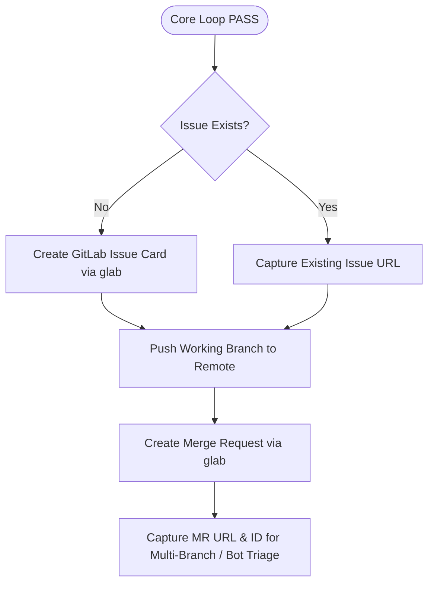

# DOT Adapter: GitLab Integration (`glab`)

## 1. Purpose & Scope

This module encapsulates all GitLab operations within the DOT ecosystem. Once a code change has successfully passed the [Generic AI Engineering Loop](file:///Users/egagofur/Development/work/ai-engineering-loop/README.md), this adapter automates issue tracking and Merge Request (MR) generation via the `glab` CLI.

---

## 2. Step-by-Step GitLab Workflow



---

## 3. Step 1: Git Context & Remote Repository Inspection

1. Check current branch and git status:
   ```bash
   git status
   git log -n 5 --stat
   ```
2. Determine repository path and remote URLs:
   ```bash
   git remote -v
   ```
3. Push working branch to remote:
   ```bash
   git push -u origin <branch-name>
   ```

---

## 4. Step 2: GitLab Issue Card Generation

### A. Check for Existing Issue
- Look for an existing issue number in:
  - Branch name (e.g. `issue-235-...`, `fix/300-...`).
  - Commit message (e.g. `fix(#300): ...`, `Refs #300`).
  - Search open issues:
    ```bash
    glab issue list --repo <repo> --search "<keywords>"
    ```

### B. Create Standardized Issue Card
If no issue exists, create one in the designated tracker (e.g. `dot-system/dotify-new` for central Dotify tracker, or the target repository):

```bash
glab issue create \
  --repo <target-issue-repo> \
  --title "[<Module>] <Summary>" \
  --description "<Issue Description Markdown>" \
  --assignee <username> \
  --label "Ready to Test" \
  --yes
```

#### Standardized Issue Description Template:
```markdown
## Issue Description
[Detailed description of the bug or feature, explaining root cause and business impact.]

## Scope
- [x] [Component 1 modified]
- [x] [Component 2 modified]
- [x] [Unit tests added in path/to/test.ts]

## Testing Steps
1. Login as [User Role / Email].
2. Navigate to [Target Menu / URL].
3. Perform [Action e.g. submit attendance, clock-in, approve overtime].
4. Verify [Expected Result].

## Expectation
| Kondisi / Skenario | Logika Lama (Sebelum) | Logika Baru (Sesudah) |
|---|---|---|
| [Scenario 1] | [Incorrect status/error] | [Correct expected status] |
| [Scenario 2] | [Unhandled edge case] | [Properly handled] |

## Notes
- Base branch: `<target-base>`
- Verified with automated test suites.
```

---

## 5. Step 3: Base Merge Request Creation

Create the primary Merge Request targeting the base branch (`main`, `staging`, or `develop`):

```bash
glab mr create \
  --repo <current-repo> \
  --source-branch <branch-name> \
  --target-branch <target-branch> \
  --title "<type>(<scope>): <short description>" \
  --description "<MR Description Markdown>" \
  --assignee <username> \
  --yes
```

#### Standardized MR Description Template:
```markdown
## Issue
<GitLab Issue URL>

## What did you do?
- <Concise point 1 explaining root cause fix>
- <Concise point 2 explaining edge cases handled>
- <Concise point 3 mentioning unit test coverage>

## Screenshot / Video
<!-- Attach screenshots, terminal test logs, or UI captures if available -->

## Note for Deployment
- No manual database migrations required. (or specify migration command if applicable)
```
