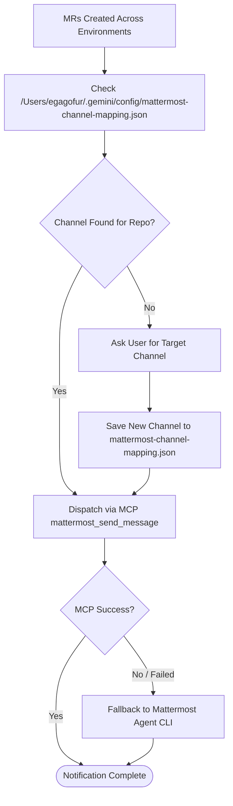

# DOT Adapter: Mattermost Notifications

## 1. Overview & Objectives

The **Mattermost Notification Module** formats final release notes and automatically delivers them to designated team channels via the Mattermost MCP server or CLI.

This provides seamless visibility to QA engineers, product managers, and reviewers upon successful completion of the delivery pipeline.

---

## 2. Channel Resolution & Dispatch Flow



---

## 3. Mandatory Attribution Rule

> [!IMPORTANT]
> When sending messages or replying to threads on Mattermost (via MCP tools or CLI):
> - **Always** include the sender attribution parameter (`from: "AI Agent"`) in MCP calls:
>   ```json
>   {
>     "channel": "internal-dotify",
>     "message": "...",
>     "from": "AI Agent"
>   }
>   ```
> - **Always** include the CLI flag (`--from "AI Agent"`) in CLI calls:
>   ```bash
>   node /Users/egagofur/Development/work/kontribusi/mattermost-agent/dist/cli/index.js send <channel> "<message>" --from "AI Agent"
>   ```
> - Do not omit or suppress sender attribution.

---

## 4. Channel Resolution Logic

1. **Inspect Mapping File**:
   Read `/Users/egagofur/.gemini/config/mattermost-channel-mapping.json` using the current repository name or project slug (e.g. `dotify-new`, `dotify-api`, `dot-system/dotify-new`).
2. **Channel Found**:
   Dispatch message to the mapped channel name (e.g. `"internal-dotify"`).
3. **Channel Unknown**:
   - **DO NOT GUESS** or broadcast to arbitrary channels.
   - Ask the user to specify the target channel for this repository.
   - Immediately persist the user's answer into `/Users/egagofur/.gemini/config/mattermost-channel-mapping.json` for future automated runs.

---

## 5. Standardized Mattermost Markdown Report Format (No AI Slop + Human-Written + PIC at End)

Render separate, ready-to-copy Markdown blocks for every generated Merge Request using a simple, clean, and punchy format:

```text
[MR <ENV_TAG>] <MR_URL>
Changes log 
- <Poin 1: Apa yang diperbaiki / fitur apa yang aktif>
- <Poin 2: Perubahan mekanisme/perilaku sistem secara gamblang>
- <Poin 3: Proteksi regresi atau pengujian yang ditambahkan>

cc: <PIC>
```

### Formatting & Writing Rules (Prinsip `no-ai-slop`):
- **DILARANG MENGGUNAKAN HEADING MARKDOWN (`#`, `##`, `###`, `####`)**: Gunakan teks polos agar font di Mattermost tidak membesar secara berlebihan.
- **Format Sederhana Tanpa Metadata Bertele-tele**: Jangan menyertakan tabel metadata yang panjang (seperti Branch, Repo, Status Verifikasi). Cukup link MR dan list `Changes log`.
- **Sertakan PIC di Akhir Pesan**: Ambil PIC dari file konfigurasi `mattermost-channel-mapping.json`. Jika belum ada, tanyakan kepada user dan simpan ke file mapping. Tambahkan `cc: <PIC>` di baris paling bawah.
- **Gunakan Bahasa Manusia yang Lugas & Konkret**:
  - ✅ **Awali dengan kata kerja aktif**: *"Memperbaiki..."*, *"Memigrasikan..."*, *"Menjaga..."*, *"Menambahkan..."*, *"Mengubah..."*.
  - ❌ **Dilarang kata-kata AI Slop / Puffery**: `secara komprehensif`, `memastikan keakuratan`, `memfasilitasi`, `menyelaraskan alur`, `mengoptimalkan proses`, `solusi yang kokoh/robust`, `meningkatkan efisiensi`, `telah berhasil diimplementasikan`.
  - ❌ **Dilarang raw code / AST leakage**: Jangan menyebut nama variabel internal atau query mentah (misal `user.type.hasNormalHours`, `attendanceConfirmationPagination Prisma query`). Jelaskan dampak fungsionalnya.

### Environment Tags:
- `[MR DEV]`: Merge Request targeting `develop`.
- `[MR STAGING]`: Merge Request targeting `staging`.
- `[MR MAIN]` (or `[MR PROD]`): Merge Request targeting `main` / `master`.

### Contoh Penerapan Nyata:

```text
[MR DEV] https://gitlab.dot.co.id/playground/bikin-rindu-tools-v2/-/merge_requests/108
Changes log 
- Memperbaiki crash halaman dashboard di Safari setelah login akibat QuotaExceededError pada localStorage.
- Memigrasikan penyimpanan cache browser ke IndexedDB (idb-keyval) sehingga kapasitas penyimpanan leluasa dan tidak memblokir main thread.
- Menjaga synchronous script di head untuk preferensi tema agar tidak terjadi kedipan tampilan (FOUC).
- Menambahkan auto-migration otomatis untuk memindahkan data lama dari localStorage ke IndexedDB sekaligus membebaskan kuota browser.

cc: @hanaaaca

[MR DEV] https://gitlab.dot.co.id/dot-system/dotify-new/-/merge_requests/963
Changes log 
- Mengubah status entitas yang tadinya APPROVED menjadi NEED APPROVAL otomatis saat project atau jam kerjanya diedit.
- Memperbaiki sinkronisasi worker agar periode absensi berjalan (UNCONFIRMED) tetap diproses saat admin mengedit data.
- Menjaga entitas lain yang sudah disetujui PM di periode yang sama agar status approval-nya tidak ter-reset.
- Menambahkan unit test untuk skenario lembur multi-entry harian.

cc: @ulfa.mufida
```
