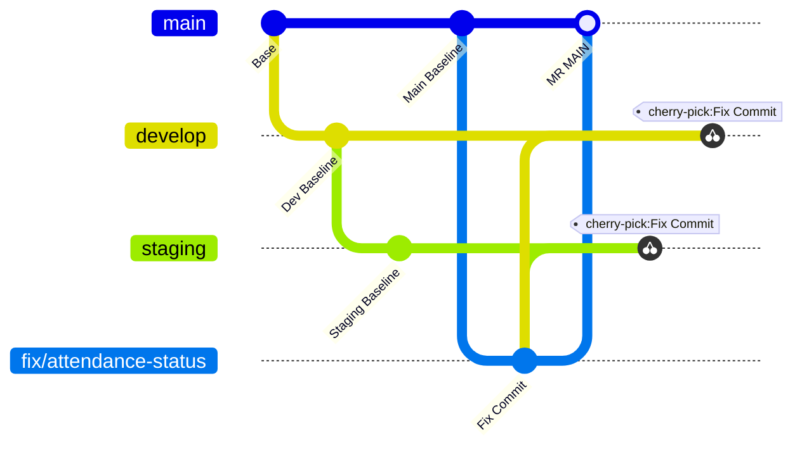

# DOT Adapter: Multi-Branch Propagation

## 1. Overview & Branching Hierarchy

DOT Indonesia repositories maintain synchronized deployments across multiple environments. A typical repository uses three primary target branches:



1. **`main` / `master`** $\rightarrow$ Production Environment (`[MR MAIN]` / `[MR PROD]`).
2. **`staging`** $\rightarrow$ Staging / QA Testing Environment (`[MR STAGING]`).
3. **`develop`** $\rightarrow$ Active Development & Bot Review Environment (`[MR DEV]`).

---

## 2. Multi-Branch Propagation Workflow

Once the fix is committed on the source branch and the initial Merge Request is created, propagate the exact fix commit to all secondary environments.

### Step-by-Step Execution:

For each secondary target environment (`staging`, `develop`):

```bash
# 1. Fetch latest changes from remote
git fetch origin <target-env>

# 2. Checkout a new dedicated branch tracking the remote environment
git checkout -b <branch-name>-<target-env> origin/<target-env>

# 3. Cherry-pick the verified fix commit
git cherry-pick <commit-hash>

# 4. Resolve any target-specific differences and verify tests pass
# commands from .ai-engineering-loop/verification.md
npx jest
npx tsc --noEmit

# 5. Push the branch to remote
git push -u origin <branch-name>-<target-env>

# 6. Create the environment-specific Merge Request via glab
glab mr create \
  --repo <repo> \
  --source-branch <branch-name>-<target-env> \
  --target-branch <target-env> \
  --title "<type>(<scope>): <short description>" \
  --description "<MR Description Markdown>" \
  --assignee <username> \
  --yes
```

---

## 3. Conflict & Environment Discrepancy Handling

1. **Clean Cherry-Picks**:
   Because the [generic AI Engineering Loop](../../README.md) enforces surgical, minimal diffs, cherry-picking should be clean in >95% of cases.
2. **Merge Conflicts**:
   If a merge conflict occurs due to divergent code between `main` and `develop`:
   - Resolve the conflict surgically preserving the fix semantics.
   - Run the full test suite (`npx jest`) to prove correctness on the specific environment.
   - Complete the cherry-pick:
     ```bash
     git add <resolved-files>
     git cherry-pick --continue
     ```
3. **Environment-Specific Tests**:
   Always execute deterministic test suites (`npx jest`, `npx tsc --noEmit`) on each branch prior to pushing.
