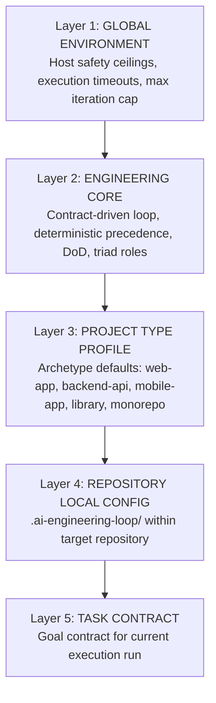

# Configuration Precedence & Resolution Engine

## 1. Overview & Core Principle

To support multiple repositories, varied tech stacks, and disparate team conventions without fragmenting or forking the generic core, the AI Engineering Loop implements a **5-Layer Configuration Hierarchy**.

The core principle of configuration resolution is:

> **The more specific layer refines or overrides the broader layer, provided it does not violate immutable safety boundaries.**



---

## 2. The 5 Hierarchy Layers

### Layer 1: Global Environment
- **Authority**: System / Host Platform (Antigravity IDE, CLI environment).
- **Scope**: Hard safety constraints (e.g. `ABSOLUTE_MAX_ITERATIONS = 5`, maximum command timeout = 10m, safe file path boundaries).
- **Overridability**: **Immutable**. Cannot be overridden by downstream layers.

### Layer 2: Engineering Core (`core/`)
- **Authority**: AI Engineering Operating System specification.
- **Scope**: Mandatory engineering invariants:
  - No code changes without a formalized [Goal Contract](file:///Users/egagofur/Development/work/ai-engineering-loop/core/goal-contract.md).
  - Deterministic checks must pass 100% before adversarial review.
  - Review findings require reproducible evidence (Level 1–3) to be valid.
  - Only the [Judge Agent](file:///Users/egagofur/Development/work/ai-engineering-loop/agents/judge.md) can issue a `PASS` verdict.
- **Overridability**: Invariant. Downstream layers cannot skip verification or eliminate agent roles.

### Layer 3: Project Type Profile (`profiles/`)
- **Authority**: Archetype profiles (`web-app`, `backend-api`, `mobile-app`, `library`, `monorepo`).
- **Scope**: Tech stack defaults:
  - Relevant review domains for Devil's Advocate (e.g. activating database transaction reviews for APIs, responsive UI checks for web apps).
  - Typical testing patterns (e.g. Jest/Vitest for web, pytest/go test for backend, XCTest/Espresso for mobile).
- **Overridability**: Overridden by explicit repository-local configuration.

### Layer 4: Repository-Local Configuration (`.ai-engineering-loop/`)
- **Authority**: Target repository checked-in files.
- **Scope**: Repository-specific ground truth:
  - Exact test/lint/typecheck commands in `verification.md`.
  - Layer definitions in `architecture.md`.
  - Architectural constraints and forbidden patterns in `conventions.md`.
  - Configured delivery adapter (DOT, GitHub, GitLab) in `adapter.md`.
- **Overridability**: Overrides Layer 3 defaults for this specific codebase.

### Layer 5: Task Contract
- **Authority**: Current execution request / prompt.
- **Scope**: Task-specific Acceptance Criteria (AC-1..N), out-of-scope boundaries, and temporary overrides.
- **Overridability**: Scoped strictly to the active task run.

---

## 3. Precedence Resolution Algorithm

When the engine executes a task, it resolves configuration keys using the following lookup order:

```python
def resolve_config_key(key: str, context: ExecutionContext) -> Any:
    # 1. Task Contract (highest priority for task-scoped values)
    if context.task_contract.has(key):
        return context.task_contract.get(key)

    # 2. Repository Local Configuration (.ai-engineering-loop/)
    if context.repo_config.has(key):
        return context.repo_config.get(key)

    # 3. Project Type Profile (profiles/<type>.md)
    if context.profile.has(key):
        return context.profile.get(key)

    # 4. Engineering Core Defaults
    if context.core_defaults.has(key):
        return context.core_defaults.get(key)

    # 5. Global Environment Safety
    return context.global_env.get(key)
```

---

## 4. Conflict Resolution & Escalation Rules

1. **Refinement vs Contradiction**:
   - *Refinement (Allowed)*: Profile says "Run unit tests"; Repo config specifies `npx jest --config jest.unit.json`. $\rightarrow$ Valid refinement.
   - *Contradiction (Escalate)*: Core requires deterministic verification; Task contract requests skipping tests to merge faster. $\rightarrow$ **Forbidden**. The engine rejects the override and flags a policy violation.
2. **Unresolvable Contradictions**:
   - If repository configuration directly contradicts an established platform invariant (e.g. a command requires root sudo or drops protected tables), the system halts and triggers [Human Escalation](file:///Users/egagofur/Development/work/ai-engineering-loop/core/escalation-policy.md).
