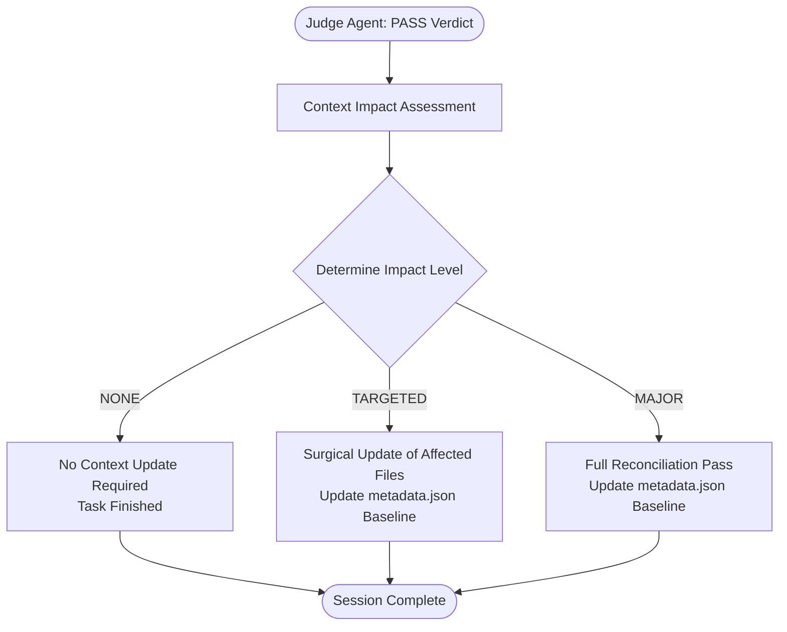

# Context Impact Assessment Specification

## 1. Overview & Core Philosophy

In the AI Engineering Loop, project context (`.ai-engineering-loop/`) is a **Living Knowledge Base** that reflects the current engineering reality of the repository.

However, performing an expensive full-repository re-analysis after every completed task introduces unnecessary overhead and latency. Most software changes (e.g. fixing a UI bug, tweaking validation logic, or adding a test) do **not** alter the project's architecture, conventions, or build commands.

The **Context Impact Assessment** is a lightweight, evidence-based evaluation executed immediately after a task reaches a **Judge `PASS`** verdict, determining whether and how `.ai-engineering-loop/` should be updated before closing the session.



---

## 2. The 3 Context Impact Levels

```text
┌─────────────────┬──────────────────────────────────────────┬─────────────────────────────┐
│ Impact Level    │ Task Characteristics                     │ System Action               │
├─────────────────┼──────────────────────────────────────────┼─────────────────────────────┤
│ NONE            │ Isolated bugfix, UI tweak, test-only,   │ NO-OP (Skip refresh)        │
│ (80-90% tasks)  │ small refactor preserving architecture.  │                             │
├─────────────────┼──────────────────────────────────────────┼─────────────────────────────┤
│ TARGETED        │ Manifest scripts changed, new module,    │ Surgically reconcile only   │
│ (10-15% tasks)  │ new team invariant, new CI config.       │ affected files in context.  │
├─────────────────┼──────────────────────────────────────────┼─────────────────────────────┤
│ MAJOR           │ Framework migration, database redesign,  │ Full repository context     │
│ (< 5% tasks)    │ monorepo restructuring, auth overhaul.   │ reconciliation pass.        │
└─────────────────┴──────────────────────────────────────────┴─────────────────────────────┘
```

---

## 3. Impact Level Classification Matrix

### Level 1: `NONE` (No Action)
- **Criteria**:
  - The task diff only touches existing function bodies, templates, styles, or test files.
  - Zero new external dependencies or build scripts introduced.
  - Directory hierarchy and layer boundaries remain unchanged.
- **Examples**:
  - Fixing a typo or styling bug in `src/components/Button.tsx`.
  - Fixing an off-by-one error in `src/utils/date.ts`.
  - Adding edge-case unit tests to `user.service.spec.ts`.
- **Action**: Output `Context Impact: NONE`. Do not modify `.ai-engineering-loop/`.

---

### Level 2: `TARGETED` (Surgical Reconciliation)
- **Criteria**:
  - A specific dimension of project knowledge has become stale due to the diff.
- **Mapping by File / Diff Signal**:

| Changed Area in Task Diff | Stale Context File | Targeted Action |
|---|---|---|
| `package.json` / `go.mod` scripts modified | `verification.md`, `config.md` | Update test/build/lint command entries |
| New folder in `src/modules/` or `apps/` | `architecture.md` | Add module summary and boundary notes |
| New global error class or lint rule added | `conventions.md` | Document new pattern or forbidden rule |
| `.gitlab-ci.yml` / `.github/workflows` edited | `adapter.md` | Update CI/CD workflow references |

- **Action**: Reconcile *only* the affected markdown file(s) and update `metadata.json` baseline.

---

### Level 3: `MAJOR` (Full Context Reconciliation)
- **Criteria**:
  - The diff introduces a paradigm shift in how the codebase compiles, runs, or organizes architecture.
- **Examples**:
  - Migrating from Next.js Pages Router to App Router.
  - Converting a single repository into a Turborepo/pnpm monorepo.
  - Migrating ORM from TypeORM to Prisma or replacing REST with tRPC.
  - Introducing a complete OAuth2 / JWT authentication architecture.
- **Action**: Execute full 5-pass reconciliation, update all relevant `.ai-engineering-loop/` files, and establish a new baseline in `metadata.json`.

---

## 4. Devil's Advocate & Judge Drift Interaction

During task review, the [Devil's Advocate](file:///Users/egagofur/Development/work/ai-engineering-loop/agents/devil-advocate.md) may discover that the codebase has drifted from the documented architecture:

> *Example Review Finding*: "The implementation assumes `user-service` connects directly to Postgres, but the codebase has migrated to an asynchronous event queue in `src/events/`."

### Triage Protocol:
1. The **Devil's Advocate** flags the discrepancy in its Finding Ledger.
2. The **Judge Agent** evaluates the finding:
   - If `VALID`: The Judge flags an active architectural drift.
   - Upon task completion, the Context Impact Assessment automatically triggers a `TARGETED` or `MAJOR` refresh of `architecture.md` to capture the new reality.
   - If `INVALID` (e.g. reviewer hallucination), no context update occurs.

---

## 5. Output Reporting Protocol

Every completed engineering run concludes with a **Context Impact Summary**:

### Example: Impact Level NONE
```text
Project Context Assessment
- Impact Level: NONE
- Reason: Surgical bugfix in src/services/attendance.ts preserved existing architecture and commands.
- Action: Context refresh SKIPPED (context is CURRENT).
```

### Example: Impact Level TARGETED
```text
Project Context Assessment
- Impact Level: TARGETED
- Reason: Added Redis client and caching layer in src/infrastructure/cache.ts.
- Affected Context Files:
  - architecture.md (added Cache Layer boundary)
  - config.md (added Redis dependency)
- Action: Surgically updated architecture.md and config.md.
- Baseline: Updated to commit a1b2c3d.
```
