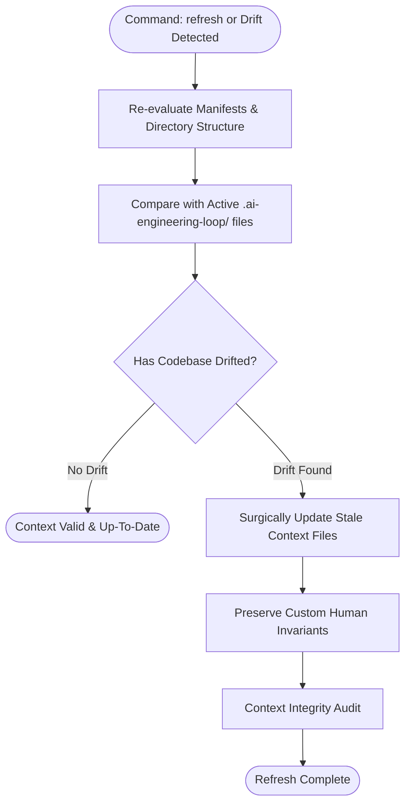

# Context Refresh & Health Policy Specification

## 1. Overview & CLI Operations

The AI Engineering Loop provides deterministic health monitoring and drift refresh capabilities through two explicit CLI commands:

- `npx ai-engineering-loop status` (or `/ai-engineering-loop status`): Inspects `.ai-engineering-loop/` integrity and reports context readiness.
- `npx ai-engineering-loop refresh` (or `/ai-engineering-loop refresh`): Re-evaluates repository manifests, detects drift, and updates stale context non-destructively.

---

## 2. Drift Dimensions Monitored

| Dimension | Checked Artifacts | Drift Indicator | Action |
|---|---|---|---|
| **Package Manager / Scripts** | `package.json`, `pnpm-lock.yaml`, `go.mod` | Scripts renamed, new test runner installed | Update `verification.md` |
| **Workspace Packages** | `pnpm-workspace.yaml`, `apps/`, `packages/` | New package folder added or deleted | Update `architecture.md` and `config.md` |
| **Tech Stack / Versions** | Manifest dependencies | Major framework upgrade (e.g. Next.js 13 $\rightarrow$ 14) | Update `config.md` |
| **VCS & Integrations** | Remote URLs, CI workflows (`.github/`, `.gitlab-ci.yml`) | Migration from GitLab to GitHub Actions | Update `adapter.md` |

---

## 3. Non-Destructive Update Rules

1. **Surgical Updates**: Only update sections that have demonstrably drifted.
2. **Preserve User Annotations**: Retain custom rules and forbidden patterns added manually by developers in `conventions.md`.
3. **Idempotency**: Running `refresh` when no drift exists produces zero file modifications.
