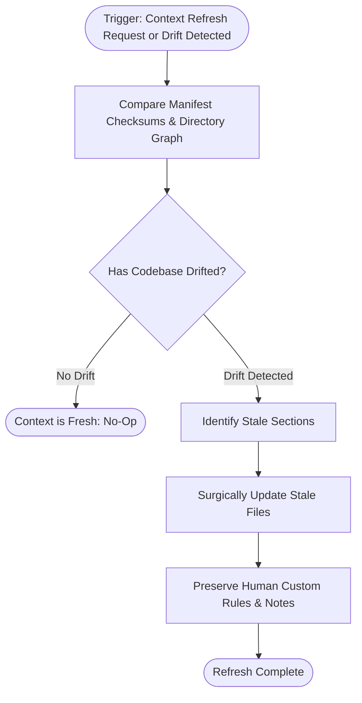

# Context Refresh Policy Specification

## 1. Overview & Objectives

Over the lifecycle of a software project, architecture, dependencies, and verification commands evolve:
- A new package manager may replace an older one (`npm` $\rightarrow$ `pnpm`).
- A new microservice or package may be added to a monorepo.
- Test runners may migrate (e.g. Jest $\rightarrow$ Vitest).

The **Context Refresh Policy** defines how the AI Engineering Loop detects **context drift** and updates `.ai-engineering-loop/` non-destructively without erasing manual customizations made by human engineers.

---

## 2. Refresh Triggers

A context refresh is initiated under any of the following conditions:

1. **Explicit User Command**: The user requests a refresh (e.g. *"refresh project context"*, *"re-analyze repository"*, *"update .ai-engineering-loop"*).
2. **Manifest Mutation**: The agent observes that package manifests (`package.json`, `go.mod`, `Cargo.toml`) have changed materially since context generation.
3. **New Architectural Directory**: New top-level application or package directories (e.g. `apps/new-service`) are detected.
4. **Verification Failure Due to Outdated Command**: A command in `verification.md` fails because a script or binary name changed.

---

## 3. Drift Detection Mechanism

The agent compares current codebase facts against the active `.ai-engineering-loop/` files across four dimensions:

| Dimension | Checked Artifacts | Drift Indicator | Action |
|---|---|---|---|
| **Package Manager / Scripts** | `package.json`, `pnpm-lock.yaml`, `go.mod` | Scripts renamed, new test runner installed | Update `verification.md` |
| **Workspace Packages** | `pnpm-workspace.yaml`, `apps/`, `packages/` | New package folder added or deleted | Update `architecture.md` and `config.md` |
| **Tech Stack / Versions** | Manifest dependencies | Major framework upgrade (e.g. Next.js 13 $\rightarrow$ 14) | Update `config.md` |
| **VCS & Integrations** | Remote URLs, CI workflows (`.github/`, `.gitlab-ci.yml`) | Migration from GitLab to GitHub Actions | Update `adapter.md` |

---

## 4. Non-Destructive Update Rules

When updating `.ai-engineering-loop/`, the agent MUST follow these strict preservation rules:

1. **Section-Level Surgical Edits**: Only update sections that have demonstrably drifted. Do not regenerate the entire directory from scratch.
2. **Preserve User Annotations**: If a human engineer added custom notes, forbidden rules, or specific instructions in `conventions.md` or `architecture.md`, those notes must be retained.
3. **Evidence-Backed Attribution**: When updating an entry, include a brief commit or file reference explaining why the section was updated (e.g. *"Updated `test_unit` command following migration to Vitest in PR #42"*).
4. **Discrepancy Reporting**: If an existing context file contains a deliberate custom rule that seems unusual (e.g. an intentional override skipping a broken legacy test), the agent must not remove it without flagging it to the user.
