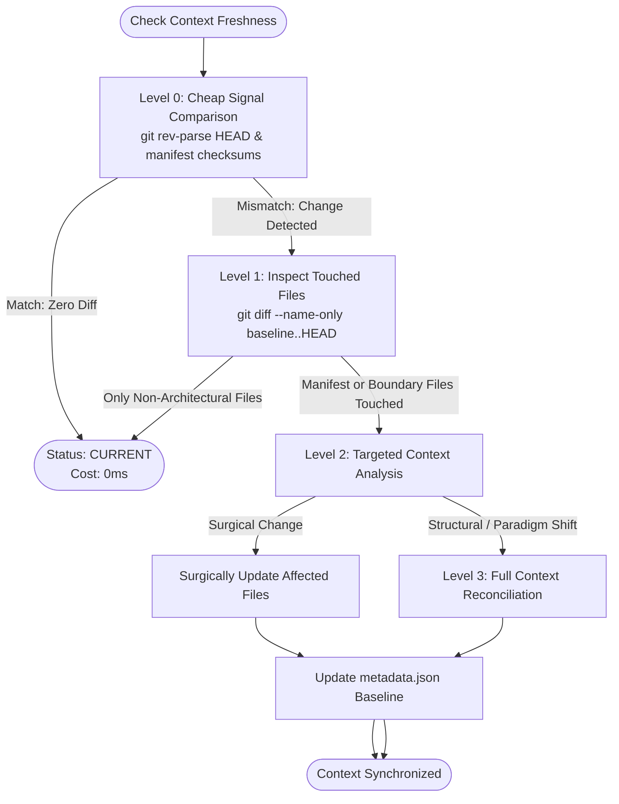

# Context Refresh & Living Baseline Policy

## 1. Overview & Core Laws

The **Context Refresh Policy** defines how the AI Engineering Loop maintains living synchronization between `.ai-engineering-loop/` and the underlying repository without unnecessary computation.

### Three Fundamental Invariants:
1. **Reconciliation, Not Destruction**: Refresh never deletes `.ai-engineering-loop/` or wipes manual developer notes. It reconciles existing context against current repository facts.
2. **Progressive Cost**: Drift detection uses cheap signals (Level 0) before performing deeper inspections (Levels 1–3).
3. **Strict Context Isolation**:
   - **Project Context (`.ai-engineering-loop/`)**: Shared, living architectural rules and verification commands.
   - **Task Context**: Ephemeral task contracts, specific diff scopes, and temporary session data.
   - **Loop State**: Transient retry counters, test outputs, and finding signatures.
   *Task execution histories and conversational chat transcripts are NEVER dumped into `.ai-engineering-loop/`.*

---

## 2. Context Baseline Metadata (`metadata.json`)

To enable deterministic, instant drift checks without requiring a database, the `.ai-engineering-loop/` directory maintains a lightweight `metadata.json` baseline:

```json
{
  "contextVersion": "1.0.0",
  "generatedAt": "2026-08-25T10:00:00Z",
  "repositoryRevision": "7f8b9a1c2d3e...",
  "projectProfile": "backend-api",
  "manifestChecksums": {
    "package.json": "a3f5b2c1...",
    "go.mod": "e9b8c7d6..."
  },
  "lastReconciliation": {
    "timestamp": "2026-08-25T10:00:00Z",
    "trigger": "init",
    "impact": "INITIAL_BOOTSTRAP"
  }
}
```

---

## 3. Progressive Multi-Level Drift Detection Hierarchy

Drift detection ascends through four progressively detailed levels:



### Level 0: Instant Cheap Signal Comparison (Cost: ~0ms)
- Compare current `git rev-parse HEAD` and manifest hashes (`package.json`, `go.mod`, etc.) against `metadata.json`.
- If identical $\rightarrow$ status is **`CURRENT`**. Stop immediately.

### Level 1: Touched File Scope Inspection (Cost: ~50ms)
- If HEAD has advanced (e.g. other developers merged commits), inspect touched file paths via `git diff --name-only <baseline>..HEAD`.
- If all changed files are isolated application logic, styles, or tests (e.g. `src/views/Profile.vue`, `src/utils/math.ts`) $\rightarrow$ status is **`CURRENT`**.

### Level 2: Targeted Context Analysis (Cost: ~200ms)
- If manifests, top-level directory layouts, or CI workflows were touched, re-read those specific files and reconcile only the corresponding markdown files (`verification.md`, `architecture.md`, `adapter.md`).

### Level 3: Full Repository Context Reconciliation (Cost: ~1-2s)
- Triggered only when major structural shifts occur (e.g. monorepo workspace addition, framework migration). Re-runs full 5-pass discovery.

---

## 4. Pre-Task Drift Gate

Before starting any task, the engine executes the Pre-Task Drift Gate:

```text
Load Project Context
       ↓
Level 0 / Level 1 Drift Check
       ↓
┌────────────────────────────────────────┐
│ CURRENT                                │
│ → Proceed directly to Goal Contract    │
│                                        │
│ STALE (Drift Detected)                 │
│ → Reconcile affected context files     │
│ → Update baseline metadata             │
│ → Proceed to Goal Contract             │
└────────────────────────────────────────┘
```

This guarantees that an AI agent never writes code using outdated build commands or obsolete architectural assumptions.

---

## 5. Scheduled Maintenance / Heartbeat

- **Role**: A secondary safety net catching external repository modifications (e.g. external PRs merged without the loop).
- **Protocol**: Executes Level 0/Level 1 drift detection periodically (e.g. every 12h or 24h).
- **Rule**: If Level 0/1 detects no material changes, it **STOPS immediately**. It NEVER performs a full re-analysis simply because a timer fired.

---

## 6. Anti-Infinite-Loop Safeguard

To prevent circular update loops (`Task -> Refresh -> Context Changes -> Refresh -> ...`):
1. Every refresh operation concludes by updating `metadata.json` to the current repository revision (`repositoryRevision = git rev-parse HEAD`).
2. Setting the new baseline guarantees that subsequent Level 0 checks evaluate to `CURRENT`.
3. The refresh engine is strictly **idempotent**: running `refresh` multiple times on unchanged code produces 0 file modifications and terminates with *"Context is already current"*.
