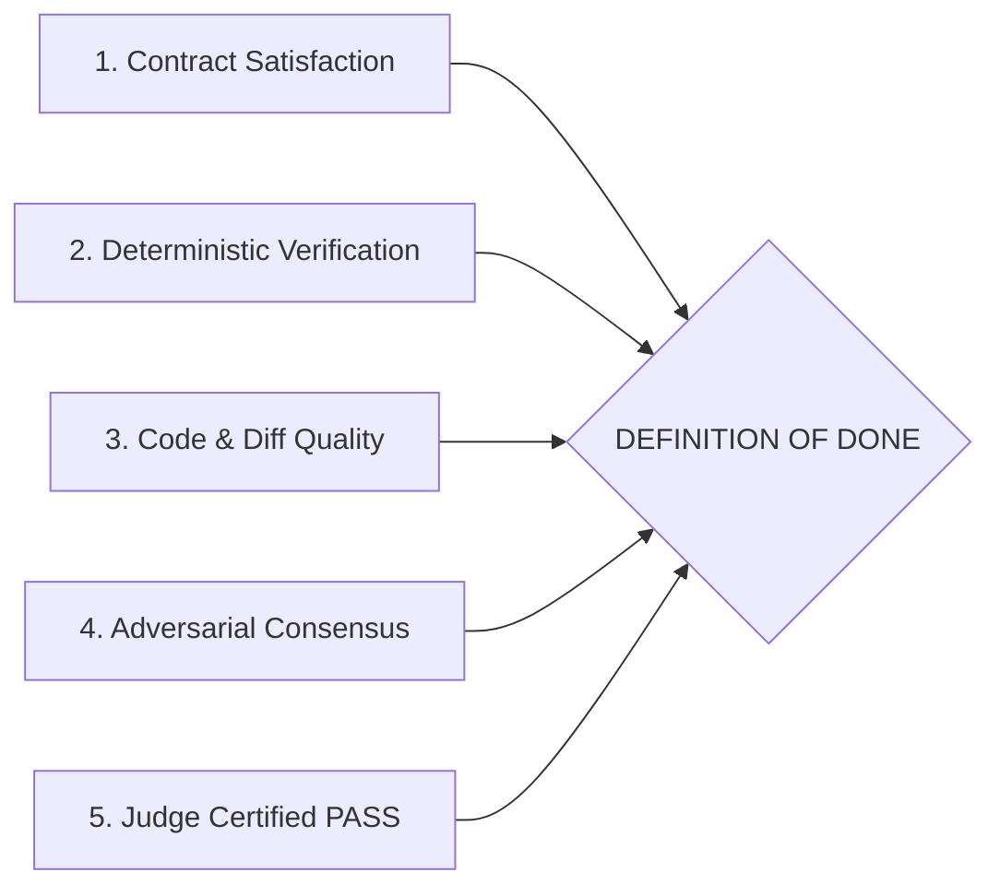

# Definition of Done (DoD) Specification

## 1. Principle & Definition

The **Definition of Done (DoD)** is the objective, non-negotiable threshold that must be satisfied before any task can be declared complete, merged, or handed off to downstream delivery pipelines.

The core question answered by the DoD is not:
> *"Does the agent believe it solved the problem?"*

The DoD answers:
> **"Has the system provided verifiable proof satisfying all technical and business criteria?"**

---

## 2. The 5 Pillars of Done

To achieve a `DONE` status, an engineering task must satisfy all five pillars without exception:

### Pillar 1: Contract Satisfaction
- 100% of Acceptance Criteria defined in the [Goal Contract](file:///Users/egagofur/Development/work/ai-engineering-loop/core/goal-contract.md) are demonstrably met.
- Zero out-of-scope files or unauthorized modules were modified.
- All technical constraints (e.g. backward compatibility, no unapproved dependencies) are preserved.

### Pillar 2: Deterministic Verification
- **Unit & Regression Tests**: 100% passing tests (0 failures, 0 errors, 0 unresolved broken suites).
- **Static Typing / Compilation**: 0 type errors (e.g. `tsc --noEmit` exits with `0`).
- **Linting & Code Formatting**: 0 lint errors on modified files.
- **Build / Packaging**: Project builds successfully without warnings treated as errors.

### Pillar 3: Code & Diff Quality
- **Surgical Diff**: Smallest coherent diff that completely resolves the issue.
- **Architecture Preservation**: Adheres to existing repository patterns, naming conventions, and layer boundaries.
- **Seams & TDD**: Tests sit at Goal Contract seams; red then green (`policies/tdd-policy.md`).
- **Glossary**: New names match `.ai-engineering-loop/glossary.md`.
- **Zero Placeholders**: No stubbed functions, empty `catch` blocks, speculative `TODO` comments, or orphaned dead code.
- **Null & Boundary Safety**: Explicit handling of `null`, `undefined`, empty collections, and error paths.

### Pillar 4: Adversarial Consensus
- Independent [Devil's Advocate Review](file:///Users/egagofur/Development/work/ai-engineering-loop/agents/devil-advocate.md) has been executed across all 6 core review domains.
- **Zero Unresolved Blocking Findings**: No open `SEV-1 (Critical)` or `SEV-2 (High)` findings.
- **Evidence-Based Triage**: Every raised finding has been formally triaged with reproducible evidence as `VALID` (and resolved in code) or `INVALID` (with technical proof of why it is a false positive).

### Pillar 5: Judge Certified PASS
- The [Judge Agent](file:///Users/egagofur/Development/work/ai-engineering-loop/agents/judge.md) has evaluated the complete execution trace, verified the evidence, confirmed no-progress limits were not violated, and issued a signed `PASS` verdict.

---

## 3. DoD Verification Checklist

Every iteration concluding in a `PASS` verdict must produce a DoD verification table:

| Checklist Item | Required Standard | Status | Evidence Reference |
|---|---|:---:|---|
| Acceptance Criteria AC-1..N | 100% satisfied | ✅ | Unit test file & assertion links |
| Test Suite Execution | 0 failures, 0 errors | ✅ | Test command output log |
| Typecheck / Compiler | Exit code 0 | ✅ | Typecheck log |
| Linter | 0 errors on diff | ✅ | Linter log |
| Build Check | Exit code 0 | ✅ | Build command log |
| Adversarial Review | Completed across 6 topics | ✅ | Review findings artifact |
| Blocking Findings (Sev 1/2)| 0 unresolved | ✅ | Triage summary table |
| Judge Verdict | PASS | ✅ | Judge evaluation report |

---

## 4. Rejection Criteria

An engineering run MUST be rejected and flagged as `FAIL` or `BLOCKED` if any of the following occur:

1. **Unverified Claims**: The agent states that a test passed or feature works without providing command outputs or test code.
2. **Post-Hoc Goal Shifting**: Modifying Acceptance Criteria to match buggy behavior instead of fixing the bug.
3. **Suppressed Errors**: Adding `@ts-ignore`, `eslint-disable`, empty catch blocks, or skipping tests to force a green build.
4. **Unresolved Critical Findings**: Attempting to declare completion while a `SEV-1` or `SEV-2` finding from the Devil's Advocate remains open.
