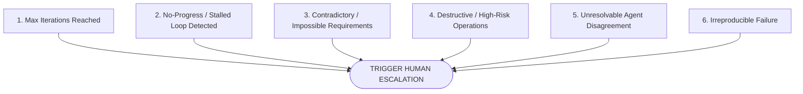

# Escalation Policy Specification

## 1. Principle & Core Philosophy

The primary objective of the AI Engineering Loop is:

> **Reliable Autonomy, NOT Maximum Autonomy at All Costs.**

An autonomous agent that attempts to push through deep architectural ambiguities, unresolvable test regressions, or unverified business rules creates significant technical debt and risk.

The **Escalation Policy** defines deterministic thresholds where autonomous iteration MUST immediately halt and hand off control to a human engineer with an actionable, evidence-backed report.

---

## 2. Mandatory Escalation Triggers

An agent MUST trigger Human Escalation when any of the following conditions are met:



### Trigger 1: Maximum Iterations Reached
- **Condition**: The system has completed `MAX_ITERATIONS` (default: 3) and unresolved blocking findings (`SEV-1` or `SEV-2`) still persist.
- **Rationale**: Prolonged retries indicate either an incorrect fundamental strategy or a hidden architectural obstacle.

### Trigger 2: No-Progress / Stagnation Detected
- **Condition**: Two consecutive iterations produce identical or semantically equivalent finding signatures without demonstrable code convergence (see [No-Progress Policy](file:///Users/egagofur/Development/work/ai-engineering-loop/policies/no-progress-policy.md)).
- **Rationale**: Prevents thrashing where the agent modifies code without resolving the underlying flaw.

### Trigger 3: Contradictory or Inconsistent Acceptance Criteria
- **Condition**: Satisfying Criterion A mathematically or logically violates Criterion B, or the Goal Contract contradicts an established database or platform invariant.
- **Rationale**: Agents must not invent business compromises without stakeholder input.

### Trigger 4: High-Risk / Destructive Operations
- **Condition**: The fix requires dropping production database columns, bypassing authentication/authorization layers, modifying global build pipelines, or upgrading major core dependencies.
- **Rationale**: High blast-radius architectural changes require human authorization.

### Trigger 5: Irreproducible Failure
- **Condition**: The agent is unable to reproduce the reported bug deterministically after exhaustive environment inspection and logging.
- **Rationale**: Prevents speculative fixes for phantom issues.

### Trigger 6: Unresolvable Triad Disagreement
- **Condition**: The Maker Agent and Devil's Advocate Agent present mutually incompatible, evidence-backed arguments regarding architecture or domain rules, and the Judge cannot definitively resolve it from existing codebase artifacts.
- **Rationale**: Domain-level business tradeoffs belong to product owners and human engineers.

---

## 3. Human Escalation Report Protocol

When escalating, the agent must NEVER output a generic message like *"I am stuck."*

Instead, it must render an **Actionable Escalation Report** following this structured template:

```markdown
# ⚠️ Human Escalation Triggered

## 1. Escalation Reason
**Trigger**: [e.g. Trigger 2: No-Progress / Stalled Loop Detected]
**Iteration**: [e.g. Iteration 3 of 3]

## 2. Summary of Attempted Solutions
- **Iteration 1**: [What was tried, what failed]
- **Iteration 2**: [What was modified, what remained unresolved]
- **Iteration 3**: [Current diff and exact blocker]

## 3. Core Technical Blocker
[Precise explanation of why the agent cannot proceed autonomously. Include code locations, conflicting constraints, or missing domain knowledge.]

## 4. Active Findings Ledger
| Finding ID | Severity | Category | Location | State | Summary |
|---|---|---|---|---|---|
| SEC-001 | HIGH | Security | `src/auth/guard.ts:42` | TRIAGED_VALID | IDOR risk when tenant ID is omitted |

## 5. Specific Decision Required from Human
[State 2-3 concrete options for the human to choose from, or a focused question]:
- **Option A**: [Description of architectural option A and tradeoffs]
- **Option B**: [Description of architectural option B and tradeoffs]

## 6. Current Workspace State
- **Branch**: `<current-working-branch>`
- **Uncommitted Changes**: [Clean / Stashed / In-flight diff]
- **Deterministic Test Status**: [Passing / Failing with command logs]
```

---

## 4. Resumption Protocol

Once the human engineer provides guidance or amends the [Goal Contract](file:///Users/egagofur/Development/work/ai-engineering-loop/core/goal-contract.md):
1. The iteration counter is reset: $K \leftarrow 1$.
2. The agent incorporates the human's decision into the Goal Contract constraints.
3. The loop resumes at the **Maker Agent** phase with clean validation.
