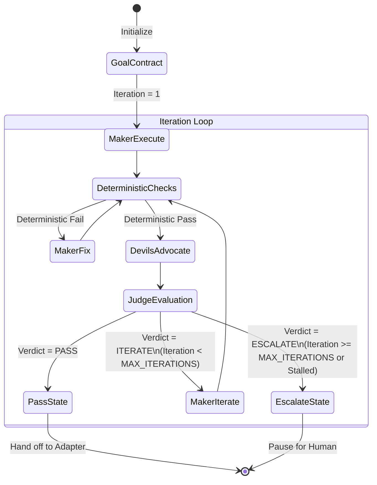
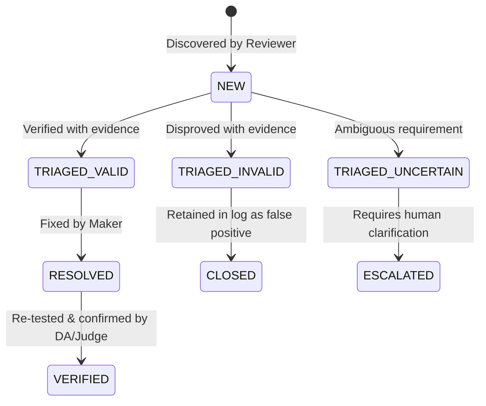

# Iteration Policy Specification

## 1. Overview & Objectives

The **Iteration Policy** governs autonomous retry loops within the AI Engineering Loop. When deterministic tests fail or the [Devil's Advocate](file:///Users/egagofur/Development/work/ai-engineering-loop/agents/devil-advocate.md) identifies valid blocking findings, the system initiates an **autonomous iteration cycle**.

The objective of this policy is to enable **reliable self-correction** while strictly guarding against infinite loops, cognitive drift, and resource exhaustion.

---

## 2. Iteration Limits & Configuration

```text
DEFAULT_MAX_ITERATIONS = 3
MIN_ITERATIONS = 1
MAX_ALLOWED_CEILING = 5
```

- **Default Cap**: An engineering run is allotted a maximum of **3 iterations** by default.
- **Configurability**: Projects or workflows may configure `MAX_ITERATIONS` between 1 and 5 in their runtime configuration or Goal Contract.
- **Hard Ceiling**: Under no circumstances may an agent loop beyond 5 iterations without human re-authorization.

---

## 3. The Autonomous Iteration Lifecycle



### Iteration State Machine Steps

1. **Cycle Start (Iteration $K$)**:
   - Increments iteration counter $K \leftarrow K + 1$.
   - Verifies $K \le \text{MAX\_ITERATIONS}$. If $K > \text{MAX\_ITERATIONS}$, immediately triggers `ESCALATE`.
2. **Maker Refinement**:
   - The [Maker Agent](file:///Users/egagofur/Development/work/ai-engineering-loop/agents/maker.md) receives the prior iteration's triaged findings and Judge directives.
   - Maker applies targeted code fixes and updates test suites.
3. **Deterministic Re-verification**:
   - All tests, typecheck, lint, and build checks are re-executed from scratch.
4. **Adversarial Differential Review**:
   - The [Devil's Advocate](file:///Users/egagofur/Development/work/ai-engineering-loop/agents/devil-advocate.md) evaluates the updated diff against previously raised findings and checks for new regressions.
5. **Judge Evaluation & Progression**:
   - The [Judge Agent](file:///Users/egagofur/Development/work/ai-engineering-loop/agents/judge.md) compares findings from Iteration $K$ with Iteration $K-1$.
   - If progress is verified and all criteria met $\rightarrow$ `PASS`.
   - If new valid findings emerge but progress is demonstrated $\rightarrow$ `ITERATE` (if $K < \text{MAX\_ITERATIONS}$).
   - If repeated findings or no progress detected $\rightarrow$ `ESCALATE`.

---

## 4. Finding State Transitions

Every finding generated during iteration must progress through an explicit state lifecycle:



| State | Definition | Next Permissible Action |
|---|---|---|
| `NEW` | Discovered by Devil's Advocate in current iteration | Judge / Maker triages against repository facts |
| `TRIAGED_VALID` | Confirmed real technical or contractual defect | Maker must apply code/test fix |
| `TRIAGED_INVALID` | Confirmed false positive / non-applicable suggestion | Closed; documented with explanation |
| `TRIAGED_UNCERTAIN` | Unclear business rule or contradictory requirement | Escalated to human user |
| `RESOLVED` | Maker has applied code fix and passing test | Re-evaluated by Devil's Advocate & Judge |
| `VERIFIED` | Confirmed completely resolved by Judge | Marked complete |

---

## 5. Iteration State Preservation

To maintain continuity across sub-agent calls or tool invocations, each iteration MUST update a standardized state record containing:

1. **Current Iteration Number** ($K / N$).
2. **Active Finding Ledger**: Complete list of all findings with their current state.
3. **Cumulative Code Diff**: Total changes relative to base branch.
4. **Deterministic Run Results**: Exit codes and timestamped test outcomes.
5. **No-Progress Hash**: Signatures of active findings for stagnation detection.
