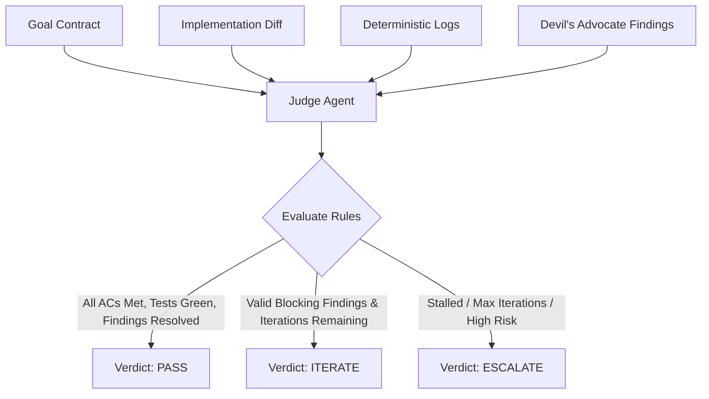

# Judge Policy Specification

## 1. Overview & Role Definition

The **Judge Agent** is the impartial arbiter of the AI Engineering Loop. In traditional workflows, either the author approves its own code (optimistic bias) or a reviewer blocks changes arbitrarily (nitpicking/hallucination).

The Judge Agent evaluates the complete matrix of:
1. The original [Goal Contract](file:///Users/egagofur/Development/work/ai-engineering-loop/core/goal-contract.md).
2. The surgical code implementation & diff.
3. The raw [Deterministic Verification](file:///Users/egagofur/Development/work/ai-engineering-loop/core/verification-loop.md) outputs (tests, typecheck, lint, build).
4. The [Devil's Advocate Review Findings](file:///Users/egagofur/Development/work/ai-engineering-loop/agents/devil-advocate.md) and Author's evidence/triage.
5. The [Iteration & No-Progress State](file:///Users/egagofur/Development/work/ai-engineering-loop/core/iteration-policy.md).



---

## 2. Evidence Evaluation Rules

The Judge does NOT blindly accept claims from either the Maker or the Devil's Advocate. Every statement is scrutinized according to the following evidentiary rules:

### Rule 1: Deterministic Precedence
If any deterministic check (unit tests, TypeScript compilation, linter, build) failed or was not executed, the Judge **CANNOT** issue a `PASS` verdict.

### Rule 2: Rejection of Unsubstantiated Nitpicks
A Devil's Advocate finding that:
- Relies on personal aesthetic preference (e.g. *"variable names could be shorter"*),
- Suggests speculative future-proofing abstractions not requested in the Goal Contract, or
- Misunderstands existing repository conventions,
must be declared **`INVALID`** by the Judge and discarded from blocking the build.

### Rule 3: Strict Severity Thresholds
- **SEV-1 (Critical)** and **SEV-2 (High)** findings: Must be resolved in code with passing tests before a `PASS` verdict can be granted.
- **SEV-3 (Medium)** and **SEV-4 (Low)** findings: May be accepted into an action items backlog if they do not violate any Acceptance Criteria in the Goal Contract.

### Rule 4: Verification of Author Triage
If the Maker Agent claims a finding is `INVALID` (e.g. *"The suggested API does not exist"*), the Judge verifies this claim against the repository before accepting the dismissal.

---

## 3. Verdict Computation Logic

```text
FUNCTION ComputeVerdict(Contract, Diff, DeterministicLogs, Findings, IterationState):
    IF DeterministicLogs.HasFailures() THEN
        RETURN ITERATE(reason="Deterministic verification gates failed")
    END IF

    IF IterationState.IsStalled() OR IterationState.CurrentIteration >= IterationState.MaxIterations THEN
        IF Findings.HasUnresolvedBlocking() THEN
            RETURN ESCALATE(reason="Max iterations reached with unresolved blocking findings")
        END IF
    END IF

    IF Contract.ViolatesConstraints(Diff) THEN
        RETURN ESCALATE(reason="Implementation violated technical constraints or modified out-of-scope files")
    END IF

    UnresolvedBlocking = Findings.GetUnresolved(severity IN [SEV_1, SEV_2])
    
    IF UnresolvedBlocking.Count == 0 THEN
        IF Contract.AllAcceptanceCriteriaVerified(DeterministicLogs) THEN
            RETURN PASS(summary="All criteria satisfied and verified with proof")
        ELSE
            RETURN ITERATE(reason="Missing deterministic proof for specific Acceptance Criteria")
        END IF
    ELSE
        RETURN ITERATE(reason="Unresolved blocking findings exist", findings=UnresolvedBlocking)
    END IF
```

---

## 4. Standardized Judge Verdict Report

Every evaluation concludes with a formal **Judge Verdict Artifact**:

```markdown
# ⚖️ Judge Evaluation Report

## 1. Executive Verdict
- **Verdict**: `[PASS | ITERATE | ESCALATE]`
- **Iteration**: `[K of N]`
- **Confidence**: `[HIGH | MEDIUM | LOW]`

## 2. Deterministic Verification Audit
| Gate | Command | Result | Status |
|---|---|---|:---:|
| Unit Tests | `npx jest --testPathIgnorePatterns="integration"` | 14 passed, 0 failed | ✅ PASS |
| Static Types | `npx tsc --noEmit` | Exit code 0 | ✅ PASS |
| Linter | `npx eslint --fix <files>` | 0 errors, 0 warnings | ✅ PASS |
| Build | `npm run build` | Exit code 0 | ✅ PASS |

## 3. Goal Contract Compliance Audit
| Acceptance Criterion | Verification Method | Status |
|---|---|:---:|
| AC-1: Correct attendance status calculation | `resolve-display-status.test.ts` | ✅ PASS |
| AC-2: Weekend & non-normal hours edge cases | `resolve-display-status.test.ts:L45` | ✅ PASS |
| AC-3: Backward compatibility preserved | Integration test suite | ✅ PASS |

## 4. Finding Triage & Resolution Matrix
| ID | Severity | Category | Reviewer Finding | Triage Status | Resolution Proof |
|---|---|---|---|:---:|---|
| COR-001 | HIGH | Correctness | Missing null check on overtimeNote | `VALID` | Fixed in `service.ts:L32`; tested in `service.test.ts` |
| SEC-001 | LOW | Security | Suggest sanitizing display status | `INVALID` | Display status is an enum internally generated, not user input |

## 5. Directives for Next Step
[If PASS: Hand off to Delivery Adapter.]
[If ITERATE: Explicit, numbered instructions for the Maker Agent.]
[If ESCALATE: Actionable human decision points.]
```
