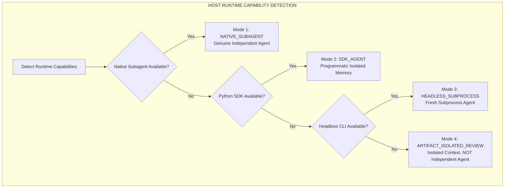
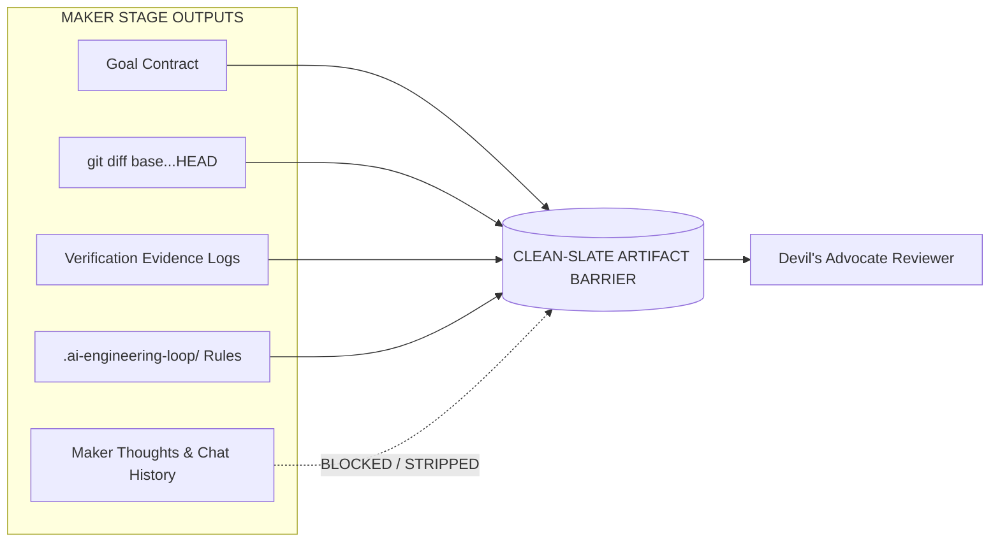

# Multi-Agent Orchestration & Adversarial Review Architecture

## 1. Overview & Core Distinctions

The AI Engineering Loop coordinates a multi-agent triad (**Maker**, **Devil's Advocate**, **Judge**) to deliver verifiable, regression-free software changes.

A critical design requirement is maintaining a strict distinction between:
1. **Context Isolation**: Stripping conversational history, author rationalizations, and intermediate scratchpad text so the review is evaluated purely on the diff and project contracts.
2. **Agent Independence**: Spawning a physically distinct LLM process or sub-agent instance with clean memory and independent reasoning weights.

> **Fundamental Invariant**:
> A Clean-Slate Artifact Barrier provides *context isolation*, but **must NOT** be described as an "independent sub-agent" when the same session executes the review.



---

## 2. 4-Tier Execution Priority & Runtime Modes

The orchestration layer detects and logs the active execution mode according to the following strict hierarchy:

| Priority | Execution Mode | Mechanism | True Agent Independence? | Logged Designation |
|:---:|---|---|:---:|---|
| **1** | **`NATIVE_SUBAGENT`** | Host runtime natively summons an independent sub-agent session. | **YES** | `Execution Mode: NATIVE_SUBAGENT (Independent Agent)` |
| **2** | **`SDK_AGENT`** | Programmatic instantiation via Python SDK (`google-antigravity.Agent`). | **YES** | `Execution Mode: SDK_AGENT (Independent Process & Context)` |
| **3** | **`HEADLESS_SUBPROCESS`** | Headless CLI agent spawned in a separate subprocess via `run_command`. | **YES** | `Execution Mode: HEADLESS_SUBPROCESS (Fresh Process)` |
| **4** | **`ARTIFACT_ISOLATED_REVIEW`** | Clean-Slate Artifact Isolation Barrier in single-agent session. | **NO** | `Execution Mode: ARTIFACT_ISOLATED_REVIEW (Isolated Review Context, Not Independent Agent Execution)` |

> [!IMPORTANT]
> When `ARTIFACT_ISOLATED_REVIEW` is used, the system **never** claims "independent sub-agent review" in delivery logs or audit artifacts. It is explicitly labeled as *isolated review context*.

---

## 3. The Clean-Slate Artifact Isolation Barrier

Regardless of whether Mode 1, 2, 3, or 4 is active, the Devil's Advocate **must only consume bounded, objective artifacts**:



### Context Payload Specification:
- **Included**:
  1. `Goal Contract`: Objective, Acceptance Criteria (AC-1..N), Technical Constraints, Out of Scope.
  2. `Project Context`: `.ai-engineering-loop/` (`architecture.md`, `conventions.md`, `verification.md`).
  3. `Pure Git Diff`: Raw patch (`git diff <base>...HEAD`).
  4. `Verification Evidence`: Execution logs, exit codes, and test counts.
  5. `Active Iteration Index & Prior Finding Signatures`: To verify resolution of previous issues.
- **Strictly Excluded**:
  1. Maker's internal reasoning, chain-of-thought, or justifications.
  2. Intermediate discarded attempts and scratchpad text.
  3. Conversational chat history.

---

## 4. Dual-Axis Finding Model

The Devil's Advocate categorizes findings along separate **Validity**, **Severity**, and **Disposition** axes. Severity is never conflated with reviewer disposition:

```json
{
  "iteration": 1,
  "executionMode": "ARTIFACT_ISOLATED_REVIEW",
  "diffHash": "95c97037",
  "findings": [
    {
      "id": "DA-01",
      "topic": "correctness",
      "validity": "VALID",
      "severity": "BLOCKER",
      "disposition": "STRONG",
      "location": "src/services/payment.ts#L42-L58",
      "acceptanceCriteria": "AC-2",
      "failureScenario": "Under concurrent requests with identical idempotency keys, duplicate ledger rows are inserted before the lock is acquired.",
      "reproduction": "Execute test_concurrent_idempotency_requests() with 5 parallel threads.",
      "evidence": "Observed missing SELECT FOR UPDATE in findByPaymentKey query.",
      "concreteAlternativeDiff": "```diff\n- const tx = await findByKey(key);\n+ const tx = await findByKeyWithLock(key, { mode: 'FOR UPDATE' });\n```"
    }
  ]
}
```

---

## 5. Judge Decision Matrix

The Judge Agent evaluates findings based primarily on **Validity + Severity**:

```text
┌─────────────────┬─────────────────┬────────────────────────────────────────────────────────┐
│ Validity        │ Severity        │ Judge Verdict & System Action                          │
├─────────────────┼─────────────────┼────────────────────────────────────────────────────────┤
│ VALID           │ BLOCKER / HIGH  │ ITERATE: Maker MUST apply fix diff and add test.       │
│ VALID           │ MEDIUM / LOW    │ ACCEPT / TRADEOFF: Merged; documented in MR notes.     │
│ INVALID         │ ANY             │ DISMISS: Hallucination / disproven; recorded signature. │
└─────────────────┴─────────────────┴────────────────────────────────────────────────────────┘
```

- **Invariant**: The reviewer's classification (`STRONG` / `ACCEPTABLE` / `WEAK`) **never overrides factual evidence**. An `INVALID` finding cannot block delivery. A `VALID + BLOCKER` finding unconditionally forces an iteration.
