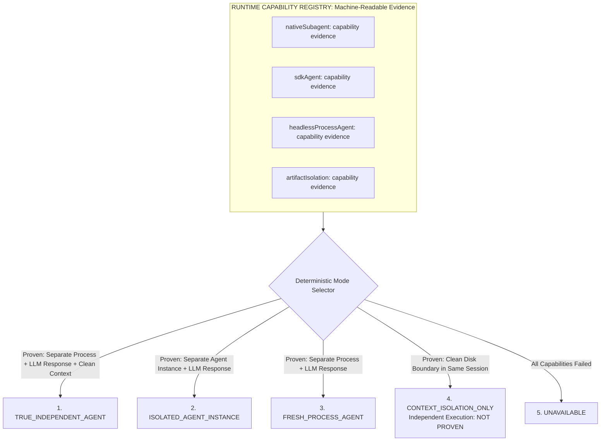

# Runtime Capability Registry & Execution-Mode Selection Specification

## 1. Overview & Foundational Laws

The AI Engineering Loop enforces strict honesty and evidence-based rigor regarding agent execution:

> **Core Law**:
> AI Engineering Loop must **NEVER** claim independent agent execution without runtime evidence of an actual separate LLM execution.

### Non-Negotiable Invariants:
1. **Documentation is NOT capability proof**: Mentioning `subagent: true` or referencing subagent documentation does not prove subagent execution.
2. **Configuration is NOT execution proof**: A YAML flag or config file is not evidence of a running agent.
3. **IPC existence is NOT agent execution proof**: The existence of an IPC binary (`agentapi`) or successful message dispatch (`send-message`) is an IPC capability, **NOT** an LLM agent execution capability.
4. **Conversation creation without model response is NOT an agent**: An empty thread ID without an actual captured LLM response is not execution proof.
5. **Persona simulation is NEVER an agent**: Switching roles within the same session is self-review, not independent adversarial review.
6. **Artifact isolation is strictly labeled**: When review is conducted within the same session via artifact boundaries, it is **strictly reported as `CONTEXT_ISOLATION_ONLY`** with `Independent LLM execution: NOT PROVEN`.



---

## 2. Standard 5 Execution Modes (Deterministic Priority)

| Priority | Mode Name | Requires Independent LLM Execution? | Condition for Selection |
|:---:|---|:---:|---|
| **1** | **`TRUE_INDEPENDENT_AGENT`** | **YES** | Separate child conversation/process exists **AND** actual LLM model response is produced **AND** conversational history is not inherited. |
| **2** | **`ISOLATED_AGENT_INSTANCE`** | **YES** | Separate conversation/agent instance exists with verified independent model execution. |
| **3** | **`FRESH_PROCESS_AGENT`** | **YES** | A separate OS process successfully executes an LLM agent with fresh context and returns a verified model response. |
| **4** | **`CONTEXT_ISOLATION_ONLY`** | **NO** | Clean-Slate Artifact Isolation Barrier in same session. Strips 100% of prompt history on disk. Guaranteed fallback. |
| **5** | **`UNAVAILABLE`** | **NO** | No review execution mechanism is available. |

---

## 3. Capability Evidence Contract

Every runtime candidate must produce a structured, verifiable Evidence Contract before it can be selected:

```json
{
  "mechanism": "antigravity-agentapi-new-conversation",
  "classification": "UNAVAILABLE",
  "available": false,
  "commandOrApi": "agentapi new-conversation",
  "result": "rpc error: project_id is required when providing project_env_config",
  "executionIdentity": "localhost:63821",
  "conversationId": "bb2ae0c2-9edb-44f6-b499-0313b45ef9b4",
  "parentConversationId": null,
  "childConversationId": null,
  "modelExecutionProven": false,
  "independentContextProven": false,
  "historyInherited": null,
  "isDocumentationOnly": false,
  "reason": "new-conversation reaches the Language Server but is blocked by project_id authorization in the current standalone workspace",
  "timestamp": "2026-08-25T13:15:00.000Z"
}
```

---

## 4. Antigravity Environment Empirical Discovery Record

| Investigated Surface | Tested Command / API | Classification | Status & Result |
|---|---|---|---|
| **In-Chat Subagent Tool** | Toolset declarations | `UNAVAILABLE` | `browser_subagent` present; no general code subagent tool. |
| **Python SDK** | `import google.antigravity` | `UNAVAILABLE` | `ModuleNotFoundError: No module named 'google.antigravity'`. |
| **External Agent CLI** | `/Users/.../.local/bin/claude -p` | `UNAVAILABLE` | Unauthenticated: `Not logged in · Please run /login`. |
| **Antigravity `new-conversation`** | `agentapi new-conversation` | `UNAVAILABLE` | Blocked by Language Server `project_id` authorization. |
| **Antigravity `send-message`** | `agentapi send-message` | `NOT_AN_AGENT_EXECUTION_CAPABILITY` | Succeeded (IPC message dispatch works, but is not an agent). |
| **Custom Plugin (`AGENT.md`)** | `subagent: true` in plugin | `UNAVAILABLE` | Did not register a callable subagent tool. |
| **Artifact Barrier** | `buildReviewContextBarrier()` | `CONTEXT_ISOLATION_ONLY` | **Available & Verified**: 0% prompt bleed on disk. |

---

## 5. Exact Reporting Rules

When `CONTEXT_ISOLATION_ONLY` is selected, the report generator must output:

```text
Execution Mode: CONTEXT_ISOLATION_ONLY
Independent LLM Execution: NOT PROVEN
Review Method: Clean-Slate Artifact Isolation Barrier (Single Session Review)
```

### Strictly Forbidden Phrases during `CONTEXT_ISOLATION_ONLY`:
- *"independent agent review"*
- *"subagent"*
- *"multi-agent review"*
- *"independent reviewer"*
