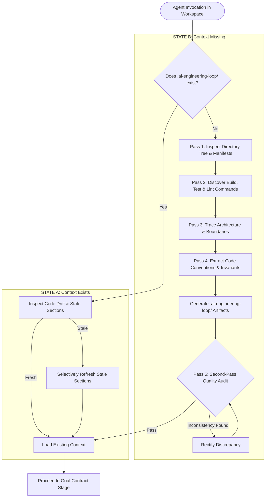

# Project Initialization & Context Discovery Specification

## 1. Overview & Core Philosophy

The AI Engineering Loop operates under a primary principle of zero-friction autonomy:

> **"The repository should teach the agent how the repository works. The engineering loop should teach the agent how to work on it."**

When an autonomous coding agent enters any repository, it must not require the human user to manually explain basic architectural layers, package managers, or test commands. The agent must automatically discover, generate, and validate repository-specific context before formulating task-specific Goal Contracts.



---

## 2. Dual-State Initialization Flow

### State A: Existing Context (`.ai-engineering-loop/` is Present)
When the context directory already exists, it is treated as **repository-owned ground truth**:
1. **Preserve Intentional Customizations**: The agent does NOT blindly overwrite existing context files.
2. **Inspect Drift**: Compare existing `verification.md` commands and `architecture.md` notes against current codebase files (e.g. checking if a package manager changed from `npm` to `pnpm`, or if a new `apps/` directory was added).
3. **Selective Refresh**: Update only stale or missing sections while retaining human-crafted rules (see [Context Refresh Policy](file:///Users/egagofur/Development/work/ai-engineering-loop/core/context-refresh-policy.md)).

---

### State B: Missing Context (`.ai-engineering-loop/` is Absent)
When invoked in an unconfigured codebase, the agent automatically executes the 5-pass discovery workflow:

```text
Detect ──▶ Analyze ──▶ Infer Profile ──▶ Generate Context ──▶ Quality Audit ──▶ Continue
```

The user is not prompted to create folders or fill out templates manually.

---

## 3. The 5-Pass Discovery Engine

### Pass 1: Structural & Workspace Topology
- **Directory Tree**: Inspect root and top-level directories (`src/`, `apps/`, `packages/`, `server/`, `client/`, `tests/`, `docs/`).
- **Topology Classification**: Determine if the repository is a **Single Application**, **Multi-Service Project**, or **Monorepo Workspace** (detecting `pnpm-workspace.yaml`, `turbo.json`, `nx.json`, `lerna.json`, `Cargo.toml [workspace]`, `go.work`).
- **Profile Binding**: Bind the matching archetype from [`profiles/`](file:///Users/egagofur/Development/work/ai-engineering-loop/profiles/README.md) (`web-app`, `backend-api`, `mobile-app`, `library`, `monorepo`).

### Pass 2: Manifests & Command Discovery
Inspect configuration files to extract exact CLI commands:
- **Package Manifests**: `package.json` (`scripts`), `go.mod`, `Cargo.toml`, `pyproject.toml`, `requirements.txt`, `composer.json`, `pubspec.yaml`, `Gemfile`.
- **Command Extraction**:
  - `test_unit`: Command for focused unit testing (e.g. `npx vitest run`, `pytest -v`, `go test ./...`).
  - `test_all`: Command for full regression testing.
  - `typecheck`: Command for static type analysis (`npx tsc --noEmit`, `mypy`, `cargo check`).
  - `lint`: Command for linting and formatting (`npx eslint --fix`, `ruff check`, `golangci-lint run`).
  - `build`: Command for production bundle / binary compilation (`npm run build`, `go build`).
  - `e2e`: Command for browser/integration tests if configured (`npx playwright test`, `cypress run`).

> [!IMPORTANT]
> Never assume generic commands (e.g. `npm test`) if the repository uses another package manager (e.g. `pnpm run test` or `bun test`). If a command cannot be determined with certainty, record it as `UNKNOWN (requires discovery)` rather than guessing.

### Pass 3: Architecture & Invariant Mapping
Inspect codebase entrypoints and directory layouts:
- **Ingress / Presentation**: Routers, controllers, UI views, pages, API handlers.
- **Domain / Services**: Business logic services, use-cases, actions.
- **Data Access & Storage**: ORM schemas (Prisma, TypeORM, Drizzle, SQLAlchemy, GORM), migrations, caching stores (Redis).
- **External Integrations**: Third-party APIs, webhooks, message queues (Kafka, RabbitMQ, SQS).
- **Layer Boundaries**: Document forbidden layer leaps (e.g. "UI components must not query database directly").

### Pass 4: Observed Conventions Extraction
Extract actual conventions from current source code:
- **Naming Standards**: File naming (`kebab-case`, `camelCase`, `snake_case`), component naming, test file suffixes (`*.test.ts`, `*_spec.rb`).
- **Error Handling**: Standard exception classes, error wrapper types (`Result<T, E>`), HTTP status patterns.
- **Existing Documentation Cross-Check**: Inspect existing project documentation (`README.md`, `CONTRIBUTING.md`, `ARCHITECTURE.md`, `docs/`, `AGENTS.md`, `CLAUDE.md`).
  - *Rule*: Documentation is treated as evidence, not absolute truth. If documentation contradicts the code, prioritize observed code facts and record the discrepancy.

### Pass 5: Second-Pass Quality Audit
Before finalizing `.ai-engineering-loop/`, the agent reviews the generated context against these quality criteria:
1. **Evidence Attribution**: Are key architectural claims backed by file citations?
2. **Zero Secret Leakage**: Did any `.env` secrets, tokens, or credentials leak into the markdown files? (Must be 100% clean).
3. **No Hallucinated Commands**: Are all listed verification commands backed by manifest scripts?
4. **Conciseness**: Is the documentation focused on what an agent needs to know (under 300 lines total across files), avoiding exhaustive wiki bloat?

---

## 4. Generated Context Schema

The discovery engine generates the standard `.ai-engineering-loop/` directory:

```text
.ai-engineering-loop/
├── config.md           # Project identity, languages, frameworks, bound profile
├── architecture.md     # Ingress, domain, data access, and boundary invariants
├── conventions.md      # Observed naming, error handling, and forbidden patterns
├── verification.md     # Machine-checked CLI commands with evidence sources
└── adapter.md          # Detected VCS, CI/CD, review bots, and notification channels
```

---

## 5. Non-Destructive Safety Rules

During project initialization and discovery, the agent MUST strictly adhere to the [Discovery Safety Policy](file:///Users/egagofur/Development/work/ai-engineering-loop/policies/discovery-safety-policy.md):
- **NEVER** edit application source code, configuration, or tests.
- **NEVER** inspect private secrets (`.env`, `.env.local`, `.pem`, credentials).
- **NEVER** create git branches, commits, or push to remote remotes.
- **ONLY** write new files under `.ai-engineering-loop/`.
