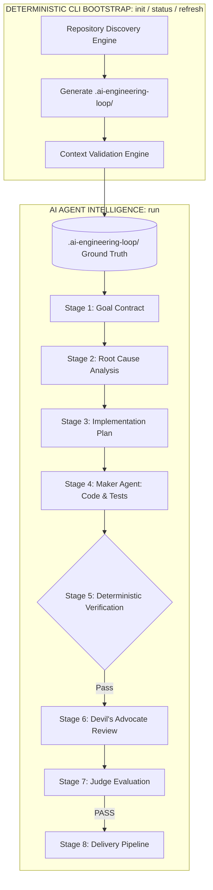

# Project Initialization & Context Discovery Specification

## 1. Overview & Core Philosophy

The AI Engineering Loop enforces a clean architectural separation between **Deterministic Context Bootstrap** and **Agent Intelligence**:

> **"The CLI bootstraps and validates repository context. The AI Agent reasons over that context to execute the engineering lifecycle."**



---

## 2. Operation Separation: `init` vs `run`

### The `init` Operation
- **Purpose**: Discovers repository characteristics, extracts manifest scripts, binds archetype profiles, and generates `.ai-engineering-loop/`.
- **Command**: `npx ai-engineering-loop init` (or `/ai-engineering-loop init`).
- **Boundaries**:
  - `init` **MUST NOT** edit application code, write business logic, author unit tests, or run adversarial reviews.
  - `init` **MUST NOT** commit to git, change branches, push to remotes, or open PRs.
  - The only permitted file writes are within `<workspace-root>/.ai-engineering-loop/`.
- **Idempotency**: Running `init` repeatedly is safe. If context is already complete and valid, `init` is a non-destructive no-op.

---

### The `run` Operation
- **Purpose**: Consumes the ground truth in `.ai-engineering-loop/` to solve a specific user task.
- **Command**: `npx ai-engineering-loop run` (or `/ai-engineering-loop [task]`).
- **Boundaries**:
  - The Agent reads `.ai-engineering-loop/` (triggering auto-init if missing).
  - Formulates the [Goal Contract](file:///Users/egagofur/Development/work/ai-engineering-loop/core/goal-contract.md).
  - Performs Root Cause Analysis (RCA) and Implementation Planning.
  - Executes surgical diffs, runs deterministic test suites, conducts independent adversarial review via the [Devil's Advocate](file:///Users/egagofur/Development/work/ai-engineering-loop/agents/devil-advocate.md), and obtains certification from the [Judge Agent](file:///Users/egagofur/Development/work/ai-engineering-loop/agents/judge.md).

---

## 3. Dual-State Initialization Flow

```text
State A (Context Exists):
Inspect Health ──▶ Detect Drift ──▶ Selectively Refresh Stale Sections ──▶ Load

State B (Context Missing):
Inspect Topology ──▶ Manifests/Commands ──▶ Inferred Profile ──▶ Generate .ai-engineering-loop/ ──▶ Validate
```

---

## 4. The 5-Pass Discovery Engine

1. **Pass 1 (Topology & Profile)**:
   - Identifies if Monorepo (`pnpm-workspace.yaml`, `turbo.json`, `nx.json`, `Cargo.toml [workspace]`, `go.work`) or Single Application.
   - Binds archetype profile: `web-app` | `backend-api` | `mobile-app` | `library` | `monorepo`.
2. **Pass 2 (Manifests & Verification Commands)**:
   - Reads `package.json`, `go.mod`, `Cargo.toml`, `pyproject.toml`, `pubspec.yaml`.
   - Extracts exact CLI scripts: `test_unit`, `test_all`, `typecheck`, `lint`, `build`, `e2e`.
3. **Pass 3 (Architecture & Invariants)**:
   - Maps ingress (controllers/routers/views), domain services, and database layers.
   - Sets boundary invariant rules.
4. **Pass 4 (Conventions & Documentation)**:
   - Identifies observed naming conventions, test file placement, error patterns.
   - Cross-checks existing docs (`README.md`, `CONTRIBUTING.md`, `CLAUDE.md`, `AGENTS.md`) without blindly trusting contradictions.
5. **Pass 5 (Safety Audit & File Generation)**:
   - Strictly ignores private credentials (`.env`, `.env.local`, `.pem`, tokens, API keys).
   - Generates `.ai-engineering-loop/` (`config.md`, `architecture.md`, `conventions.md`, `verification.md`, `adapter.md`).

---

## 5. Version Control Recommendation

Because `.ai-engineering-loop/` represents the shared ground truth of a repository's engineering conventions, it is **strongly recommended to commit `.ai-engineering-loop/` to version control**:

```bash
git add .ai-engineering-loop
git commit -m "chore: initialize AI Engineering Loop context"
```

This allows all team members and future AI agent sessions to share identical context without redundant discovery cycles.
