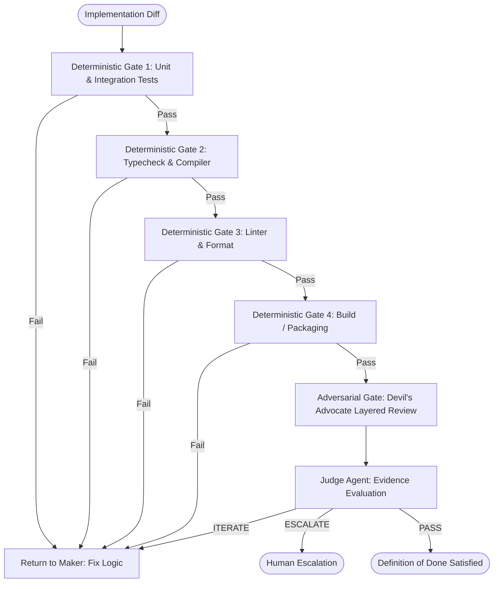

# Verification Loop Specification

## 1. Overview

The **Verification Loop** is the dual-layer validation engine of the AI Engineering Loop. It guarantees that code is not merely claimed to be functional by its author, but is rigorously tested via **machine-checkable deterministic gates** and scrutinized by **independent adversarial inspection**.



---

## 2. Dynamic Command Discovery

The exact commands executed for each deterministic gate are resolved dynamically according to [Configuration Precedence](file:///Users/egagofur/Development/work/ai-engineering-loop/core/configuration-precedence.md):

1. Read `.ai-engineering-loop/verification.md` from the target repository if present.
2. If missing, fall back to the defaults of the bound [Project Profile](file:///Users/egagofur/Development/work/ai-engineering-loop/profiles/README.md) (`web-app`, `backend-api`, `mobile-app`, `library`, `monorepo`).
3. If profile is unspecified, infer commands from repository manifests (`package.json`, `go.mod`, `Cargo.toml`, `pyproject.toml`).

---

## 3. Layer 1: Deterministic Verification

Deterministic verification consists of machine-executed commands producing binary (`PASS` / `FAIL`) or structured outputs. 

An agent is **strictly prohibited** from proceeding to adversarial review if any deterministic gate fails.

### The 4 Deterministic Gates

#### Gate 1: Unit & Regression Tests
- **Objective**: Prove correctness of new logic and ensure zero regressions.
- **Criteria**: 100% exit code `0`, zero test failures, zero unexpected skipped tests.
- **Rules**:
  - Tests must cover happy paths, null/undefined safety, empty inputs, boundary conditions, and error branches.
  - Test assertions must be strict (e.g. checking specific return values, error types, and state mutations, not merely `toBeDefined()`).

#### Gate 2: Static Typing & Compilation
- **Objective**: Prove mathematical type safety and schema conformance.
- **Criteria**: Zero compiler / typechecker errors across the codebase or affected workspaces (e.g. `tsc --noEmit`, `mypy`, `cargo check`).

#### Gate 3: Code Standards & Linting
- **Objective**: Guarantee zero static analysis rule violations and formatting hygiene.
- **Criteria**: Zero linter errors on touched files (e.g. `eslint`, `ruff`, `golangci-lint`, `dart analyze`).

#### Gate 4: Build & Packaging
- **Objective**: Ensure the project compiles, bundles, or packages without missing assets or circular dependencies.
- **Criteria**: Build command completes with exit code `0`.

---

## 4. Layer 2: Adversarial Verification (Devil's Advocate)

Once all deterministic gates pass, the code diff is submitted to the **Devil's Advocate Agent**.

### Purpose
Deterministic tests only test what the author *thought* to test. The Devil's Advocate exists to discover what the author *forgot*, *assumed*, or *misunderstood*.

### Scope of Review
The Devil's Advocate reviews strictly the git diff against the target base branch:
```bash
git diff <base-branch>...HEAD
```

### Layered Review Rules
Review domains are dynamically assembled based on the active **Project Profile** and **Repository Invariants** (see [Devil's Advocate Specification](file:///Users/egagofur/Development/work/ai-engineering-loop/agents/devil-advocate.md)), ensuring only substantive, relevant topics are evaluated.

---

## 5. Verification Evidence Protocol

All claims of verification must be accompanied by **reproducible evidence**:

1. **Command Executed**: Full CLI command line string.
2. **Exit Code**: Exact status code returned.
3. **Execution Output**: Raw relevant output snippet showing test pass counts, typecheck logs, or lint results.
4. **Acceptance Criteria Mapping**: Explicit mapping showing which test corresponds to which AC from the [Goal Contract](file:///Users/egagofur/Development/work/ai-engineering-loop/core/goal-contract.md).

> [!CAUTION]
> Statements such as *"I have manually verified that this works"* or *"The tests should pass"* without command outputs are invalid and will be rejected by the Judge Agent.
