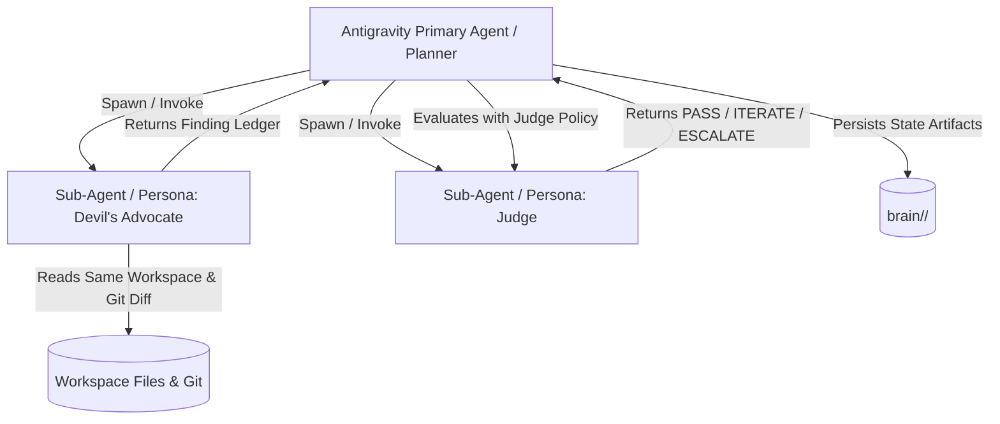

# Antigravity Sub-Agent Feasibility & Execution Strategy

## 1. Executive Summary

This document evaluates the practical feasibility of executing the **AI Engineering Loop** (Maker, Devil's Advocate, Judge) inside the **Google Antigravity IDE / Agentic Platform**, addressing runtime capabilities, context segregation, token economics, and persistence.

---

## 2. Analysis of the 8 Core Questions

### 1. Can Antigravity summon independent sub-agents?
- **Status**: **YES**.
- **Mechanism**: Antigravity natively supports agentic delegation through sub-agents (e.g. `invoke_subagent` / `browser_subagent` / background tasks). Sub-agents execute with their own independent message loops, instructions, and tool sets.
- **Alternative / Fallback**: If subagent spawning is constrained in a single-agent CLI mode, Antigravity agents can execute **Context-Switched Multi-Turn Personas** by clearing operational context, adopting strict role instructions, and evaluating the isolated `git diff`.

### 2. Can the main agent pass context to a sub-agent?
- **Status**: **YES**.
- **Mechanism**: The spawning task payload allows passing:
  - The [Goal Contract](file:///Users/egagofur/Development/work/ai-engineering-loop/core/goal-contract.md).
  - Target base branch name (`main`, `develop`).
  - Active iteration index and finding ledger history.

### 3. Can the sub-agent inspect the same repository?
- **Status**: **YES**.
- **Mechanism**: Sub-agents share the active workspace root (`/Users/.../ai-engineering-loop`). They have access to `view_file`, `grep_search`, `list_dir`, and `run_command` (`git diff`, `git log`, `npx jest`, etc.).

### 4. Can the sub-agent return structured findings?
- **Status**: **YES**.
- **Mechanism**: The sub-agent is instructed to output strictly formatted YAML/Markdown compliant with the [Finding Policy](file:///Users/egagofur/Development/work/ai-engineering-loop/policies/finding-policy.md). Upon task completion, the structured output is delivered directly back into the primary agent's context.

### 5. Can the main agent consume those findings?
- **Status**: **YES**.
- **Mechanism**: The primary agent parses the returned Finding Ledger, updates the iteration state artifact, and feeds the findings into the [Judge Agent](file:///Users/egagofur/Development/work/ai-engineering-loop/agents/judge.md).

### 6. Can the loop be repeated automatically?
- **Status**: **YES**.
- **Mechanism**: Antigravity's autonomous loop executes sequentially until the Judge outputs `PASS` or triggers `ESCALATE`. The loop does not require human intervention between iterations unless an escalation trigger is activated.

### 7. Can iteration state be persisted?
- **Status**: **YES**.
- **Mechanism**: Antigravity provides a dedicated per-conversation artifact directory:
  `<appDataDir>/brain/<conversation-id>/`
  The loop persists:
  - `goal_contract.md`
  - `iteration_ledger.json` (finding signatures, iteration index, diff hashes)
  - `verification_logs.txt`
  - `judge_verdict.md`

### 8. What are the practical token/context limitations?
- **Analysis**:
  - Full codebase context in every prompt leads to context bloat and degraded attention.
  - **Optimization Strategy**:
    - Write `git diff` to `.ai-engineering-loop/tasks/current.diff` and pass that path.
    - Devil's Advocate: at most 8 tool calls; skip css/generated; no git log; wait (no background).
    - Judge: at most 4 tool calls; ledger + Goal Contract only; fact-check cited locations; wait.
    - Do not use `browser_subagent` as a reviewer.
    - If `invoke_subagent` is missing, use CONTEXT_ISOLATION_ONLY with the same budgets. See `policies/review-budget.md` and `.agents/`.

---

## 3. Recommended Execution Modes in Antigravity

| Dimension | Mode A: Native Sub-Agents (Recommended) | Mode B: Persona Context Switching |
|---|---|---|
| **Context Isolation** | 100% Isolated context window | Sequential turns within single context |
| **Cognitive Bias** | Zero author bias (clean slate) | Low bias if context is scoped to diff |
| **Token Overhead** | Minimal (sub-agent starts fresh) | Moderate (context grows across turns) |
| **Implementation Complexity** | Requires subagent invocation tool | Works natively in standard chat turn |
| **Antigravity Fit** | Ideal for complex multi-file features | Ideal for quick, surgical fixes |

---

## 4. Implementation Roadmap for Antigravity Skill

To deploy this workflow as an Antigravity Custom Skill (e.g. `skills/ai-engineering-loop/SKILL.md`):
1. Package the core loop into an executable skill definition with YAML frontmatter.
2. Provide slash command shortcuts (e.g. `/loop:start`, `/loop:review`).
3. Bind the DOT Adapter as an opt-in release plugin when working inside DOT repositories.
