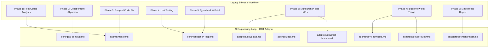

# Migration Plan: Legacy 8-Phase Workflow to AI Engineering Loop

## 1. Overview & Migration Objectives

The legacy `dot-dev-workflow` established a strong 8-phase engineering foundation across DOT codebases. However, it tightly coupled generic engineering principles (root cause analysis, surgical diffs, unit testing, static typing) with company-specific delivery tooling (GitLab, `glab`, `@coreview-bot`, Mattermost).

This migration plan maps every single phase of the legacy workflow into the new modular architecture, ensuring that **zero engineering rigor is lost** while achieving complete platform independence.

---

## 2. Comprehensive Phase-by-Phase Mapping

---

## 3. Detailed Mapping Matrix

| Legacy Phase | New Architecture Placement | Action (`Keep / Modify / Move / Remove`) | Detailed Rationale |
|---|---|:---:|---|
| **Phase 1: Comprehensive Code & Root Cause Analysis** | `agents/maker.md` & `core/goal-contract.md` | **MODIFY & KEEP** | End-to-end data tracing, git history examination (`git log -n 5 -p`), and blind spot identification are preserved in the Maker Agent. The output feeds directly into formalizing the Goal Contract. |
| **Phase 2: Collaborative Alignment & Brainstorming** | `core/goal-contract.md` | **MODIFY & KEEP** | Upgraded from informal conversational alignment to a binding, machine-verifiable [Goal Contract](file:///Users/egagofur/Development/work/ai-engineering-loop/core/goal-contract.md) containing explicit Acceptance Criteria, constraints, and out-of-scope declarations. |
| **Phase 3: Surgical & Clean Code Fixing** | `agents/maker.md` & `core/definition-of-done.md` | **KEEP** | Preserves core quality rules: smallest coherent diff, zero dead code, zero speculative abstractions, adhering to existing architectural conventions and design tokens. |
| **Phase 4: Unit Testing & Boundary Coverage** | `core/verification-loop.md` (Gate 1) & `agents/maker.md` | **KEEP** | Retains 100% test pass requirement, boundary condition testing, null/undefined safety, and edge-case permutations as Deterministic Gate 1. |
| **Phase 5: Build & Type Safety Verification** | `core/verification-loop.md` (Gates 2, 3, 4) | **KEEP** | Retains `tsc --noEmit` and `eslint --fix` as mandatory machine-checked gates that must pass prior to review. |
| **Phase 6: Multi-Branch MR & Issue Card via `glab` CLI** | `adapters/dot/gitlab.md` & `adapters/dot/multi-branch.md` | **MOVE TO ADAPTER** | Moved out of generic core into the DOT Adapter. The core loop remains platform-agnostic, while DOT adapter encapsulates `glab issue create`, `glab mr create`, and cherry-picking to `staging` and `develop`. |
| **Phase 7: Automated Bot Review Triage (`@coreview-bot`)** | `agents/devil-advocate.md` (Internal) + `adapters/dot/coreview.md` (External) | **SPLIT & MOVE** | The concept of adversarial review is promoted to the generic core as the internal [Devil's Advocate Agent](file:///Users/egagofur/Development/work/ai-engineering-loop/agents/devil-advocate.md) (runs *before* opening MR). The external `@coreview-bot` triage (`VALID` vs `HALU`) is moved to `adapters/dot/coreview.md` (runs *after* opening MR). |
| **Phase 8: Mattermost Markdown Report & Auto-Send via MCP** | `adapters/dot/mattermost.md` | **MOVE TO ADAPTER** | Moved out of generic core into the DOT Adapter. Preserves channel mapping lookup (`mattermost-channel-mapping.json`), fallback prompt, and MCP `mattermost_send_message` dispatch with `from: "AI Agent"`. |

---

## 4. Key Improvements over Legacy Workflow

1. **Elimination of Self-Certification**: In the legacy workflow, the same agent that wrote code decided it was done. In the new architecture, only the independent [Judge Agent](file:///Users/egagofur/Development/work/ai-engineering-loop/agents/judge.md) can grant a `PASS` verdict.
2. **Pre-MR Adversarial Inspection**: Flaws are caught and fixed locally via the [Devil's Advocate](file:///Users/egagofur/Development/work/ai-engineering-loop/agents/devil-advocate.md) *before* publishing PRs/MRs to remote repositories.
3. **No-Progress & Escalation Circuit Breakers**: Bounded iterations (`MAX_ITERATIONS = 3`) and [No-Progress Detection](file:///Users/egagofur/Development/work/ai-engineering-loop/policies/no-progress-policy.md) prevent runaway loops and thrashing.
4. **Pluggable Architecture**: The same generic core loop can now be used with GitHub, Bitbucket, Jira, Linear, or Slack simply by swapping adapters.
