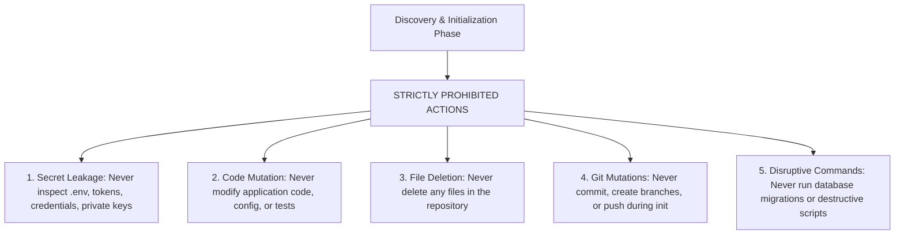

# Discovery Safety Policy Specification

## 1. Principle & Core Rule

Project initialization and context discovery is a **read-mostly, non-destructive operation**.

Its sole objective is to inspect repository topology, manifests, and architecture to generate or update `.ai-engineering-loop/`. It must never alter production application code or compromise security.

---

## 2. Strictly Prohibited Actions During Discovery

An agent executing project initialization MUST NEVER:

### 1. Secret & Credential Inspection
- **Prohibited Files**: `.env`, `.env.local`, `.env.production`, `id_rsa`, `*.pem`, `*.key`, `credentials.json`, `secrets.yaml`, `.netrc`.
- **Permitted Files**: `.env.example`, `.env.sample`, `config.example.json` (template files containing no real secret values).
- **Rule**: If an agent inadvertently reads a file containing API keys or database passwords, it is **strictly forbidden** from copying or referencing those values in `.ai-engineering-loop/`.

### 2. Application Code Mutation
- The agent must not edit `src/`, `apps/`, `packages/`, or any configuration files outside of `.ai-engineering-loop/` during the initialization stage.

### 3. File Deletion
- The agent must not delete any files, directories, or caches during discovery.

### 4. Git Mutations
- The agent must not execute `git commit`, `git checkout -b`, `git push`, or `git reset` during initialization. Git commands are strictly restricted to read-only inspection (`git status`, `git log -n 5`, `git remote -v`).

### 5. Disruptive Commands
- The agent must not execute live database migrations (`prisma migrate dev`, `alembic upgrade head`) or destructive test cleanup scripts during discovery.

---

## 3. Permitted Actions During Discovery

The only actions authorized during project initialization are:

1. **Read-Only Inspection**: Reading repository directories, file trees, package manifests, configuration files, and documentation.
2. **Writing Context Files**: Creating or updating markdown files strictly within `<workspace-root>/.ai-engineering-loop/`.
3. **Informational Git Queries**: Running `git status`, `git remote -v`, and `git log -n 5 --stat`.
