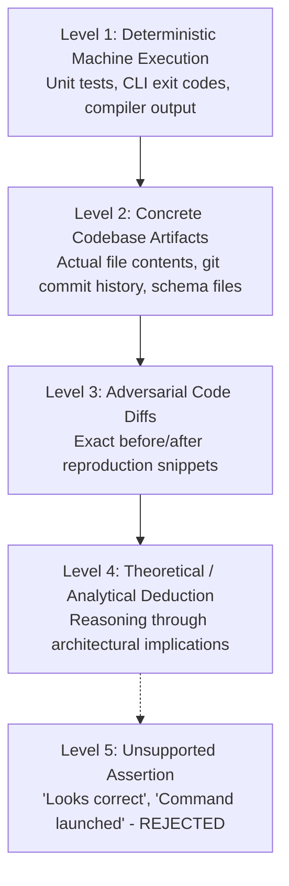

# Evidence Policy Specification

## 1. Principle & Core Law

The foundational premise of the AI Engineering Loop is:

> **Claims without verifiable evidence are invalid.**

An agent may not state that code is functional, bug-free, optimized, or ready for merge based on assumption or conversational confidence. Every positive and negative claim throughout the loop must be substantiated by demonstrable proof.

---

## 2. Verification Evidence Contract

A verification `PASS` is strictly invalid without concrete execution evidence. The system categorically rejects vague statements such as *"command was launched"* or *"test appears to have passed"*.

### Mandatory Execution Evidence Properties:
1. **`command`**: Exact CLI command executed.
2. **`executionIdentity`**: Execution ID / PID / timestamp.
3. **`startTime` & `endTime`**: Documenting execution duration.
4. **`exitCode`**: Must be `0`.
5. **`stdout` & `stderr`**: Raw machine logs captured.
6. **`timeoutStatus`**: Must be `"COMPLETED"`.
7. **`testCounts`**: Explicit counts of passed, failed, and skipped tests.
8. **`assertionEvidence`**: Specific assertion proof matching the active Goal Contract's Acceptance Criteria.

---

## 3. The Evidence Hierarchy

### Level 1: Deterministic Machine Execution (Highest Proof)
- Automated unit/integration test results with full test names, assertions, and exit codes.
- Compiler / typechecker outputs (`tsc --noEmit`, `cargo check`).
- Linter execution reports with zero errors.
- Real-time build artifacts and exit statuses.

### Level 2: Concrete Codebase Artifacts
- Direct citations of existing repository files, functions, database schemas, and configuration keys with explicit file paths and line ranges.
- Git commit logs (`git log -n 5 -p`) and git blame history proving past behavior.

### Level 3: Adversarial Code Diffs
- Concrete code diffs demonstrating an edge case or proposing a surgical fix.

### Level 4: Analytical Deduction
- Structured logical deduction mapping user workflows to code paths. Acceptable for brainstorming and initial analysis, but must be validated by Level 1 or Level 2 before completion.

### Level 5: Unsupported Assertions (Strictly Prohibited)
- Vague statements of confidence (*"I am confident this fixes the problem"*).
- Claiming a test passed without running the command.
- Assuming an API exists without checking `node_modules` or codebase imports.
- **Action**: The Judge Agent automatically invalidates any finding or completion claim backed only by Level 5 assertions.

---

## 4. Evidence Requirements for Common Agent Claims

| Claim Type | Mandatory Evidence Required | Prohibited Substitute |
|---|---|---|
| **"Bug is fixed"** | Reproducing test that previously failed now passes with exit code 0. | "The logic was corrected." |
| **"No regressions"** | Full test suite execution log showing 0 failures. | "I only touched a single function." |
| **"Type safe"** | `tsc --noEmit` / compiler run output with 0 errors. | "I added type annotations." |
| **"Review finding is invalid"** | File path & line showing the suggested API does not exist or behavior is intentional. | "I disagree with the reviewer." |
| **"Acceptance criteria AC-X met"** | Test function name & assertion specifically targeting AC-X. | "Implemented according to spec." |
