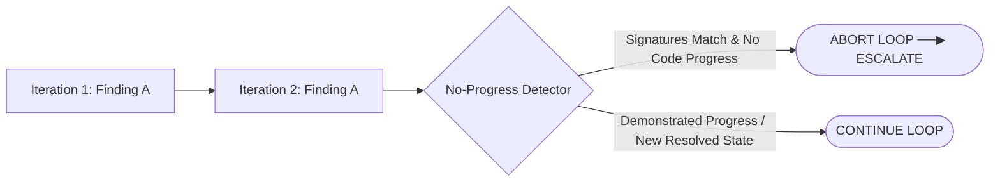

# No-Progress Policy Specification

## 1. Overview & Objective

A major risk in autonomous AI agent loops is **thrashing (stagnation)**: the agent modifies code repeatedly across iterations without actually resolving the underlying defect, oscillating between two broken states, or generating the same unresolved findings repeatedly.

The **No-Progress Policy** defines an algorithmic mechanism to detect stagnation early and halt the loop with a [Human Escalation](file:///Users/egagofur/Development/work/ai-engineering-loop/core/escalation-policy.md) rather than wasting tokens and computational cycles.



---

## 2. Finding Signature Hashing

To detect recurring findings objectively across iterations, each active finding is assigned a **Finding Signature**:

$$\text{Signature} = \text{Hash}\Big(\text{Category} + \text{File Location} + \text{Core Problem Concept}\Big)$$

### Signature Formula Components:
1. **Category**: One of `Correctness`, `Security`, `ErrorHandling`, etc.
2. **Normalized Location**: File path and functional block (e.g. `src/server/attendance/service.ts:calculateDuration`).
3. **Core Issue Key**: Normalized problem keywords (e.g. `timezone-conversion-utc`, `null-pointer-overtime-note`, `missing-auth-tenant-id`).

---

## 3. Stagnation Detection Criteria

Stagnation is detected if any of the following rules evaluate to `TRUE`:

### Criterion 1: Identical Unresolved Finding Across 2 Consecutive Iterations
- If Iteration $K$ produces an unresolved blocking finding with the exact same Signature as Iteration $K-1$, AND the Maker Agent's diff did not change the underlying logic block.

### Criterion 2: Oscillating Diffs (Ping-Pong State)
- If the diff generated in Iteration $K$ reverts the codebase back to the state of Iteration $K-2$.

### Criterion 3: Persistent Deterministic Failure
- If the exact same unit test or compiler error fails in Iteration $K$ after the Maker Agent attempted a fix in Iteration $K-1$.

### Criterion 4: Scope Divergence / Thrashing
- If the Maker Agent modifies more than $3\times$ the number of lines or files compared to Iteration 1 without resolving the original Acceptance Criteria (indicating uncontrolled thrashing).

---

## 4. Operational Algorithm

```python
def check_stagnation(
    current_iteration: int,
    iteration_history: list[IterationRecord]
) -> tuple[bool, str]:
    if current_iteration < 2:
        return False, "Initial iteration"

    prev_record = iteration_history[current_iteration - 2]
    curr_record = iteration_history[current_iteration - 1]

    # Check 1: Recurring blocking finding signatures
    prev_blocking = {f.signature for f in prev_record.unresolved_blocking_findings}
    curr_blocking = {f.signature for f in curr_record.unresolved_blocking_findings}

    recurring = prev_blocking.intersection(curr_blocking)
    if recurring and curr_record.diff_hash == prev_record.diff_hash:
        return True, f"Identical unresolved findings {recurring} with no effective diff progress"

    # Check 2: Ping-Pong reversion
    if current_iteration >= 3:
        two_back_record = iteration_history[current_iteration - 3]
        if curr_record.diff_hash == two_back_record.diff_hash:
            return True, "Oscillating diff detected (reverted to state from 2 iterations ago)"

    # Check 3: Identical deterministic failure
    if (curr_record.deterministic_errors == prev_record.deterministic_errors and 
        len(curr_record.deterministic_errors) > 0):
        return True, f"Deterministic check failed with identical errors across iterations: {curr_record.deterministic_errors}"

    return False, "Progress verified"
```

---

## 5. Escalation Action

When `check_stagnation` returns `True`:
1. The Judge Agent immediately sets the verdict to **`ESCALATE`**.
2. Autonomous iteration stops.
3. The agent generates the standardized [Human Escalation Report](file:///Users/egagofur/Development/work/ai-engineering-loop/core/escalation-policy.md) highlighting the recurring signature and exact blocking contradiction.
