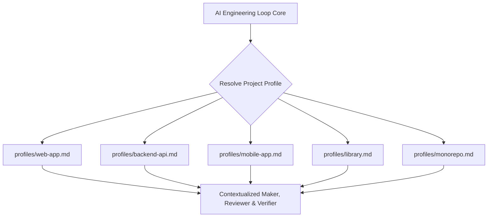

# Project Profiles Specification

## 1. Purpose & Core Concept

A **Project Profile** describes the engineering characteristics, verification expectations, common risk areas, and active review domains of a broad software archetype without modifying the generic core engineering loop.

---

## 2. Standard Profile Catalog

| Profile | Target Archetype | Primary Verification Focus | Active Review Domains |
|---|---|---|---|
| **[`web-app`](file:///Users/egagofur/Development/work/ai-engineering-loop/profiles/web-app.md)** | Single-Page Apps, SSR/SSG websites, Admin Portals | DOM rendering, browser responsiveness, bundle size, CSS/tokens | Responsive layout, accessibility (a11y), client state, Core Web Vitals |
| **[`backend-api`](file:///Users/egagofur/Development/work/ai-engineering-loop/profiles/backend-api.md)** | REST / GraphQL / gRPC Microservices, Background Workers | Unit tests, database migrations, schema contracts | Auth/Authz, SQL injection, concurrency, transactions, API contracts |
| **[`mobile-app`](file:///Users/egagofur/Development/work/ai-engineering-loop/profiles/mobile-app.md)** | iOS, Android, React Native, Flutter | Platform builds, simulator smoke tests, widget tests | Offline sync, device permissions, lifecycle transitions, network resilience |
| **[`library`](file:///Users/egagofur/Development/work/ai-engineering-loop/profiles/library.md)** | Reusable SDKs, packages, shared utilities | Broad runtime compatibility, zero external dependencies | Public API stability, semver breaking changes, bundle tree-shaking |
| **[`monorepo`](file:///Users/egagofur/Development/work/ai-engineering-loop/profiles/monorepo.md)** | Turborepo, Nx, Lerna, Yarn/pnpm Workspaces | Workspace scope tests, affected package compilation | Cross-package boundaries, circular dependencies, dependency isolation |

---

## 3. Profile Discovery & Binding

1. **Explicit Binding**: Declared in `<repo>/.ai-engineering-loop/config.md` via `project_profile: <name>`.
2. **Implicit Auto-Detection**: If `.ai-engineering-loop/` is absent, the engine inspects repository manifest files:
   - `flutter.yaml` / `ios/` / `android/` $\rightarrow$ `mobile-app`
   - `turbo.json` / `nx.json` / `pnpm-workspace.yaml` $\rightarrow$ `monorepo`
   - `next.config.js` / `vite.config.ts` / `index.html` $\rightarrow$ `web-app`
   - `Dockerfile` / `go.mod` / `requirements.txt` $\rightarrow$ `backend-api`
   - `rollup.config.js` / `tsup.config.ts` / `"main": "dist/..."` $\rightarrow$ `library`
