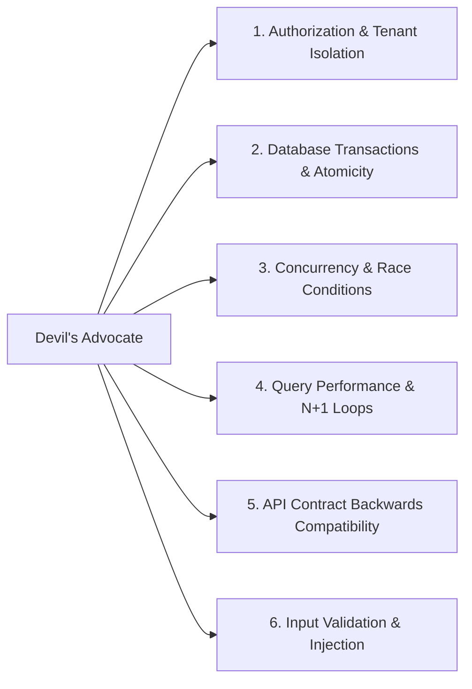

# Project Profile: `backend-api`

## 1. Profile Definition

- **Archetype**: Backend Services, REST / tRPC / GraphQL / gRPC APIs, Microservices, Background Workers (Node.js/TypeScript, Go, Python, Java, Rust, Elixir).
- **Core Environment**: Server runtimes, databases (PostgreSQL, MySQL, MongoDB, Redis), message queues (Kafka, RabbitMQ), containerized infrastructure.

---

## 2. Engineering & Architecture Characteristics

- **Layered Clean Architecture**: Strict boundaries between Transport/Controllers $\rightarrow$ Domain Services $\rightarrow$ Data Repositories $\rightarrow$ Infrastructure.
- **Data Integrity & ACID**: Explicit transaction boundaries for multi-table mutations. Zero partial database writes on mid-operation failures.
- **Idempotency**: Critical endpoints (e.g. payment, billing, order placement) must implement idempotent processing via unique request tokens or database unique constraints.
- **API Contract Discipline**: Strict schema validation on input payloads and response shapes (`zod`, `pydantic`, `protobuf`).

---

## 3. Verification Expectations

When working in a `backend-api` repository, deterministic verification should prioritize:

1. **Unit & Domain Tests**: Fast, isolated tests of domain services and calculation logic.
2. **Integration / DB Tests**: Real or test-container database tests validating transaction rollbacks, unique constraints, and foreign key integrity.
3. **Static Typing / Linting**: `tsc --noEmit`, `golangci-lint`, `ruff`, `mypy`.
4. **Schema Contract Validation**: Verifying that OpenAPI / GraphQL / protobuf contracts have not broken backwards compatibility.
5. **Database Migration Checks**: Dry-run migration execution and rollback tests.

---

## 4. Active Review Domains for Devil's Advocate

When reviewing diffs in a `backend-api` project, the [Devil's Advocate](file:///Users/egagofur/Development/work/ai-engineering-loop/agents/devil-advocate.md) activates these targeted checks:

### 1. Authorization & Tenant Isolation (IDOR)
- Does the endpoint verify that the requesting user has access to the requested entity (`tenant_id` / `org_id` / `user_id` check), or does it blindly trust IDs supplied in the request body/path?

### 2. Database Transactions & Atomicity
- If multiple database writes occur in one business operation, are they wrapped inside an explicit database transaction with rollback on error?

### 3. Concurrency & Race Conditions
- Can two concurrent requests for the same user cause double spending, duplicate voucher redemptions, or negative inventory balances?
- Are optimistic locks (e.g. `version` column) or database-level row locks (`SELECT FOR UPDATE`) used where necessary?

### 4. Query Performance & N+1 Loops
- Are relational queries executing queries in a loop (`for item in items: db.query(...)`) instead of using joins or batch fetching (`IN (...)` / dataloaders)?
- Are new `WHERE` or `ORDER BY` filters supported by database indexes?

### 5. API Contract Compatibility
- Does the change remove or rename an existing response field that could break existing mobile or web clients in production?

### 6. Input Validation & Injection
- Are inputs validated using schema parsers before reaching domain logic?
- Are database queries constructed safely via parameterization?
