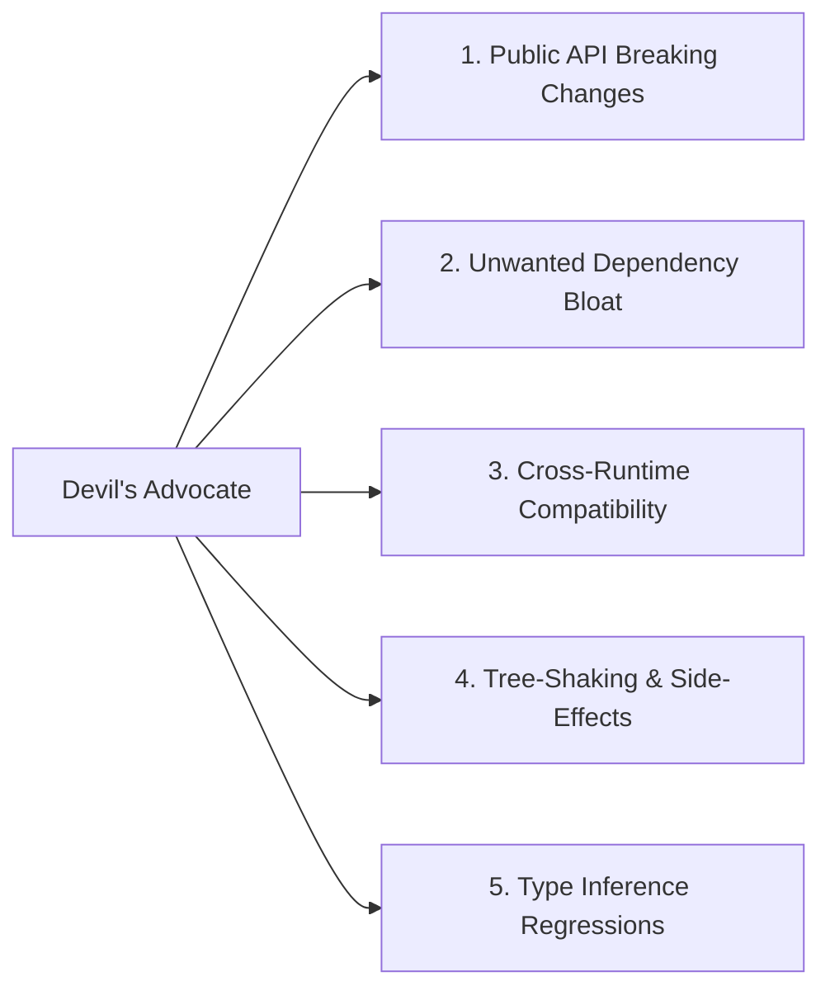

# Project Profile: `library`

## 1. Profile Definition

- **Archetype**: Reusable SDKs, Shared Packages, npm/PyPI/crates/Go modules, Open Source Libraries.
- **Core Environment**: Diverse downstream host runtimes, varied Node/browser versions, zero assumption about host application architecture.

---

## 2. Engineering & Architecture Characteristics

- **Semantic Versioning & Public API Stability**: Strict adherence to SemVer. Zero breaking changes on exported function signatures or interfaces in minor/patch releases.
- **Minimal Dependencies**: Extreme reluctance to introduce third-party transitive dependencies. Prefer native standard libraries.
- **Tree-Shaking & Bundle Efficiency**: Clean ES Module / CommonJS dual packaging, side-effect free declarations (`"sideEffects": false`).
- **Comprehensive TypeScript Declarations**: Exported `.d.ts` definitions with complete JSDoc annotations and strong generics.

---

## 3. Verification Expectations

1. **Compatibility Matrix Testing**: Unit tests executed across multiple runtime versions (e.g. Node 18, 20, 22).
2. **API Surface & Type Tests**: Type-level regression tests (e.g. `tsd`, `expect-type`) ensuring type inference remains intact for consumers.
3. **Packaging & Export Tests**: Build tools (`tsup`, `rollup`, `pkgroll`) verifying that output bundles export all expected entrypoints.
4. **Zero-Dependency Audit**: Dependency vulnerability and size audit.

---

## 4. Active Review Domains for Devil's Advocate

When reviewing diffs in a `library` project, the [Devil's Advocate](file:///Users/egagofur/Development/work/ai-engineering-loop/agents/devil-advocate.md) activates these targeted checks:

### 1. Public API Breaking Changes
- Does modifying this parameter or return type break existing consumers who update within the same major version?

### 2. Unwanted Dependency Bloat
- Is a new dependency being pulled in for something that could be written in 10 lines of standard library code?

### 3. Cross-Runtime Compatibility
- Does the code rely on Node.js-specific globals (`process`, `Buffer`, `fs`) in a package intended to also run in browser or edge runtimes (Cloudflare Workers, Deno)?

### 4. Tree-Shaking & Side-Effects
- Does importing a single utility from the package accidentally cause the entire library to be bundled by Webpack/Vite?
