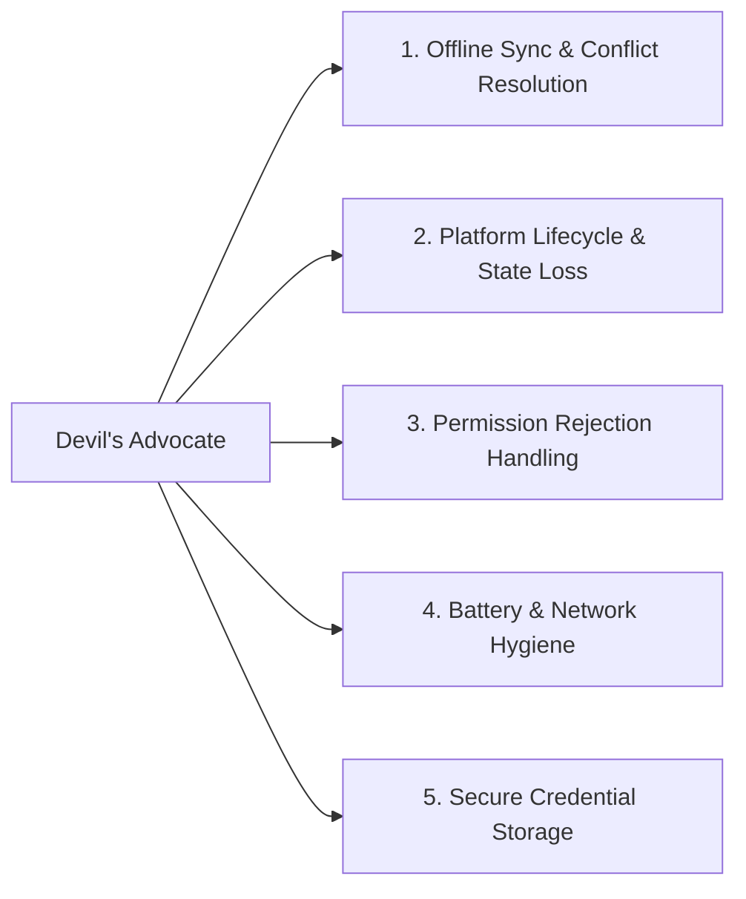

# Project Profile: `mobile-app`

## 1. Profile Definition

- **Archetype**: Native & Cross-Platform Mobile Applications (iOS / Swift, Android / Kotlin, Flutter / Dart, React Native).
- **Core Environment**: Mobile operating systems (iOS, Android), intermittent network connectivity, constrained memory and battery, background lifecycle states.

---

## 2. Engineering & Architecture Characteristics

- **Offline-First & Resilience**: Expect network loss at any time. State must persist locally (SQLite, Room, CoreData, Hive, WatermelonDB) and synchronize reliably upon reconnection.
- **Platform Lifecycle Handling**: Gracefully handle backgrounding, app suspension, memory pressure warnings, and foreground resumption.
- **State Management**: Reactive state architecture (Bloc, Riverpod, Redux, Zustand, Combine, StateFlow) with single source of truth.
- **Secure Device Storage**: Sensitive credentials (auth tokens, encryption keys) stored in iOS Keychain or Android Keystore / EncryptedSharedPreferences.

---

## 3. Verification Expectations

When working in a `mobile-app` repository, deterministic verification should prioritize:

1. **Unit & Logic Testing**: Pure Dart/Kotlin/Swift unit tests on stores, state notifiers, repository mappers, and sync algorithms.
2. **Widget & Component Testing**: Testing component rendering, user taps, and navigation state.
3. **Static Analysis & Typechecks**: `dart analyze`, `flutter test`, `swiftlint`, `ktlint`, `detekt`.
4. **Native Build Validation**: `flutter build bundle`, `xcodebuild build-for-testing`, `./gradlew assembleDebug`.
5. **Offline Scenario Simulation**: Unit tests verifying behavior when network repository throws `SocketException` or returns 503.

---

## 4. Active Review Domains for Devil's Advocate

When reviewing diffs in a `mobile-app` project, the [Devil's Advocate](file:///Users/egagofur/Development/work/ai-engineering-loop/agents/devil-advocate.md) activates these targeted checks:

### 1. Offline Sync & Conflict Resolution
- Does the code properly enqueue mutations when offline, or will unsaved user data be lost if the network drops before submit?
- If the server has a newer version of a record upon sync, does the app have an explicit conflict resolution strategy?

### 2. Platform Lifecycle & State Loss
- If the operating system kills the app in the background due to memory pressure, does the user return to an empty screen or is essential draft state restored?

### 3. Permission Rejection Handling
- If the user denies camera, location, or notification permissions, does the app degrade gracefully or enter a crash loop?

### 4. Battery & Network Hygiene
- Are location listeners, GPS polling, or background timers stopped when the screen is dismissed?
- Are large images cached appropriately on disk rather than re-downloaded on every scroll?

### 5. Secure Credential Storage
- Are JWT tokens or API secrets saved in secure hardware-backed storage rather than plain `SharedPreferences` / `UserDefaults`?
