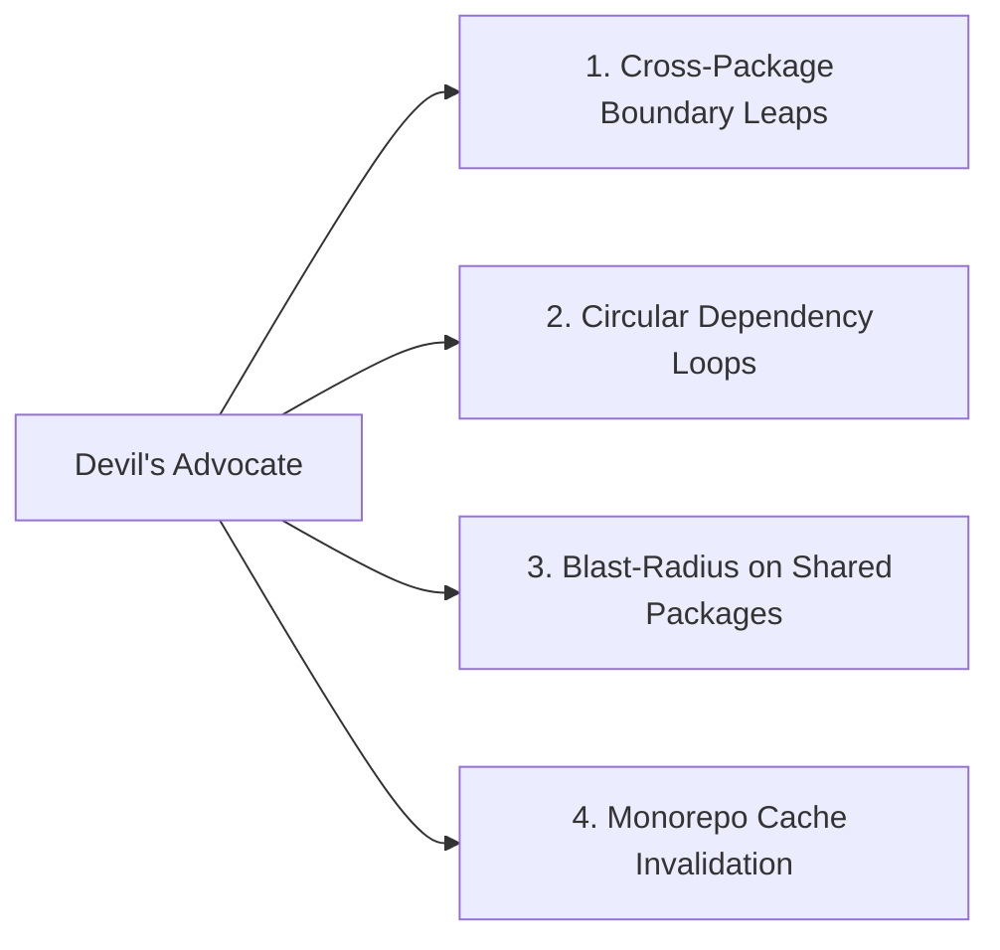

# Project Profile: `monorepo`

## 1. Profile Definition

- **Archetype**: Multi-package workspaces, Turborepo, Nx, Lerna, Cargo workspaces, Go multi-module repositories.
- **Core Environment**: Shared codebases hosting multiple interdependent apps, services, and shared packages in a single git repository.

---

## 2. Engineering & Architecture Characteristics

- **Workspace Boundaries**: Strict dependency rules between packages (e.g. `packages/ui` must not import `apps/web`; shared packages must only depend on approved core libraries).
- **Internal Dependency Linking**: Use of `workspace:*` references rather than published npm packages for local development.
- **Incremental Builds & Task Caching**: Optimized task pipelines where unaffected packages are skipped during verification.

---

## 3. Verification Expectations

1. **Scoped & Affected Testing**: Running tests on touched packages and their direct downstream dependents (e.g. `turbo run test --filter=...[origin/main]`).
2. **Workspace Typecheck**: Full typecheck across the monorepo root ensuring zero cross-package type breakage.
3. **Circular Dependency Checks**: Static analysis tools verifying zero circular package graph dependencies (`madge`, `eslint-plugin-import`).
4. **Boundary Linting**: Linters enforcing architecture tags (e.g. Nx boundaries).

---

## 4. Active Review Domains for Devil's Advocate

When reviewing diffs in a `monorepo` project, the [Devil's Advocate](file:///Users/egagofur/Development/work/ai-engineering-loop/agents/devil-advocate.md) activates these targeted checks:

### 1. Cross-Package Boundary Leaps
- Is a shared package importing code or types from an application-layer package?

### 2. Blast-Radius on Shared Packages
- If modifying a core utility in `packages/common`, have all consuming applications (`apps/api`, `apps/web`, `apps/mobile`) been verified against breaking changes?

### 3. Circular Dependency Loops
- Does adding this import introduce a cycle in the monorepo graph?
