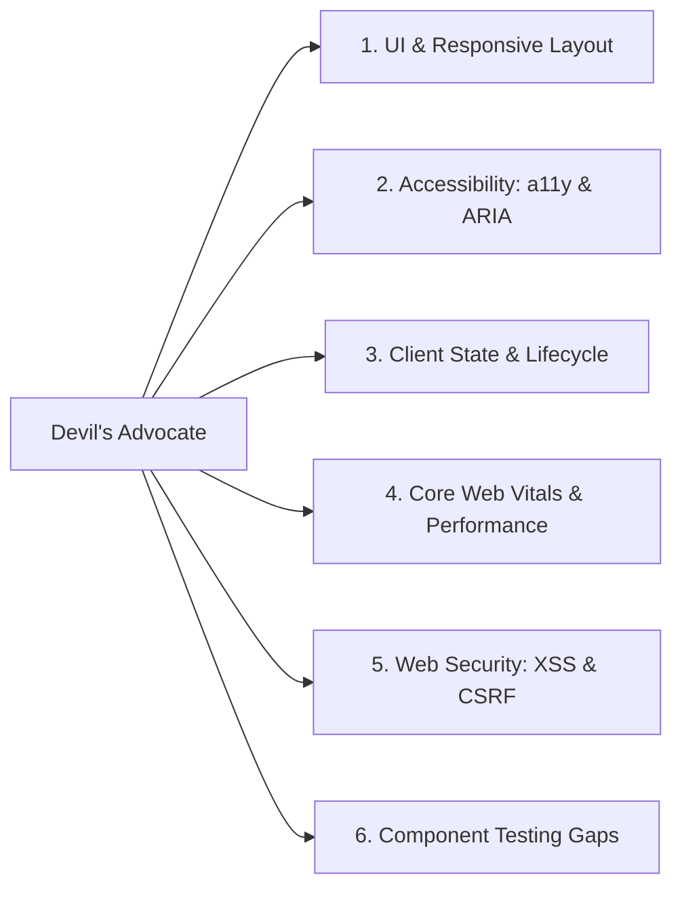

# Project Profile: `web-app`

## 1. Profile Definition

- **Archetype**: Frontend Web Applications, Single-Page Applications (SPAs), SSR/SSG Portals (Next.js, Remix, Vite, React, Vue, Svelte, Angular).
- **Core Environment**: Modern web browser runtimes, DOM APIs, CSSOM, client-side rendering engines.

---

## 2. Engineering & Architecture Characteristics

- **Design System & Tokens**: Strict adherence to design tokens (colors, spacing, typography, elevation). Zero arbitrary hardcoded hex codes or ad-hoc margins.
- **Component Hierarchy**: Clear separation between dumb presentational components, smart container components, and global state hooks.
- **Semantic HTML**: Proper use of `<main>`, `<nav>`, `<article>`, `<header>`, `<button>`, `<dialog>` rather than nested `
` soup.
- **Client State Management**: Explicit tracking of loading, error, empty, and populated UI states.

---

## 3. Verification Expectations

When working in a `web-app` repository, deterministic verification should prioritize:

1. **Component & Unit Testing**: Vitest / Jest + React Testing Library (verifying user-facing interactions, role queries, and state transitions).
2. **Type Safety**: `tsc --noEmit` on frontend types, props, and API response shapes.
3. **Linting & Accessibility**: `eslint-plugin-jsx-a11y`, CSS linting.
4. **Build & Bundling**: Production bundle build (`npm run build`) ensuring zero missing assets, broken imports, or bundle size regressions.
5. **Browser Verification**: When visual changes occur, run Playwright / Cypress smoke tests or DOM inspections.

---

## 4. Active Review Domains for Devil's Advocate

When reviewing diffs in a `web-app` project, the [Devil's Advocate](file:///Users/egagofur/Development/work/ai-engineering-loop/agents/devil-advocate.md) activates these targeted checks:

### 1. UI & Responsive Layout
- Does the layout break or overflow horizontally on small viewport widths (320px–390px)?
- Are modal dialogs, popovers, and dropdowns properly trapped or positioned using standard APIs?
- Are dark/light theme tokens respected?

### 2. Accessibility (a11y)
- Are interactive elements accessible via keyboard (`Tab`, `Enter`, `Escape`)?
- Do icons have `aria-hidden="true"` or descriptive text for screen readers?
- Are color contrast ratios compliant with WCAG AA standards?

### 3. Client State & Lifecycle
- Are event listeners, interval timers, and WebSocket subscriptions cleaned up on unmount?
- Are loading skeletons and error retry banners implemented for async network fetches?

### 4. Core Web Vitals & Performance
- Are images optimized with explicit `width`, `height`, and modern formats (`webp`, `avif`)?
- Does the change introduce heavy client-side dependencies that inflate bundle size?

### 5. Web Security
- Is user-generated content safely escaped to prevent Cross-Site Scripting (XSS)?
- Are sensitive auth tokens kept in `HttpOnly` cookies rather than `localStorage` where appropriate?
